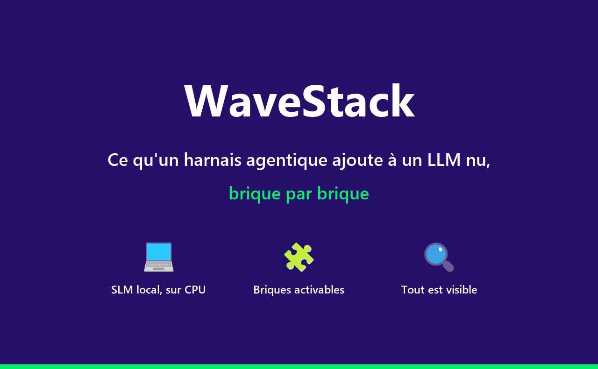

# WaveStack

WaveStack rend visible, brique par brique, ce qu'un harnais agentique ajoute à un LLM nu :
raisonnement, mémoire, prompt système, outils, RAG, MCP, skills, hooks, sous-agent et
compression du contexte.
Démonstrateur pédagogique local, qui tourne sur CPU, sans GPU ; interface en français, en
anglais et en allemand.



*Même question, sans puis avec outils : le LLM nu avoue ne pas connaître l'heure ; avec les
outils, le modèle appelle `get_datetime`, et les volets Contexte LLM, Orchestration et Schéma
montrent chaque étape. [Version vidéo (MP4)](docs/assets/wavestack-demo.mp4).*

## Ce que vous y voyez

- **Quatre volets synchronisés** : ce que voit l'utilisateur, ce que lit vraiment le modèle,
  ce que fait le harnais pas à pas, et où tourne chaque pièce (sur le poste ou sur le réseau).
- **Des briques à brancher une à une**, au fil d'un programme guidé de six modules (5 h 15).
- **Trois écrans pour regarder à l'intérieur** : le LLM nu (tokens, échantillonnage), l'Atelier
  RAG et l'Atelier MCP.
- **Un petit modèle local** (Qwen3.5-2B, 1,3 Go), installé sans droits administrateur, ou un
  modèle cloud si vous avez une clé API.

## Installation sous Windows

Pour Windows 10 ou 11 x64 ; aucun droit administrateur n'est nécessaire. Sous macOS ou Linux,
ou si une étape bloque (politique du poste, proxy), suivez
[l'installation détaillée](docs/installation.md).

**Sur un réseau d'entreprise**, tapez d'abord `$env:UV_SYSTEM_CERTS = "1"` dans le terminal, et
faites autoriser par votre service informatique les domaines listés dans
[Derrière un proxy d'entreprise](docs/installation.md#derrière-un-proxy-dentreprise).

1. **Installez `uv`**, le gestionnaire Python utilisé par le projet, dans un terminal PowerShell :

   ```powershell
   powershell -ExecutionPolicy ByPass -c "irm https://astral.sh/uv/install.ps1 | iex"
   ```

   Fermez puis rouvrez le terminal pour que la commande `uv` soit reconnue. Si la commande est
   refusée par le poste, voir [Windows](docs/installation.md#windows).

2. **Récupérez WaveStack**, avec Git (`git clone https://github.com/Aliquanto3/agentic-harness-training-demo.git`) ou en décompressant
   l'archive zip remise par votre formateur, puis ouvrez un terminal dans le dossier obtenu.

3. **Déposez le modèle** (1,28 Go) dans le dossier des modèles de WaveStack :

   ```powershell
   New-Item -ItemType Directory -Force "$env:LOCALAPPDATA\WaveStack\models" | Out-Null
   $ProgressPreference = "SilentlyContinue"
   Invoke-WebRequest -UseBasicParsing "https://huggingface.co/unsloth/Qwen3.5-2B-GGUF/resolve/main/Qwen3.5-2B-Q4_K_M.gguf" -OutFile "$env:LOCALAPPDATA\WaveStack\models\Qwen3.5-2B-Q4_K_M.gguf"
   ```

   Si le téléchargement échoue, prenez
   [le fichier](https://huggingface.co/unsloth/Qwen3.5-2B-GGUF/resolve/main/Qwen3.5-2B-Q4_K_M.gguf)
   avec le navigateur et copiez-le dans ce dossier.

4. **Lancez** :

   ```powershell
   uv run wavestack
   ```

Le premier lancement télécharge Python 3.13 et les dépendances dans votre profil (quelques
minutes), puis ouvre le navigateur sur le diagnostic. Si plusieurs modèles sont trouvés sur le
poste, cliquez sur « Choisir » en face de Qwen3.5-2B. Ouvrez ensuite l'atelier par le lien « Atelier » de la barre
de navigation, choisissez le scénario « LLM nu » dans le sélecteur en bas à gauche et suivez sa
consigne : le [programme de formation](docs/guide.md#programme-de-formation) enchaîne ensuite
les modules. Ctrl+C dans le terminal arrête WaveStack ; `uv run wavestack` le relance.

## Aller plus loin

| Document | Contenu |
|---|---|
| [Installation détaillée](docs/installation.md) | Pas à pas Windows, macOS et Linux, premier lancement, proxy, mise à jour, extras optionnels |
| [Guide d'utilisation](docs/guide.md) | L'interface, le programme de formation, les ateliers, le RAG, la compression, FinOps et GreenOps |
| [Modèles](docs/modeles.md) | Changer de modèle, fenêtre de contexte, Ollama et llama-server, modèles cloud |
| [Contribuer](CONTRIBUTING.md) | Environnement de développement, conventions, tests, ajout de scénarios |
