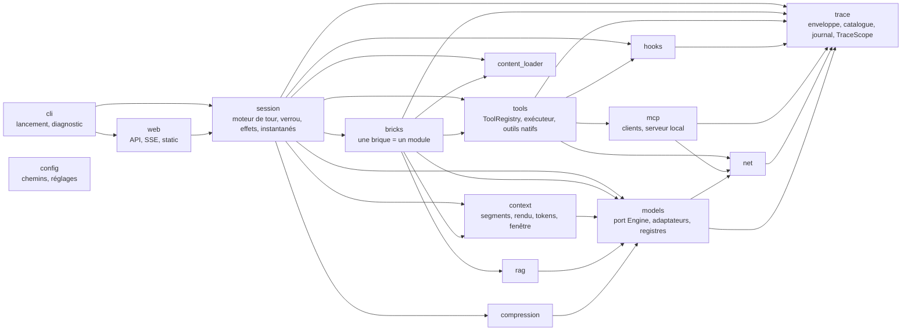
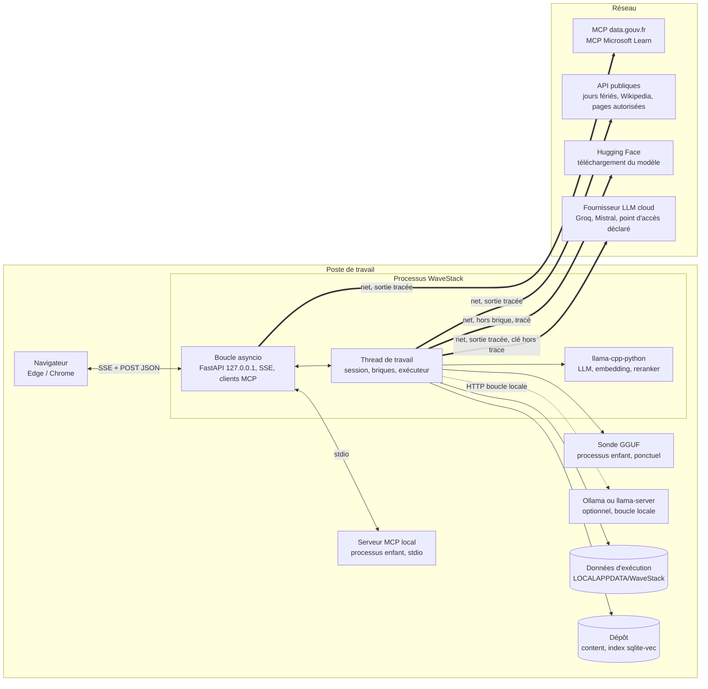
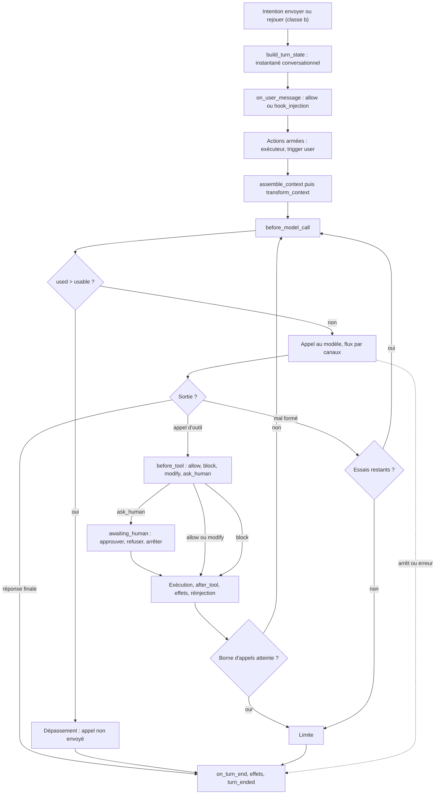

# Architecture Spine — WaveStack

## Design Paradigm

**Moteur de tour à journal d’événements.** Le harnais est une boucle de tour explicite. Tout ce qu’il fait est émis comme **événement de trace** et ajouté en fin de journal. Les cinq volets ne sont que des projections de ce journal, en lecture seule : l’interface ne peut montrer que ce que le harnais a réellement fait.

Les briques sont des modules qui s’accrochent à des points fixes du tour. Elles renvoient des *contributions* (segments, outils) et des *effets* typés ; seule la session les applique. Le modèle, les outils, le MCP et le réseau sont derrière des ports (hexagonal).



Règles de dépendance :
- Les flèches ne remontent jamais, et personne n’importe `web` ni `cli`.
- Une brique n’importe jamais une autre brique.
- Seul `models` importe les bibliothèques d’inférence, et seul `net` crée des clients HTTP.
- `trace` et `config` n’importent rien du projet ; tout module peut les importer.
- Un module émet dans le journal sans recevoir d’émetteur en paramètre, par la `TraceScope` (AD-2).

## Invariants & Rules

### AD-1 — Journal d’événements, interface en projection [ADOPTED]

- **Binds:** FR-1 à FR-4, FR-7, FR-14, FR-22, FR-28, FR-30, FR-41, NFR-8
- **Prevents:** des volets qui affichent un état différent de ce que le harnais a fait ; une interface qui calcule elle-même ce qu’elle n’a pas reçu.
- **Rule:** Toute donnée affichée provient d’un événement du journal ou d’une réponse de lecture de l’API construite à partir du journal (`/api/state`, `/api/architecture`, `/api/diagnostic`).
  - Le front ne recalcule ni tokens, ni contexte, ni disponibilité, ni ventilation de la jauge, ni séparation du raisonnement.
  - Sont permises côté front :
    - la mise en forme ;
    - les écarts entre deux valeurs reçues ;
    - le chronomètre local ancré sur le `ts` d’un `*_started`, que remplace le `duration_ms` du `*_ended`.
  - Un seul magasin de projection côté navigateur consomme tous les événements, que les volets soient visibles ou masqués.

### AD-2 — Enveloppe, catalogue et flux des événements

- **Binds:** tous les modules qui émettent ; le front
- **Prevents:** des formes d’événement incompatibles ; un événement qu’on ne peut rattacher à son appel, son étape ou son nœud ; une reconnexion qui perd des événements.
- **Rule:** L’enveloppe se compose des champs suivants :
  - `{seq, ts, session_epoch, turn_id, context_id, call_id, step_id, parent_step, kind, actor, trigger, brick, component, edge, payload}` ;
  - `seq` est un entier strictement croissant sur toute la vie du processus, jamais remis à zéro. Une réinitialisation émet `session_reset` et incrémente `session_epoch`, ce qui vide les projections ;
  - `ts` est en ISO 8601 à la milliseconde. Les durées (`duration_ms`) sont mesurées avec `time.monotonic()` ;
  - `turn_id`, `context_id`, `call_id`, `step_id`, `component` et `edge` valent `null` hors portée (démarrage, diagnostic, activation d’une brique) ;
  - `actor` (`model`, `harness` ou `user`) indique qui produit l’événement ;
  - `trigger` (`model`, `user`, `harness` ou `hook`) indique qui a causé la chaîne. Il est hérité de l’étape parente, et c’est lui qui porte les badges « déclenché par le modèle » et « forcé par l’utilisateur » ;
  - `component` et `edge` sont des identifiants du schéma (AD-12).

  **Règles du catalogue :**
  - Le catalogue des `kind` et un modèle pydantic par `payload` vivent dans le seul module `trace`.
  - Une story ajoute ses `kind`, mais ne change jamais l’enveloppe.
  - Toute opération qui dure émet une paire `*_started` / `*_ended` sur le même `step_id`. `*_started` porte `phase_label` en français (« Lecture du contexte (1 840 tokens) ») ; `*_ended` porte `duration_ms` et le `status`.
  - Les `kind` fixés dès maintenant sont :
    - `turn_started{replay_of, active_model}` et `turn_ended{status: completed|cancelled|limit|overflow|error}`, émis seulement dans le contexte `main` ;
    - `model_load_started{model: ActiveModel, phase_label}` et `model_load_ended{model, status: ok|restored|error, duration_ms, reason_fr}`, hors tour (`turn_id` et `step_id` nuls), émis par tout chargement de modèle, démarrage compris (CAP-34) ;
    - `session_reset` ;
    - `context_rendered`, `context_preview` (AD-9), `prefix_not_reused{common_tokens, cause}` (AD-4) et `context_reconciled{call_id, segments: [{id, tokens}], usage_source}` avec les champs de jauge d’AD-9 (AD-4, mode chat) ;
    - `context_overflow{used, usable}`, `output_truncated{channel, output_tokens, max_tokens}` et `limit_reached{limit: calls|retries|sub_calls}` (AD-9, AD-10), émis par la session ;
    - `model_call_started`, `model_first_token`, `model_delta{channel: reasoning|text|tool_call, text}` et `model_call_ended` ;
    - `tool_started` et `tool_ended{status: ok|error|blocked|limit|overflow}` ;
    - `hook_decided`, `approval_requested{approval_id}` et `approval_resolved{approval_id, decision}` ;
    - `outbound_request{origin: brick|diagnostic|download|model, method, url, headers: [{name, value, masked}], body}` (AD-15 ; `headers` depuis la story 23, liste vide par défaut pour les événements antérieurs) ;
    - `effect_applied` ;
    - `session_state` ;
    - `architecture_changed` ;
    - `diagnostic_check` ;
    - `harness_error`.
  - `model_delta` transporte du texte UTF-8 complet, regroupé toutes les 50 ms au plus. `model_call_ended{raw_output, reasoning, text, tool_calls, prompt_tokens, output_tokens, prompt_ms, gen_ms, stop_reason: stop|length|cancelled|error}` fait foi, et les projections remplacent les deltas par lui. Il porte aussi `output_tps` et `usage_source: engine|api|estimate`.
    - Dans les deux modes, `prompt_ms` court de l’envoi au premier delta (tous canaux ; en mode chat, « attente du premier token, réseau compris »), `gen_ms` du premier au dernier delta, et `output_tps = output_tokens / (gen_ms / 1000)`, arrondi à l’unité, calculé par la session (`null` si `gen_ms` est nul). Sans `usage`, les tokens de sortie sont estimés comme ceux de l’entrée (AD-4), sur tous les canaux.
    - En mode chat, `raw_output` est la suite des deltas `choices[0].delta` en JSON Lines, et `tool_calls` garde l’identifiant d’origine du fournisseur à côté de celui de la session (AD-4).

  **Portée et flux :**
  - La session pose la portée courante dans une `contextvar` `TraceScope` ; `tools`, `hooks`, `mcp` et `net` émettent sans paramètre. La portée porte aussi `origin` (`brick`, `diagnostic`, `download` ou `model`), posé par l’appelant et lu par `net` ; la session pose `origin = model` dans la portée de chaque appel au modèle. `origin` n’est jamais hérité : l’exécuteur (AD-14) pose `origin = brick` à chaque exécution d’outil. Un passage de thread à boucle copie explicitement la portée (AD-24).
  - Le journal vit en mémoire seulement : un redémarrage le perd.
  - Le flux passe par `fastapi.sse.EventSourceResponse`, avec `id = seq`. La reprise se fait par `Last-Event-ID`.
  - Le front démarre par `GET /api/state` (état courant et dernier `seq`), puis reprend le flux au `seq` suivant.

### AD-3 — Un seul écrivain, un verrou d’opération, trois classes d’intentions

- **Binds:** session, web, bricks, FR-5, FR-7, FR-11, FR-12, FR-32, FR-39, FR-42, FR-43
- **Prevents:** deux chemins de mutation de l’état ; une commande qui modifie l’état en plein tour ou en plein rechargement ; des commandes refusées sans raison ; des actions armées à deux endroits ; une intention du diagnostic refusée dans l’état même où elle sert.
- **Rule:** Seule la `Session` modifie l’état : historique, `wanted` des briques, actions armées, réglages, mémoire globale, `settings.json`, `api_keys.json`.
  - **Verrou d’opération.** La session est toujours dans l’un de ces états : `idle`, `turn`, `awaiting_human`, `model_load`, `download`, `reset` ou `diagnostic`. Elle l’émet par `session_state{state, reason_fr}`, que le front utilise pour désactiver ses commandes en affichant la raison.
    - **Diagnostic.** En diagnostic bloquant, une `Session` minimale existe dans l’état `diagnostic`. Elle accepte les quatre intentions du diagnostic (`select_model`, `download_model`, `set_api_key`, `test_cloud_model`) et refuse toutes les autres.
    - `download_model` et `test_cloud_model` tiennent le verrou pendant leur durée (`download`, ou `model_load` avec la raison « Test de {modèle} »), puis rendent l’état précédent.
    - **Choix du modèle.** En `diagnostic`, `select_model` enregistre le choix puis le charge. Une fois un modèle remis au chargement, `select_model` est un changement à chaud (CAP-34), de classe (b) : accepté en `idle`, même quand `idle` porte une raison (chargement raté, serveur seul), refusé ailleurs. Le passage en `model_load` se fait sous le verrou, dans l’appel qui accepte l’intention. Le budget d’AD-8 est contrôlé avant toute libération : un refus, chiffré, laisse actif le modèle précédent. Puis, sur le thread de travail : libération de l’ancien modèle, sonde d’un GGUF jamais sondé (AD-7), chargement ; en cas d’échec, le modèle précédent est rechargé (`model_load_ended{status: restored}`), et s’il échoue aussi, `idle` avec la raison. Capacités, briques, schéma et aperçu sont réévalués ; la conversation est gardée (AD-17). `selected_model` n’est écrit qu’après un changement réussi. La session refuse `test_cloud_model` et `select_model` d’un modèle cloud sans clé valide (AD-20), avec la raison.
  - **Classes d’intentions** (`POST`, JSON) :
    - **(a) Acceptées à tout moment**, prises en compte au tour suivant : bascule d’une brique ou d’une sous-option, armer ou désarmer une action, enregistrer le prompt système.
    - **(b) Refusées hors `idle`** (et hors `diagnostic` pour les quatre intentions du diagnostic), avec la raison : envoyer, rejouer, changer de modèle (`select_model`), de fenêtre ou de bornes, télécharger un modèle (`download_model`), enregistrer une clé (`set_api_key`), tester un modèle cloud (`test_cloud_model`), modifier la mémoire globale, vider la conversation, lancer un scénario.
    - **(c) Préemptives** : décision H5 (qui porte son `approval_id` ; la première réponse l’emporte), arrêt du tour, réinitialisation (qui vaut arrêt puis réinitialisation).
  - **Actions armées.** Une `ArmedAction{armed_id, kind, brick, target, args}` n’existe que dans la session, et le front projette la puce depuis les événements.
    - Elles sont consommées après `on_user_message` et avant le premier appel au modèle, dans l’ordre d’armement, par l’exécuteur (AD-14), avec `trigger = user`.
    - Une action n’est abandonnée, avec un événement, que si son mode `forced` est indisponible (AD-6). Rendue en injection, elle reste disponible.
    - La liste est vidée en fin de tour, quel que soit le statut.
  - **Réglages.** Un réglage modifié prend effet au tour suivant. Un rechargement refusé (budget, erreur) laisse actifs le modèle et la fenêtre précédents.

### AD-4 — Le contexte : segments typés, rendu par le harnais, tokens attribués exactement en local, estimés puis réconciliés en mode chat

- **Binds:** context, bricks, models, FR-2, FR-8, FR-24, FR-30, FR-32, FR-34, FR-41, FR-43
- **Prevents:** un contexte affiché différent du contexte envoyé ; des totaux qui ne tombent pas juste ; une jauge qui ne sait pas classer un segment ; un historique illisible après un changement de modèle ; un identifiant d’appel d’outil fabriqué à deux endroits ; un front qui recalcule la ventilation après l’appel.
- **Rule:**
  - **Segment.** Un segment est `{id, kind, brick, component, text, tokens, estimated, compressed_from?}`. `context_rendered` porte la liste ordonnée des segments, morceaux de gabarit compris (type `template`) : leur concaténation est exactement le prompt envoyé (en mode chat, le corps JSON envoyé). Le front n’a besoin d’aucun décalage de caractères. Story 32 : cette jointure est le « Texte exact » de Contexte LLM, affiché tel quel ; la lecture groupée ne fait que la mettre en forme.
  - **Sections et « déjà lu » (story 32).** La session regroupe les segments en **sections** : segments consécutifs de même source (`kind`, `brick`), les morceaux de gabarit entre eux absorbés (`template_tokens`), un gabarit non absorbé fusionné avec ses voisins, un segment à libellé propre (celui du fournisseur) toujours seul. Elle compare aussi chaque appel à l’appel précédent **du même contexte dans le même tour** : `seen_segments` est la longueur du préfixe commun de segments, comparés sur (`kind`, `brick`, `component`, `text`) dans l’ordre, et `seen_tokens` leurs tokens ; 0 au premier appel d’un tour. La frontière `seen_segments` coupe toujours les sections. L’interface replie ce préfixe (« déjà lu ») et marque le reste « nouveau » : elle n’additionne ni ne compare rien (AD-1).
  - **Types de segment.** `SegmentKind` est une énumération fermée, dans `context`, dans cet ordre d’empilement de la jauge :
    `system_prompt, global_memory, tool_catalog, skill_catalog, skill_body, history, rag_excerpt, tool_result, subagent_result, hook_injection, user_message, assistant_turn, template`.
    - Leur libellé français est dans `content/`. `user_message` et `template` forment ensemble « Message et gabarit ».
    - `assistant_turn` couvre la sortie du modèle rendue dans les appels suivants du même tour (raisonnement, texte, appel d’outil), ainsi que l’appel fabriqué d’une action forcée, attribué à la brique de l’action.
    - Ajouter un type exige un amendement du spine.
  - **Identifiant d’appel d’outil.** La session attribue un `tool_call_id` à la création de chaque appel (sortie du modèle, sous-agent, action forcée) : les 9 premiers caractères en base 62 du hachage de `"{step_id de l’appel au modèle}#{index dans tool_calls}"` (index 0 pour une action forcée, qui a son propre `step_id`). La session vérifie l’unicité dans le tour (`harness_error` sinon). L’identifiant renvoyé par un fournisseur est remplacé ; l’original reste dans `model_call_ended`. L’assembleur n’en fabrique jamais. Chaque appel **valide** reçoit exactement une réponse d’outil, quelle que soit l’issue : ok, bloqué, refusé ou borne. Une sortie qui contient un appel invalide n’attribue aucun identifiant (AD-10).
  - **Historique.** L’historique est stocké sous forme structurée : messages `{role, content, reasoning, tool_calls: [{id, name, arguments}]}`. `arguments` est une chaîne JSON : celle qu’émet le fournisseur en mode chat, ou celle que la session sérialise une seule fois (parseur local, action forcée). Elle n’est jamais re-sérialisée, et le rendu local la décode pour le gabarit. Il est re-rendu par le gabarit du modèle actif à chaque appel, et tout ce qui vient d’un tour antérieur est de type `history` (`brick = short_memory`). C’est le gabarit qui décide de ce qu’il garde, par exemple le raisonnement des tours précédents, que Qwen3.5 efface. La réponse d’un méta-outil de chargement (AD-25) y est stockée sous forme de talon court (« skill X chargé »), car son contenu a rejoint son emplacement stable.
  - **Source de vérité.** Le `TurnState`, figé par `build_turn_state` (AD-17), est la seule source des emplacements stables pour tous les appels du tour. Mémoire globale, skills et documentations y sont lus au début du tour. Ce qui est chargé ou écrit pendant le tour va dans `loaded_in_turn` : l’exécuteur le lit (AD-25), et l’assembleur ne s’en sert que pour les réponses d’outil.
  - **Emplacements.** Une table unique dans `context`, indexée par (type, phase `stable` ou `turn`), fixe l’emplacement de chaque segment dans le gabarit :
    - message système (`stable`) : `system_prompt`, `global_memory`, `skill_catalog`, `skill_body` ;
    - variable `tools` (`stable`) : `tool_catalog`, un segment par outil, rattaché à la brique qui le déclare ;
    - messages de l’historique ;
    - message utilisateur du tour : `hook_injection`, `rag_excerpt`, `user_message`, puis le résultat d’une action forcée rendue en injection (`tool_result` de la brique de l’action) ;
    - dans le tour (`turn`) : messages de l’assistant (`assistant_turn`) et réponses d’outil (`tool_result`, `subagent_result`, et, pour les méta-outils, `skill_body` et `tool_catalog`) ; l’erreur réinjectée d’un appel mal formé est un `tool_result`.

    Les segments stables précèdent les variables.
  - **Rendu.** Le gabarit est `tokenizer.chat_template` du modèle. Il est rendu dans un `ImmutableSandboxedEnvironment(trim_blocks=True, lstrip_blocks=True)` configuré comme transformers :
    - extensions `loopcontrols`, plus une extension `generation` sans effet ;
    - filtre `tojson(x, ensure_ascii=False, indent=None, separators=None, sort_keys=False)` ;
    - globales `raise_exception` et `strftime_now` ;
    - variables `messages`, `tools`, `add_generation_prompt`, `bos_token`, `eos_token`, et `enable_thinking` si le registre le prévoit (AD-6).

    Un test de non-régression compare le rendu Qwen3.5 à une chaîne de référence (outils, accents, apostrophe).
  - **Attribution des tokens.** L’algorithme, dans `context/render.py`, est normatif :
    1. **Prompt envoyé.** C’est toujours le rendu du gabarit avec les vraies valeurs, jamais une reconstruction.
    2. **Normalisation.** À l’assemblage, chaque texte de segment (hors `template`) perd ses blancs de tête et de fin, ainsi que tout caractère de la zone privée Unicode. Toute chaîne qui correspond à un token spécial du vocabulaire (`<|im_start|>`…) y est neutralisée, avec un événement : un contenu non fiable ne peut pas injecter de structure.
    3. **Rendu d’attribution.** Un second rendu, avec les mêmes valeurs, encadre chaque texte de segment **non vide** de sentinelles de la zone privée Unicode (U+E000 à U+E002 et l’index du segment). Un texte vide ne reçoit pas de sentinelles et ne produit pas de segment. Pour un outil de la variable `tools`, les sentinelles encadrent les chaînes de sa définition.
    4. **Contrôle du texte.** Une fois les sentinelles retirées, le rendu d’attribution doit être égal au prompt envoyé, octet pour octet. Sinon, `harness_error` « attribution approximative » est émis, le texte non localisé va à `template`, et le prompt envoyé ne change pas.
    5. **Découpage.** Le prompt est découpé en segments ordonnés et disjoints ; les morceaux hors sentinelles sont des segments `template`. Les segments ne s’imbriquent jamais : un segment englobant est coupé en morceaux disjoints, de même type, brique et composant, avec chacun son `id`.
    6. **Tokens.** Le prompt entier est tokenisé une seule fois. `Engine.token_pieces(ids)` (AD-5) donne les octets de chaque token, et le harnais vérifie que `b"".join(pieces) == prompt.encode("utf-8")` ; sinon, `harness_error`. Les décalages se cumulent en octets, et chaque token est attribué au segment qui contient son premier octet.

    La somme est égale au total par construction. Le moteur factice le vérifie. Le test de non-régression Qwen3.5 vérifie les contrôles 4 et 6, sur ces cas : un assistant à contenu vide qui appelle un outil, `load_tool_doc` avec deux serveurs, et un token de 128 espaces.
  - **Mode chat (moteur `openai_chat`).**
    - **Corps.** Les segments sont assemblés par la même table d’emplacements. Au lieu du rendu Jinja, `context`, seul écrivain du corps, construit le **corps complet** : `model`, `messages`, `tools`, `stream`, la limite de sortie sous le nom déclaré (`max_tokens_field`), `stream_options.include_usage` si l’entrée déclare `stream_usage`, et les paramètres `reasoning.on` ou `reasoning.off` que la brique raisonnement a contribués au `TurnState` (AD-6). Rien d’autre. Il le sérialise une seule fois (`json.dumps(ensure_ascii=False, separators=(",", ":"))`). `context_rendered.body` porte cette chaîne UTF-8, et les octets envoyés sont `body.encode("utf-8")`.
    - **Découpage.** Le corps est découpé par la méthode des sentinelles (étapes 3 à 5), appliquée aux chaînes JSON. La syntaxe JSON donne des segments `template` à 0 token. La concaténation des segments est égale au corps envoyé.
    - **Normalisation.** L’étape 2 retire les blancs de tête et de fin et la zone privée Unicode, et neutralise une liste de marqueurs de gabarit courants (`<|…|>`, `[INST]`…) déclarée dans `wavestack.toml`.
    - **Emplacements propres au mode chat :**
      - le raisonnement n’est renvoyé au fournisseur que si l’entrée déclare `reasoning.resend` (Mistral le demande pour ses blocs `thinking`) : il part alors dans la forme reçue et il est compté (`assistant_turn` ou `history`). Sinon, il n’a pas de segment ;
      - un appel d’outil part en `assistant.tool_calls` (identifiant de la session, `arguments` en chaîne), suivi de sa réponse `role: tool` ; `content` est omis s’il est vide ;
      - un appel mal formé part en message `assistant` dont `content` est la sortie brute définie par AD-10, suivi d’un message `user` qui porte l’erreur réinjectée.
    - **Estimation.** Chaque segment porte `estimated = true` et `tokens = ceil(caractères du texte d’origine / chars_per_token)`, réglable dans `wavestack.toml`. Un segment `template` sans texte, libellé « Gabarit appliqué chez le fournisseur (estimé) », porte l’écart.
    - **Avant l’envoi**, le total vaut la somme des estimations × `ratio`, réparti par la même règle qu’après l’appel. Le `ratio` est le dernier `usage.prompt_tokens / somme des estimations` d’un **appel réel** (jamais du test), borné à [0,8 ; 1,5], initialisé par `estimate_ratio` de `wavestack.toml`, et tenu par (modèle, `main` ou `sub`) : tous les `sub{n}` partagent le même.
    - **Dépassement en mode chat.** Il n’est bloquant (AD-9) que si la somme brute des estimations dépasse `usable`. Si seul le total corrigé dépasse, l’appel part avec l’avertissement « estimation incertaine », et le 400 « contexte dépassé » du fournisseur fait foi (AD-16).
    - **Après l’appel**, `usage.prompt_tokens` fait foi pour le total. La session émet `context_reconciled`, avec les mêmes champs de jauge que `context_rendered` (AD-9). L’écart réel va au segment « chez le fournisseur » ; s’il est négatif, les estimations sont réduites en proportion (arrondi par plus forts restes) et l’écart vaut 0. La somme est égale au total. Les projections remplacent segments et ventilation de `context_rendered` par ceux-ci, et le front n’additionne ni ne répartit rien. Sans `usage` (annulation, erreur), aucun `context_reconciled` n’est émis.
    - Le contrôle d’ajout seul ne s’applique pas.
    - L’interface marque « ≈ » toute valeur `estimated`, et le total sauf quand `usage_source = api` : c’est un matériau pédagogique (un harnais cloud compte sans tokenizer local).
  - **Ajout seul pendant un tour.** Le rendu du gabarit fait foi, et l’ajout seul est un contrôle, pas une hypothèse. La session compare les ids de l’appel n+1 à ceux de l’appel n suivis de sa sortie. Si le préfixe commun est plus court, elle émet `prefix_not_reused{common_tokens, cause: in_turn}`, et la relecture s’explique dans la trace. Le test de non-régression Qwen3.5 couvre un tour à deux appels.
  - **Ajout seul d’un tour à l’autre (mode local, lot A).** Un modèle hybride (Qwen3.5) ne sait pas tronquer son cache : toute divergence avec les ids en cache coûte une relecture complète. L’historique est donc rendu **tel qu’il a été produit** : quand le gabarit retire le bloc de raisonnement des réponses passées (`reasoning_wrap`, déduit du gabarit par des rendus sonde), la session l’écrit elle-même, avec les textes du gabarit en segments `template` (littéraux du harnais, jamais neutralisés), la réflexion (vide ou non) et le texte en `history`, et `reasoning_content = ""`. Le prompt reste le rendu du vrai gabarit. Au **premier appel de chaque tour**, la session compare les nouveaux ids aux ids que le moteur a en cache pour le contexte `main` (`cached_ids()` du moteur, sinon ids envoyés suivis de la sortie). S’ils n’en sont pas le préfixe, elle émet `prefix_not_reused{common_tokens, cause}`, avec `cause` : `reset` (conversation vidée, scénario, réinitialisation), `replay`, `abandoned` (tour précédent non `completed`), `subagent` (contexte d’un sous-agent en cache), sinon selon le segment du premier octet divergent : `system` (message système, mémoire, catalogues, skills), `history` ou `template`. Les extraits RAG, les talons de documentation et la compression réécrivent l’historique par conception : la relecture se voit (`history`). `model_call_ended.evaluated_tokens` donne les tokens de prompt réellement évalués par le moteur (`null` s’il ne le sait pas).
  - **Étape `transform_context`.** Elle est appelée par la session avant chaque appel du tour, sur les parties que cet appel est le premier à lire : avant le premier appel, les extraits RAG et les réponses des actions forcées ; avant chaque appel suivant, les réponses d’outils arrivées depuis le précédent. Chaque texte y passe une seule fois, et ce qu’un appel a déjà lu n’est jamais réécrit : l’ajout seul tient. C’est là que s’applique la compression (AD-22). *Décision provisoire, à valider (story 20, H-1) : la règle initiale limitait l’étape au seul premier appel, ce qui excluait les réponses d’outils demandées par le modèle.*

### AD-5 — Le port moteur reçoit une requête entièrement construite par le harnais, rien de plus

- **Binds:** models, FR-32, FR-34, FR-43
- **Prevents:** un adaptateur qui ajoute des tokens, des messages ou des champs à la requête ; deux « corps exacts » différents pour un même appel ; un serveur qui tronque le prompt en silence ; un préréglage qui échoue dès le premier appel.
- **Rule:** Le port `Engine` est synchrone : `complete(request: RenderedPrompt | ChatBody, cancel) → flux de fragments`, `tokenize(str) → ids`, `token_pieces(ids) → list[bytes]`, `metadata()`, `close()`.
  - `RenderedPrompt{ids | text, stop, max_tokens}` sert aux adaptateurs de texte rendu ; `ChatBody{body: bytes}` à `openai_chat` (AD-4, mode chat).
  - **`llama_cpp`** (en processus, par défaut) : reçoit les ids tokenisés par le harnais. `tokenize` encode en UTF-8 et appelle `tokenize(..., add_bos=False, special=True)`. `token_pieces` appelle `llama_cpp.llama_token_to_piece(..., special=True)` et réagrandit le tampon quand le retour est négatif. `Llama.detokenize` est interdit ici, car son tampon de 32 octets tronque sans erreur.
  - **`llama_server`** (`/completion`) : reçoit également les ids. Son tokenizer vient de `/tokenize`, et `token_pieces` de `/tokenize` avec `with_pieces: true`.
  - **`ollama_raw`** (`/api/generate`, `raw: true`) :
    - reçoit la chaîne et envoie toujours `options.num_ctx`, égal à la fenêtre effective ;
    - si le `prompt_eval_count` renvoyé diffère du compte du harnais, un événement `harness_error` « transparence réduite » est émis ;
    - son tokenizer et `token_pieces` viennent du GGUF ouvert en `vocab_only`, soit environ 80 Mo, comptés par AD-8, avec le même code que `llama_cpp`.
  - **`openai_chat`** (`POST {base_url}/chat/completions`, en streaming) :
    - reçoit le `ChatBody` et l’envoie octet pour octet ; il ne pose que deux en-têtes, `Content-Type: application/json` et l’en-tête d’authentification. `metadata()` déclare `input: chat`, et `tokenize` et `token_pieces` sont indisponibles. Un test vérifie que le corps envoyé est égal à `context_rendered.body` et au corps d’`outbound_request` du même `call_id` ;
    - le client HTTP vient de `net` (AD-15). La clé vient de `config.cloud_key(entry)` seulement (AD-20), et elle est placée, requête par requête, dans l’en-tête déclaré par l’entrée (`Authorization: Bearer` par défaut ; Azure par son API v1 seulement, `base_url` en `…/openai/v1`, `Bearer`) ;
    - **usage** : lu dans le dernier fragment qui porte `usage`, sinon `x_groq.usage` ; à défaut, `usage_source = estimate`. Un fragment sans `choices` (Azure) ne sert qu’à l’usage ;
    - **canaux** : `delta.content` est une chaîne ou une liste de blocs ; un bloc `thinking` va au canal `reasoning`, un bloc `text` au canal `text`. Les champs `reasoning` et `reasoning_content` vont au canal `reasoning`. Pour `reasoning.format = think_tags`, le séparateur d’AD-6 retire les balises `<think>` du texte ;
    - **appels d’outils** : les fragments `tool_calls` s’accumulent par `index`, sinon par `id`, et tous les éléments d’un delta sont lus ;
    - **fin** : `finish_reason` `stop` et `tool_calls` → `stop`, `length` → `length`, `content_filter` et tout autre → `error`. Un code HTTP d’erreur, un objet `error` ou une ligne non SSE reçus après un 200 terminent l’appel par `stop_reason: error` (AD-16), sauf `tool_use_failed`, en 400 ou dans le flux, qui suit la voie de l’appel mal formé (AD-10). L’annulation ferme le flux.
  - Les autres adaptateurs reçoivent toujours du texte rendu.
  - Les adaptateurs streament toujours en interne et testent le `CancelToken` à chaque fragment.

### AD-6 — Registre des capacités par famille de modèle

- **Binds:** models, bricks, FR-9, FR-13, FR-15, FR-33, FR-43
- **Prevents:** un parseur d’appels d’outils ou un repérage du raisonnement improvisés par chaque brique ou par le front.
- **Rule:** Le registre associe à chaque famille (détectée par `general.architecture` et le gabarit) :
  - son `tool_call_parser` (par exemple le XML `qwen3_coder`) ;
  - ses `stop_sequences` ;
  - un **séparateur incrémental** qui répartit le flux en canaux `reasoning`, `text` et `tool_call` ;
  - sa variable de raisonnement ;
  - sa taille de contexte native.

  Pour une famille inconnue, les données sont lues dans le GGUF. Un GGUF sans `chat_template` est « incompatible », avec la raison. Le registre est réévalué à chaque changement de modèle.
  - **Modèle cloud.** Il n’a pas de fichier. Ses capacités (`tools`, `reasoning`, `context`) sont **déclarées** dans son entrée `[[cloud.models]]` (AD-20). Son parseur d’appels d’outils est le format structuré de l’API. Une capacité non déclarée est absente.
    - **Raisonnement.** La brique raisonnement contribue au `TurnState` les paramètres `reasoning.on` ou `reasoning.off` de l’entrée ; `context` les écrit dans le corps (AD-4). Si `reasoning.always` est vrai, la réserve est celle du raisonnement même brique éteinte, et la brique s’affiche « toujours active pour ce modèle », avec sa raison. Un delta de raisonnement reçu est toujours affiché dans son canal.
    - **Sans `tools` déclaré**, le mode `model` est indisponible. Le mode `forced` reste disponible, rendu en injection (segment `tool_result` dans le message de l’utilisateur, AD-4), avec sa raison.
    - Le raisonnement caché par un fournisseur (compté en sortie, jamais transmis) est ignoré en V1.
  - **Disponibilité par mode.** Elle se calcule par mode d’action : `model` (décidée par le modèle), `forced` (forcée par l’utilisateur) et `injection` (contenu mis dans le contexte). Sans parseur connu, le mode `model` est indisponible, avec sa raison, mais `forced` et `injection` restent disponibles. Ce calcul a lieu au point unique d’AD-12.

### AD-7 — Découverte des modèles, et sonde avant le premier chargement

- **Binds:** models, diagnostic, FR-34, FR-37, UJ-3, NFR-8
- **Prevents:** plusieurs logiques de recherche de fichiers ; le lancement d’Ollama pour lire ses modèles ; un GGUF inconnu qui fait planter le processus en pleine session.
- **Rule:**
  - **Candidats.** Une seule fonction de découverte liste les candidats :
    - fichier saisi ;
    - dossier `models/` d’AD-20 ;
    - cache Hugging Face (`HF_HUB_CACHE`, `HF_HOME`, sinon `~/.cache/huggingface/hub`, `snapshots/*/*.gguf`) ;
    - LM Studio (`~/.lmstudio/models`, puis `~/.cache/lm-studio/models`) ;
    - Ollama (`OLLAMA_MODELS`, sinon `~/.ollama/models`) : on lit les manifestes, et la couche `application/vnd.ollama.image.model` est un GGUF chargeable en processus. Une couche `image.tensor` est listée « incompatible », avec la raison ;
    - serveurs déjà lancés, aux adresses de boucle locale configurées (défaut `127.0.0.1:11434` et `127.0.0.1:8080`), sondés sans jamais être lancés.
  - **Sonde.** Un GGUF qui n’a jamais été chargé avec succès est d’abord ouvert dans un processus enfant (`sys.executable -m wavestack.models.probe`). La sonde fait un chargement complet, lit l’architecture et le gabarit, et mesure la mémoire résidente.
    - Un succès est mémorisé dans `settings.json` (chemin, taille, date de modification).
    - Un échec rend le fichier « incompatible », avec la raison.

### AD-8 — Budget mémoire mesuré et registre de chargement

- **Binds:** models, rag, compression, mcp, FR-32, NFR-2, FR-43
- **Prevents:** des composants qui se chargent sans se voir ; un dépassement de budget découvert trop tard ; deux modèles génératifs en mémoire.
- **Rule:** Tout composant lourd passe par le `LoadRegistry` : modèle, tokenizer `vocab_only`, embedding, reranker, compresseur, modèle d’un serveur externe.
  - **Un seul modèle génératif (NFR-2).** Charger un modèle génératif, en processus ou servi, libère d’abord le précédent. Les composants non génératifs (tokenizer, embedding, reranker, compresseur) coexistent avec lui dans le budget.
  - **Refus.** Le registre refuse le chargement quand `RSS mesuré (psutil) de WaveStack et de ses processus enfants + coût estimé` dépasse le budget configuré (4 Go par défaut). Le message en français est chiffré.
  - **Estimation du coût.** Elle vaut la mesure de la sonde (AD-7, `rss_bytes`) quand elle existe, sinon la taille du fichier ; plus le cache KV à la fenêtre (`kv_bytes_per_token` lu par la sonde dans les métadonnées GGUF, 0 si inconnu) ; plus une marge (`[memory] budget_mb = 4096`, `load_margin_mb = 256`). Au changement de modèle, le contrôle vaut `RSS − coût du modèle actif + coût du nouveau > budget`, avant toute libération (AD-3).
  - **Cycle de vie.** Un composant se charge à l’activation de sa brique et se libère (`close()`) à sa désactivation.
  - **Mode serveur.** Le modèle en processus est libéré, et la mémoire du modèle servi est comptée : `/api/ps` pour Ollama, taille du fichier pour llama-server. En quittant Ollama, l’adaptateur envoie `keep_alive: 0`.
  - Le diagnostic affiche la même mesure.
  - **Modèle cloud.** Son coût mémoire est nul. Quand il devient le modèle actif (AD-3), le modèle local n’est pas chargé, ou il est libéré ; les composants locaux (embedding, reranker) restent comptés.

### AD-9 — Fenêtre de contexte, réserve de sortie, jauge et aperçu

- **Binds:** context, models, FR-41, NFR-1, NFR-8, FR-21, FR-38, FR-43
- **Prevents:** une jauge calculée sur la taille native, ou qui affiche 95 % sur un appel déjà refusé ; un appel qui déborde envoyé quand même ; une jauge qui ne bouge qu’après l’envoi.
- **Rule:**
  - **Fenêtre effective** = min(fenêtre configurée, contexte natif, contexte du serveur). La fenêtre configurée vaut **4 096 tokens par défaut** et se règle dans l’interface et dans la configuration ; un changement recharge le modèle (classe b).
    - **Modèle cloud** : min(`window` de l’entrée, sinon fenêtre configurée ; `context` ; `tpm // 2`). Un changement de fenêtre ne recharge rien et prend effet au tour suivant ; le réglage est désactivé si `window` est déclaré, avec la raison. Une entrée dont `tpm // 2` ne dépasse pas la plus grande réserve (1 536) est indisponible, avec la raison.
    - Les événements de jauge portent `window_source: configured|native|server|tpm|override`.
    - **Quota par minute.** Un fournisseur compte `prompt + max_tokens` par appel, et chaque appel tient dans la fenêtre. Avec un plafond de `tpm // 2`, un tour avec un appel d’outil (deux appels) tient donc dans la minute : 4 000 tokens pour Groq gpt-oss-120b (8 000 par minute).
    - Au-delà, le 429 en plein tour est assumé comme matériau pédagogique : erreur expliquée (AD-16), sans attente déduite des en-têtes ni nouvel essai. Seul l’espacement déclaré `min_interval_s` (AD-16) retarde un envoi.
  - **Réserve de sortie** : 512 tokens, ou 1 536 quand la brique raisonnement est active. `usable = fenêtre − réserve`. Chaque appel est envoyé avec `max_tokens = réserve`.
  - **Dépassement.** Si le contexte dépasse `usable`, l’appel n’est pas envoyé : `context_overflow`, puis `turn_ended{status: overflow}`.
  - **Sortie coupée.** Quand `model_call_ended.stop_reason = length`, la session émet `output_truncated`, avec le canal en cours.
    - Dans le raisonnement ou le texte, le tour se termine par `turn_ended{status: limit}` et n’entre pas dans l’historique (AD-17).
    - Dans un appel d’outil, il suit la voie de l’appel mal formé (AD-10).
  - **Sous-agent.** Dans un contexte `sub{n}`, un dépassement ou une sortie coupée terminent la délégation, pas le tour (AD-11).
  - **Calcul côté session.** `context_rendered` porte `window`, `window_source`, `reserve`, `usable`, `used`, `percent = used / usable`, `near_limit` (seuil 0,8, défini dans `wavestack.toml`), `overflow` et la ventilation par type de segment, tous calculés par la session. Story 33 : chaque segment et chaque groupe de la ventilation portent aussi `discipline` (`prompt|context|harness|neutral` : la catégorie de la brique du segment ; pour un groupe, la discipline qui porte le plus de tokens parmi ses segments, la première dans l'ordre du contexte à égalité ; `neutral` sans brique ou pour une brique inconnue), et la charge porte `by_brick: [{brick, tokens, estimated}]`, les tokens de chaque brique dans l'ordre d'apparition, sans les segments hors brique ; les cartes de brique les lisent, le front n'additionne rien (AD-1). Story 32 : la même fonction porte `sections: [{start, end, kind, label_fr, brick, discipline, tokens, template_tokens, estimated, seen}]` (index dans `segments`, `end` exclu ; Σ `sections.tokens` = `used`), `seen_segments` et `seen_tokens` (AD-4), calculés par `context_sections` et `seen_prefix` ; `context_reconciled` garde le `seen_segments` de son `context_rendered`, tokens recalés. Une seule fonction produit ces champs pour `context_rendered`, `context_preview` et `context_reconciled`.
  - **Aperçu.** Après chaque changement de configuration, la session émet `context_preview`, avec les mêmes champs et `turn_id = null`. Il est calculé sans message ni extraits RAG. La jauge l’affiche comme « prochain tour ».
  - **Scénarios fournis.** Chaque scénario déclare `expects_overflow`. Un test pytest marqué `model` rend, avec le tokenizer du modèle par défaut (GGUF ouvert en `vocab_only`), le contexte du premier appel du scénario, puis vérifie qu’il tient, ou qu’il déborde si le drapeau le demande. Le test est sauté si le GGUF est absent. Ce contexte comprend :
    - le premier prompt suggéré ;
    - les briques du scénario, et la réserve qui découle de sa brique raisonnement ;
    - les extraits RAG, comptés à leur maximum déclaré ;
    - les outils MCP, lus dans l’instantané versionné `content/mcp_snapshots/{server_id}.json`.

    En direct, si `tools/list` s’écarte de l’instantané de plus du seuil défini dans `wavestack.toml`, un avertissement est émis. Dans l’application, le `context_preview` émis au lancement d’un scénario montre le même résultat.
  - **Cas du module MCP.** La documentation complète s’y illustre avec Microsoft Learn. data.gouv.fr en documentation complète est le dépassement volontaire, qui mène au lazy loading. Le scénario Souveraineté (FR-40) utilise data.gouv.fr en lazy loading.
  - **Valeur définitive.** Elle est fixée après le banc de mesure du poste de référence : la plus grande fenêtre dont la lecture à froid tient en 30 s.

### AD-10 — Bornes de la boucle de tour

- **Binds:** session, FR-15, FR-29, FR-42, NFR-8, FR-43
- **Prevents:** des compteurs différents selon la brique ; une boucle infinie ; des bornes rattachées à une brique qu’on peut éteindre.
- **Rule:** La boucle agent appartient au cœur de la session, pas à une brique.
  - **Bornes par défaut :**
    - 6 appels au modèle par tour dans le contexte principal ;
    - 2 nouveaux essais par tour après un appel mal formé, comptés dans les 6 ;
    - 4 appels pour le sous-agent, sur un compteur propre ; sa délégation compte pour 1 dans le tour principal.
  - Une action forcée ne consomme pas d’appel.
  - **Appel mal formé.** C’est une sortie que le parseur ne sait pas lire, un outil inexistant, une sortie coupée dans un appel d’outil (AD-9), et, en mode chat, des `arguments` qui ne sont pas du JSON valide ou le refus `tool_use_failed` du fournisseur. Il suit la voie du nouvel essai, jamais la fin du tour en erreur.
    - En mode chat, si une sortie contient au moins un appel invalide, toute la sortie suit cette voie : aucun appel n’est exécuté ni ne reçoit d’identifiant.
    - La sortie brute réinjectée est `failed_generation` s’il existe, sinon `content` suivi, pour chaque appel, de `name` et de la chaîne `arguments` telle qu’émise ; jamais `raw_output`.
  - Les bornes sont des réglages de session, modifiables dans l’interface (affichées sur la carte de la brique outils) et dans la configuration.
  - Atteindre une borne du contexte principal émet `limit_reached{limit}`, puis `turn_ended{status: limit}`. Pour la borne `sub_calls`, voir AD-11.

### AD-11 — Sous-agent : même modèle, contexte minimal, pas un tour

- **Binds:** session, bricks, FR-29, NFR-1, NFR-2, FR-43
- **Prevents:** une seconde instance du modèle ; des identifiants en collision ; un sous-agent qui hérite de tout le contexte principal et perd l’économie montrée.
- **Rule:** Le sous-agent utilise la même instance du moteur, séquentiellement, avec `context_id = sub{n}` (numéroté par session). Ce n’est pas un tour.
  - **Hooks.** Il déclenche `before_model_call`, `before_tool` et `after_tool`, jamais `on_user_message` ni `on_turn_end`.
  - **Contexte.** Une brique déclare `contributes_to` (`main` seul par défaut). Le contexte du sous-agent contient :
    - le gabarit ;
    - un prompt système du sous-agent, dans `content/` ;
    - la tâche ;
    - les outils listés par la brique sous-agent (lecture de page web par défaut).

    AD-9 s’y applique, avec son propre événement de dépassement.
  - **Résultat.** Seul le résultat entre dans le contexte principal, en `subagent_result`.
  - **Échec de la délégation.** Un dépassement, une sortie coupée ou la borne `sub_calls` émettent leur événement avec `context_id = sub{n}`, puis `tool_ended{status: limit|overflow}` de `delegate`. Une issue de fournisseur (AD-16) émet `harness_error` avec `context_id = sub{n}`, puis `tool_ended{status: error}`. Le résultat réinjecté est une erreur en français, et le tour principal continue. `turn_ended` n’est jamais émis depuis un sous-contexte.
  - **Contexte principal (N2, lot A, fait).** La session copie l’état du moteur avant le sous-agent (`Engine.snapshot()`, pour llama-cpp-python l’état llama.cpp et les ids en cache, sans la copie des logits) et le restaure au retour (`Engine.restore()`) : le premier appel principal qui suit n’évalue que ses tokens nouveaux. `subagent_ended` porte la taille de la copie (`state_saved_bytes`) et la durée de restauration (`state_restore_ms`). Un moteur sans état (llama-server, Ollama), ou une copie ou une restauration en échec, laisse le tour continuer : le contexte principal est relu, et `prefix_not_reused{cause: subagent}` le dit. En mode chat, il est toujours renvoyé en entier, et aucune préservation d’état n’est tentée.

### AD-12 — Contrat de brique, disponibilité et schéma dérivés

- **Binds:** bricks, session, web, FR-3, FR-5, FR-6, FR-20, FR-33, FR-43
- **Prevents:** des raisons d’indisponibilité divergentes ; des identifiants de nœuds incompatibles ; un schéma maintenu à la main ; un changement de modèle qui efface les choix de l’utilisateur.
- **Rule:**
  - **Déclaration.** Chaque brique déclare :
    - `id` et catégorie (`prompt`, `context` ou `harness`) ;
    - groupe du panneau (`reads`, « Ce que le modèle lit », ou `acts`, « Ce que le harnais fait » ; story 33), distinct de la catégorie et émis dans `bricks_changed` ; l'ordre de la déclaration reste l'ordre d'affichage, tous les `reads` avant les `acts` (vérifié au chargement) ;
    - dépendances et capacités exigées ;
    - besoin de réseau ;
    - `contributes_to` ;
    - ses composants `{id: "{brick}.{component}", kind, hosting: local_process|local_file|network_service, edges_to}`, ce qui inclut les hooks H1 à H5 comme composants de la brique hooks.

    Les nœuds fixes sont réservés : `core.harness`, `core.model`, `core.model_sub`, `file.memory`, `file.audit`, `file.demo_dir`, `file.rag_index`. L’unicité des identifiants est vérifiée au chargement. `core.model` et `core.model_sub` prennent `hosting = network_service` quand le modèle actif est cloud. Ils sont alors dessinés en zone Réseau avec le nom du fournisseur, et les arêtes `core.harness → core.model` et `core.harness → core.model_sub` portent `crosses_boundary`.
  - **Modèle actif.** `/api/state` et `session_state` portent `active_model{id, label, hosting, provider, disclosure}`, construit par la session à partir du fichier ou de l’entrée cloud. C’est la seule source de l’indicateur de modèle et de son infobulle.
  - **État d’une brique.** Il vaut `wanted` (choix de l’utilisateur ou du scénario ; un changement de modèle ne le modifie jamais) et `available` (calculé en un seul point de la session, par mode d’action selon AD-6, avec sa raison en français). L’état effectif est `wanted ∧ available`.
  - **État d’un composant réseau.** Il vaut `not_contacted`, `available` ou `unavailable`, avec sa raison. Un serveur MCP public est `not_contacted` tant que sa sous-option n’est pas activée (AD-15). Story 34 : le nœud réseau (outil ou serveur MCP public) porte aussi `sends_fr`, ce que le harnais y envoie, en français (« le titre de l'article »), tiré de `content/tools.yaml` ou `content/mcp.yaml` (AD-19) ; le bilan des sorties sous le schéma le cite, l'interface ne sait pas ce qu'envoie chaque outil (AD-1).
  - **Schéma.** La session dérive le schéma et émet `architecture_changed{nodes, edges}` : zone locale ou réseau, disponibilité et raison, enfants (outils d’un serveur, détail d’un skill), arêtes avec `crosses_boundary`. `GET /api/architecture` en donne le dernier état.
    - Un composant est dessiné dès que sa brique est `wanted`, même indisponible.
    - Les événements d’activité portent `component` et `edge`.
  - **LLM nu.** Toutes briques éteintes, le tour est exactement celui du LLM nu.

### AD-13 — Points d’accroche du tour et hooks

- **Binds:** session, hooks, FR-26 à FR-28, FR-43
- **Prevents:** des hooks qui écrivent eux-mêmes ; des décisions au vocabulaire ou aux effets divergents ; une injection de hook invisible dans le contexte.
- **Rule:**
  - **Points d’accroche fixes :** `assemble_context`, `transform_context`, `on_user_message`, `before_model_call`, `before_tool`, `after_tool`, `on_turn_end`.
  - **Signature.** Un hook a la forme `hook(ctx: HookContext) -> HookResult{decision, detail_fr, effects}`. `HookContext` est une vue en lecture seule : point d’accroche, portée, appel d’outil résolu, événements du tour.
  - **Décisions permises par point d’accroche :**
    - `on_user_message` : `allow`, ou `modify`, qui ajoute un segment `hook_injection` sans jamais réécrire le message ;
    - `before_tool` : `allow`, `block`, `modify` (qui remplace les arguments) ou `ask_human` ;
    - `before_model_call` et `on_turn_end` : `allow` ou `block` ;
    - `after_tool` : `allow`, avec des effets.
  - **Validation humaine.** Sur `ask_human`, la session passe en `awaiting_human` et émet `approval_requested{approval_id, tool, destination, preview}`. Elle attend alors une intention de classe (c), sans délai d’expiration. Un refus est réinjecté dans le contexte ; un arrêt résout l’attente en `cancelled`.
  - Toute décision est émise avec `actor = harness`.
  - H5 porte sur les outils. Il ne s’applique pas à l’appel au modèle cloud : l’avertissement confirmé au choix du modèle en tient lieu (AD-21).

### AD-14 — Registre et exécuteur d’outils uniques, outils locaux confinés

- **Binds:** tools, mcp, bricks, FR-13 à FR-15, FR-21, FR-22, FR-27, FR-42, NFR-4
- **Prevents:** une collision de noms entre outils natifs et MCP ; un hook qui compare des noms ; un contournement des hooks ; la lecture de tout le disque quand H1 est désactivé.
- **Rule:**
  - **Registre.** Le `ToolRegistry` est le seul à attribuer les noms exposés au modèle : outil natif ou méta-outil = nom nu, outil MCP = `{server_id}__{tool}`. En cas de collision, l’outil est indisponible, avec un événement.
  - **Description d’un outil.** Chaque outil déclare :
    - `source` : `native`, `harness`, `mcp_local` ou `mcp_public` ;
    - `hosting` et `component` ;
    - `network: bool` ;
    - `reads_local_path` : le nom de l’argument qui contient un chemin, ou `null` ;
    - `preview_request(args) → {method, url, body}` pour tout outil réseau. Pour un outil MCP, l’exécuteur construit lui-même le corps `tools/call`.
  - **Exécuteur unique.** Tout appel passe par un seul exécuteur, qu’il vienne du modèle, du sous-agent ou d’une action forcée : `before_tool`, exécution, `after_tool`, réinjection. Un appel mal formé ou inexistant produit un événement et une réaction (nouvel essai, erreur réinjectée ou arrêt).
  - **Hooks.** Ils comparent des drapeaux et des arguments résolus :
    - H1 bloque tout outil `reads_local_path` dont le chemin résolu est dans le sous-dossier confidentiel ;
    - H5 s’applique à tout outil `network = true`.
  - **Confinement, toujours actif, indépendant des hooks :**
    - `read_file` résout le chemin et refuse tout ce qui sort de `content/demo_files/` ;
    - la calculatrice évalue par `ast`, avec une liste blanche d’opérateurs, jamais par `eval` ;
    - un test couvre chaque cas.

### AD-15 — Sorties réseau : une fabrique, tout est tracé

- **Binds:** net, tools, mcp, models, cli, FR-13, FR-20, FR-22, FR-37, NFR-3, NFR-4, FR-43
- **Prevents:** une donnée qui quitte le poste sans être affichée ; une bibliothèque qui contourne le proxy ou les certificats ; une page tierce qui élargit la liste d’adresses autorisées ; une clé envoyée à un autre hôte, ou écrite dans la trace ou les journaux.
- **Rule:**
  - **Fabrique de clients.** `net` fabrique deux clients avec la même configuration : un `httpx.Client` synchrone (outils, `huggingface_hub` via `set_client_factory`, adaptateurs de serveurs) et un `httpx2.AsyncClient` (transport Streamable HTTP de `mcp`). La configuration commune comprend :
    - `truststore` ;
    - le proxy de l’environnement ;
    - des délais bornés ; l’appel au modèle cloud a ses propres délais (connexion, lecture du flux), déclarés dans `wavestack.toml` ;
    - un hook de requête qui émet `outbound_request` (adresse, en-têtes, corps exact, `origin`) **avant** l’envoi pour toute destination hors boucle locale ;
    - **en-têtes tracés (story 23)** : dans l’ordre et la casse d’envoi (`request.headers.raw`, décodés en latin-1), à chaque saut de redirection. Une liste blanche fermée (`PUBLIC_HEADERS` : `host`, `accept`, `accept-encoding`, `accept-language`, `cache-control`, `connection`, `content-length`, `content-type`, `mcp-protocol-version`, `user-agent`, dans `config`) reste en clair. Tout autre en-tête garde son nom, mais sa valeur devient « [masqué] » (`masked: true`) dans la fabrique, avant `emit` : clé cloud (quel que soit le nom déclaré par `auth_header.name`), cookie, `Mcp-Session-Id`, `Last-Event-ID`, en-tête inconnu. Jamais une liste noire seule. Une entrée cloud dont `auth_header.name` est un en-tête de la liste blanche est écartée au chargement (AD-20), avec la raison. Limite : seuls les en-têtes de la requête sont vus ; ce que le transport ajoute sous le hook (identifiants du proxy, pseudo-en-têtes HTTP/2) n’est ni tracé ni affiché. L’interface ne recalcule ni ne filtre rien ;
    - la vérification de la liste d’adresses autorisées ;
    - des redirections suivies à la main et revérifiées, sauf pour `origin = model`, qui passe `follow_redirects=False` explicitement : un 3xx y devient `harness_error` « redirection refusée ».

    L’interface signale tout écart entre l’aperçu H5 et l’envoi.
  - **Au démarrage**, `cli` fait ceci avant tout import d’une bibliothèque tierce :
    - installer la **garde réseau** (ci-dessous) ;
    - `truststore.inject_into_ssl()` ;
    - `HF_HUB_DISABLE_XET=1` et `HF_HUB_DISABLE_TELEMETRY=1`. `HF_HUB_OFFLINE` n’est jamais fixé, car il est lu à l’import et bloquerait les téléchargements suivants.
  - **Garde réseau.** Un `sys.addaudithook` filtre deux événements :
    - `socket.getaddrinfo`, pour les noms d’hôte : c’est le seul événement vu sur toutes les boucles, Proactor de Windows compris ;
    - `socket.connect`, pour les adresses IP littérales.

    Il refuse tout hôte qui n’est ni en boucle locale, ni dans la liste autorisée (qui accepte les suffixes, comme `*.hf.co`), ni l’hôte du proxy configuré. Le refus lève `NetworkBlocked`, que l’appelant (`net`, `mcp` ou une brique) retrouve dans la chaîne des exceptions et convertit en `harness_error`. Derrière un proxy, la garde ne voit que le proxy, et le contrôle par destination reste à `net`. Les processus enfants (sonde, serveur MCP local) installent la même garde.
    - **Plafond assumé.** Une IP littérale ouverte par asyncio sous Proactor, et le code natif qui ouvre ses propres sockets, échappent à la garde.
    - **Garde en test.** `pytest` installe la même garde, limitée à la boucle locale. Un test vérifie le blocage sous `ProactorEventLoop`, avec le vrai client MCP.
  - **Hugging Face.** `huggingface_hub` n’est importé que dans `models/download.py`, qui télécharge dans le dossier `models/` d’AD-20 (`local_dir`). Les modèles se chargent toujours par leur chemin, jamais par `from_pretrained`.
  - **Boucle locale.** Elle est réservée aux adaptateurs de modèle et à la découverte ; un outil ne vise jamais la boucle locale.
  - **Liste d’adresses autorisées.** Elle vient de `wavestack.toml` ou de `settings.json` édité à la main, jamais d’une intention. La garde et `net` lisent la même liste. Par défaut, elle contient : l’adresse de la sonde, `huggingface.co` et `*.hf.co` (les téléchargements y sont redirigés), les serveurs MCP publics et les API des outils natifs. S’y ajoute l’hôte de chaque entrée `[[cloud.models]]` à `enabled = true`, lu dans la même configuration (jamais d’une intention).
  - **Sorties hors brique.** Elles forment une liste fermée :
    - la sonde de connectivité du diagnostic, vers une adresse fixe, avec `origin = diagnostic` ;
    - le téléchargement d’un modèle (LLM, embedding ou reranker), seulement sur l’intention explicite `download_model`, avec `origin = download` ;
    - l’appel au modèle cloud choisi explicitement, avec `origin = model`. Il garde la portée de son appel : `turn_id`, `context_id`, `call_id`, `component` `core.model` ou `core.model_sub`, et l’arête ;
    - le test d’un modèle cloud (`test_cloud_model`), avec `origin = model`.

    La sonde, le téléchargement et le test sont tracés avec `turn_id = null`. Pour un appel au modèle, le corps tracé est le `ChatBody` exact (AD-5) ; ses en-têtes sont tracés comme les autres, l’en-tête d’authentification à « [masqué] » (story 23).

    Toute autre vérification réseau (serveur MCP public, page de démonstration de `fetch_page`) a lieu à l’activation de la brique ou de la sous-option concernée.
  - **Serveur MCP public.** Il n’est contacté (`initialize`, `tools/list`) qu’à l’activation de sa sous-option ; avant, il est dessiné « non contacté ». Une réactivation retente la connexion.
  - **Règle d’adoption.** Une dépendance qui ouvre ses propres connexions n’est adoptée que si elle accepte un client injecté ou fonctionne hors ligne. Son test préalable s’exécute sous la garde.
  - Aucune télémétrie.
  - **Clé d’un modèle cloud.** Elle n’est envoyée qu’à l’hôte enregistré avec elle (AD-20), et jamais sur une redirection, puisqu’aucune n’est suivie. L’en-tête d’authentification est posé requête par requête par l’adaptateur, jamais sur le client partagé.
    - La clé est un `SecretStr` de bout en bout : intention, effet, adaptateur.
    - Elle n’apparaît dans aucun événement, message d’erreur, ligne de `logging`, réponse de l’API locale ni dans `settings.json`. Les loggers `httpx` et `httpcore` restent au niveau `WARNING`, et une réponse d’intention ne renvoie jamais ce qu’elle a reçu.
    - Toute chaîne venue du fournisseur (erreur, raison du test) passe par un filtre qui masque la clé, ainsi que ses 4 premiers et ses 4 derniers caractères, avant d’entrer dans un événement.
    - Un test avec une clé sentinelle la cherche dans le journal, les logs capturés, `settings.json`, les réponses `/api/*` et les réponses d’intention.

### AD-16 — Défaillances contenues

- **Binds:** tous, NFR-8, FR-15, FR-20, FR-43
- **Prevents:** un plantage en pleine session ; une erreur brute en anglais à l’écran.
- **Rule:** Aucune exception ne traverse la frontière de la session. Toute erreur d’une brique, d’un outil, du MCP, du réseau, du contenu ou du moteur devient `harness_error` : message en français, cause, effet sur le tour. Le tour se termine avec `turn_ended{status: error}` et l’application reste utilisable.
  - Limite assumée : un plantage natif de llama.cpp en cours d’inférence emporte le processus. La sonde d’AD-7 réduit ce risque au premier chargement.
  - **Issues d’un appel cloud.** Elles forment une liste fermée. Chacune devient `harness_error`, avec cause (filtrée, AD-15) et pistes en français, sans nouvel essai automatique :
    - 429 : quota par seconde, par minute ou par jour (« quota dépassé par seconde », etc. ; portée inconnue : « quota dépassé (par seconde, par minute ou par jour) »). Si l’entrée déclare `min_interval_s`, une piste propose de l’augmenter ;
    - 413 : requête plus grosse que le quota par minute, non réessayable (« réduisez la fenêtre ») ;
    - 400 « contexte dépassé » ;
    - 400 ou 422, autre cas : requête refusée par le fournisseur, défaut du harnais ou du préréglage, message du fournisseur cité ;
    - 401 ou 403 : clé refusée ;
    - 404 : modèle retiré ;
    - 5xx : fournisseur indisponible ;
    - 3xx : redirection refusée (AD-15) ;
    - délai dépassé, ou réseau absent (`NetworkBlocked`, échec DNS) ;
    - objet `error`, ou ligne non SSE, reçu après un 200.

    `harness_error` porte alors `http_status`, `retry_after_s` et `quota_scope: second|minute|day|unknown`, construits en Python. Quand la réponse porte un message, `message_fr` se termine par « Message du fournisseur : {message} », masqué (AD-15) et tronqué à 500 caractères avec « … » ; le délai dépassé et le réseau absent n’en ont pas. Un appel mal formé signalé par le fournisseur (`tool_use_failed`) n’est pas une issue de cette liste : il suit AD-10, et son `error.message`, masqué, entre dans le détail (« le fournisseur a refusé l’appel d’outil : {message} ») repris par `tool_call_malformed.detail_fr` et par l’erreur réinjectée ; `failed_generation` reste la sortie brute.
  - **Espacement déclaré.** `min_interval_s` (AD-20) sépare d’au moins cette durée deux envois au même `id` d’entrée, comptée entre leurs départs, tour ou « Tester », toutes instances d’adaptateur confondues (registre du module `openai_chat`). L’attente a lieu dans `run_call`, avant `model_call_started` et le chronomètre : elle n’entre ni dans `prompt_ms` ni dans `duration_ms`. Une annulation pendant l’attente termine l’appel `cancelled`, sans envoi ni événement `model_call_*`. L’attente n’est jamais déduite des en-têtes `x-ratelimit-*`, et aucun appel n’est réessayé.

### AD-17 — Instantané conversationnel, branche et rejeu

- **Binds:** session, FR-7, FR-10, FR-25, FR-39
- **Prevents:** un rejeu qui annule le changement à comparer ; un rejeu qui voit deux fois la question ; des sémantiques divergentes de « configuration » et d’« état ».
- **Rule:**
  - **Instantané.** Au début de chaque tour, la session prend un instantané de l’**état conversationnel seul** : historique de la branche active, skills chargés, documentations MCP chargées. Tout le reste est lu dans la configuration courante au moment du tour : briques, sous-options, hooks, prompt système, réglages, modèle, actions armées. La mémoire globale est figée **par conversation** (N1, lot A) : son instantané (paires identifiant, texte) est pris au premier tour de la conversation où la brique est effective (avant, le fichier est lu), gardé avec l’état conversationnel (et pour le rejeu), puis lu par chaque tour et par l’aperçu, et figé dans le `TurnState` pour tous les appels du tour (AD-4). Une entrée ajoutée (modèle, écriture forcée) est aussitôt dans le fichier et le tiroir, mais n’entre dans le message système qu’à la conversation suivante (« Vider la conversation », scénario, réinitialisation) ; une entrée supprimée ou modifiée quitte l’instantané aussitôt (jamais renvoyée, même à un fournisseur cloud) : le message système reste identique d’un tour à l’autre et le cache du moteur sert.
  - **Fonction commune.** `Session.build_turn_state(origin_turn | None)` sert à l’envoi comme au rejeu.
  - **Branche active.** L’historique est une liste de tours de la branche active. Rejouer t3 crée t4, qui fait suite à t2. t3 reste consultable, et `turn_started{replay_of}` le relie.
  - **Tour non terminé.** Un tour qui n’est pas `completed` reste dans la trace, mais n’entre pas dans l’historique.
  - **Remise à zéro.** « Vider la conversation » vide la branche et décharge skills et documentations. La réinitialisation recharge l’état initial depuis `content/`.

### AD-18 — Interface web sans compilation, API locale protégée

- **Binds:** web, FR-1 à FR-4, NFR-3, NFR-4, NFR-9, NFR-10
- **Prevents:** une dépendance à Node ou à un CDN ; un état métier dupliqué dans le front ; une page tierce qui pilote WaveStack ; une police propriétaire redistribuée.
- **Rule:**
  - **Serveur.** FastAPI sert l’API, le flux SSE, les intentions et les fichiers statiques, sur `127.0.0.1` et un port configurable.
  - **Protection de l’API :**
    - `TrustedHostMiddleware` limité à `127.0.0.1:<port>` et `localhost:<port>` ;
    - tout `POST` dont l’`Origin` n’est pas celle de l’application est refusé ;
    - intentions en `application/json` seulement ; une erreur de validation d’intention renvoie un message français avec `loc` et `type`, jamais `input` ni `ctx` (gestionnaire de `RequestValidationError`) ;
    - aucun en-tête CORS.
  - **Front.** HTML, CSS et JS en modules natifs, sans compilation. Toute bibliothèque est recopiée dans `static/vendor/`, et les polices dans `static/vendor/fonts/` avec leur licence.
    - `static/tokens.css` reprend les jetons de DESIGN.md sous les mêmes noms ; un test pytest compare les deux.
    - Aptos n’est jamais embarquée : elle est appelée par `local()`.
    - La taille de texte (story 34, NFR-9) : le mode projection redéfinit la rampe `--typography-*-font-size` (× 9/7) sous `:root.projection`, dans `app.css`, `tokens.css` restant le miroir de DESIGN.md ; les petites tailles sont en `em`.
  - **État du navigateur.** Il se limite à l’interface : sélection (et ses clés de liaison, story 34), survol lié, volets masqués, mode focus, mode projection (mémorisé), direct ou figé.

### AD-19 — Contenus en données, en français

- **Binds:** content, bricks, FR-6, FR-11, FR-12, FR-16, FR-23, FR-38, FR-40, NFR-7, NFR-11, FR-43
- **Prevents:** des textes pédagogiques en dur dans le code ; un scénario métier qui exige de modifier le code.
- **Rule:**
  - **Fichiers.** Tout contenu pédagogique est un fichier en français sous `content/` : scénarios et programme (YAML), explications des briques, libellés des types de segment, prompts système (principal et sous-agent), skills (`SKILL.md` avec en-tête `name` et `description`), corpus RAG, mémoire globale de démonstration, fichiers de démonstration.
  - **Validation.** Le chargeur valide chaque fichier par un modèle pydantic. Un fichier invalide produit `harness_error`, pas un plantage.
  - **Scénario.** Un scénario déclare ses briques `wanted`, ses hooks actifs, ses prompts suggérés et `expects_overflow`. Un scénario qui demande une brique indisponible se lance quand même, avec la brique indisponible et sa raison.
  - **Hooks.** Ce sont du code Python, activés par la configuration et les scénarios.
  - **Modèles cloud.** Le texte commun de l’avertissement et de l’infobulle, la raison « désactivé sans clé » et l’invite fixe du test sont dans `content/`. Les mentions propres à un fournisseur sont des champs de sa déclaration (AD-20), car un point d’accès interne se déclare hors du dépôt.

### AD-20 — Données d’exécution hors du dépôt

- **Binds:** config, session, models, FR-12, FR-27 (H2), FR-43
- **Prevents:** des modèles dans OneDrive ou dans le dépôt ; des chemins différents selon les modules ; une déclaration cloud lue différemment par chaque module ; un point d’accès ajouté qui efface les préréglages ; une clé partagée par deux fournisseurs.
- **Rule:**
  - **Dossier unique.** Toutes les données d’exécution sont sous un seul dossier, configurable : `%LOCALAPPDATA%\WaveStack\` sous Windows, `~/.local/share/wavestack` ailleurs. Il contient `models/`, `memory.json`, `audit.log`, `settings.json` et `api_keys.json`.
  - **Chemins.** Seul `config` résout ces chemins.
  - **Écriture.** Seule la session écrit ces fichiers, par les effets (AD-23).
  - **Formats :**
    - `memory.json` est une liste `{id, text, created_at, source: model|user|demo}` ;
    - `audit.log` est en JSON Lines ;
    - `api_keys.json` est un objet `{id: {host, key}}`, indexé par l’`id` de l’entrée cloud. L’hôte est enregistré à la saisie. Si l’hôte déclaré a changé depuis, la clé est ignorée (`key_set = false`) et doit être ressaisie. Le fichier n’est jamais lu par `trace` ni renvoyé par l’API locale : le front ne reçoit que `key_set: bool`, `key_source` et le nom `key_env` ;
    - `settings.json` mémorise le modèle choisi sous la forme `selected_model = {kind: file|server|cloud, ref}` ; une chaîne héritée de la story 1b se lit `{kind: file, ref}`.
  - **Accès à la clé.** Une seule fonction, `config.cloud_key(entry) → SecretStr | None`, lit la clé. Elle lit d’abord `api_keys.json`, dont la clé ne vaut que si l’hôte enregistré est celui de `base_url`. Sinon, elle lit la variable d’environnement que nomme `key_env`, après `strip()` ; une valeur vide compte comme absente. `config.cloud_key_source(entry) → file|env|None` sert le seul affichage : le diagnostic reçoit `key_source` et `key_env` (le nom, jamais la valeur) et affiche « Clé fournie par la variable X ». Une clé saisie passe avant la variable, et une clé du fichier pour un autre hôte cède devant elle, sans « Clé à ressaisir ». La valeur lue dans l’environnement suit les mêmes règles que celle du fichier : masque d’AD-15, absente du journal, des logs, de `settings.json`, de `/api/*` et des intentions. L’adaptateur, `key_set`, `test_cloud_model` et `select_model` n’ont pas d’autre accès. Seul `config.write_api_key(id, host, key)` l’écrit, de façon atomique.
  - **Déclaration d’un modèle cloud.** Un modèle pydantic `CloudModel` unique, dans `config`, avec `extra = "forbid"` et aucun champ de clé :

    ```text
    CloudModel{id, provider, base_url, model, auth_header{name, scheme}, max_tokens_field,
               stream_usage, tools, reasoning?, context, tpm?, window?,
               hosting_fr, training, trial, notes_fr, enabled, key_env?, min_interval_s?}
    reasoning{format: field|content_blocks|think_tags, on, off, always, resend}
    ```

    - `id` (`[a-z0-9_]+`) est un identifiant WaveStack, distinct de `model`, le nom envoyé à l’API. Il est unique après fusion.
    - `key_env` (`^[A-Z_][A-Z0-9_]*$`) nomme une variable d’environnement, jamais une valeur : `GROQ_API_KEY` pour le préréglage `groq`, `MISTRAL_API_KEY` pour `mistral`. `min_interval_s` (`> 0`, `≤ 60`) est l’espacement d’AD-16 ; le préréglage `mistral` vaut `1` (429 de l’offre gratuite dès deux appels à moins d’une seconde).
    - `base_url` est en https (http pour la seule boucle locale), sans paramètre de requête. `auth_header` vaut `{name: Authorization, scheme: Bearer}` par défaut. `max_tokens_field` vaut `max_tokens` ou `max_completion_tokens` (modèles de raisonnement Azure).
    - `on` et `off` sont les champs que la brique raisonnement ajoute au corps (AD-6) ; `training` vaut `yes`, `no` ou `opt_out`.
    - **Fusion.** Les entrées de `wavestack.toml` et de `settings.json` fusionnent par `id`, champ par champ, sur les dictionnaires bruts ; `CloudModel` valide le résultat. Une entrée de `settings.json` sans équivalent doit être complète, et `enabled = false` masque un préréglage. Une entrée fusionnée invalide est écartée avec un `diagnostic_check` d’avertissement, sans bloquer le lancement.
    - `active_model.disclosure` (AD-12) vaut `{hosting_fr, training, trial, notes_fr}` pour un modèle cloud, `null` sinon.

### AD-21 — Installation, mise à jour, lancement et diagnostic

- **Binds:** packaging, cli, FR-19, FR-35 à FR-37, NFR-5, NFR-6, FR-43
- **Prevents:** une compilation sur un poste sans compilateur ; des versions qui dérivent entre postes ; un diagnostic invisible dans le navigateur ; un processus enfant orphelin ; un modèle cloud choisi d’office ou sans confirmation.
- **Rule:**
  - **Paquets.** `uv` seul, aucune commande `pip`.
    - `uv.lock` est versionné, et `requires-python = "==3.13.*"`.
    - `llama-cpp-python` est épinglé sur l’index CPU d’abetlen : `[[tool.uv.index]]` avec `explicit = true`, `[tool.uv.sources]`, et `no-build-package = ["llama-cpp-python"]`.
    - Mise à jour : `git pull` ou une nouvelle archive zip, puis `uv run`, qui synchronise sur le verrou.
  - **README d’installation (en français).** Il documente `UV_SYSTEM_CERTS=1` derrière un proxy, `UV_PYTHON_INSTALL_MIRROR` si GitHub est bloqué, et les domaines à autoriser : PyPI, `abetlen.github.io`, `github.com` et ses domaines de téléchargement, `huggingface.co` et `*.hf.co`. Il explique aussi la clé d’un modèle cloud et demande le test avant chaque séance.
  - **Lancement** (`uv run wavestack`) :
    1. Réserver le port. S’il est occupé et qu’une instance WaveStack répond à `GET /api/health`, ouvrir le navigateur sur cette instance (`/` si son `GET /api/diagnostic` répond `ready`, sinon `/diagnostic`) et quitter avec le code 0. Sinon, message français (port en conflit, option `--port`), code non nul.
    2. Démarrer le serveur en état `diagnostic`, puis ouvrir le navigateur :
       - au premier lancement, repéré par l’absence de `diagnostic_shown` dans `settings.json`, sur `/diagnostic` au bout d’1 s, pour voir défiler les vérifications. `diagnostic_shown = true` est écrit par l’effet `SettingWrite` ; un échec d’écriture est ignoré ;
       - ensuite, quand `session.run()` rend son résultat, et au plus tôt 1 s après le démarrage : sur `/` si `ready` et sans `blocking_checks`, sinon sur `/diagnostic` ; au bout de 30 s sans résultat, sur `/diagnostic`.
       - Le diagnostic reste accessible par l’indicateur de modèle et par l’entrée « Diagnostic » du menu « Volets ▾ ».
    3. Exécuter les vérifications (mémoire, modèle, réseau) dans le thread de travail. Chacune émet `diagnostic_check{check, status, message_fr, action_fr, blocking}`, écrit dans le terminal et poussé dans le flux : une seule source.
    4. En cas d’échec bloquant, aucune session n’est créée. La page liste les candidats d’AD-7 et un champ de chemin (intention `select_model`), puis relance la vérification.
    5. `GET /api/diagnostic` garde le dernier résultat, ainsi que la version de WaveStack.
  - **Modèles cloud au diagnostic.**
    - Le diagnostic liste toujours les modèles cloud déclarés, à côté des candidats d’AD-7, avec un champ de clé masqué (`set_api_key`), un bouton « Tester » (`test_cloud_model`) et « Choisir » (`select_model`). Un choix fait après le chargement est un changement à chaud (AD-3, CAP-34), comme depuis le sélecteur `model-picker` de la barre haute ; l’état « chargé » ou « actif » est lu dans la session applicative.
    - **Confirmation.** Choisir un modèle cloud passe `select_model{kind: cloud, ref, acknowledged: true}`, envoyé par l’avertissement `cloud-warning` (EXPERIENCE.md). Sans `acknowledged`, la session refuse, avec la raison « avertissement non confirmé ».
    - **Jamais choisi d’office.** Un modèle cloud n’entre pas dans la règle « un seul fichier utilisable » de la story 1b. Un choix explicite mémorisé est repris au lancement, sans réafficher l’avertissement.
    - **Au lancement**, un modèle cloud mémorisé est utilisable s’il est déclaré, que `key_set` est vrai et que l’hôte correspond. Aucune requête réseau n’est faite : un défaut réseau se découvre au premier appel ou au test. Sinon, un avertissement, puis la règle de démarrage.
    - **Test.** « Tester » envoie l’invite et l’outil fixes de `content/`, sans aucune donnée de l’utilisateur, avec le corps réel du modèle (outils, paramètres de raisonnement déclarés). Il fait au plus deux appels, le second avec une réponse d’outil fixe, pour valider les identifiants et le préréglage. Sa portée : `turn_id = null`, `context_id = diag`, `call_id = diag.{n}.c{k}`, `step_id = diag.{n}.s{k}`. Il émet les `model_call_*`, puis `diagnostic_check{check: cloud_test, …}` avec la réponse, l’appel d’outil reçu et le débit. Il n’entraîne pas le `ratio` d’AD-4. Il n’exige pas la confirmation, et sa ligne dit ce qui part : une requête fixe, la clé et l’adresse IP du poste.
  - **Processus.** Le serveur MCP local (`MCPServer`, stdio) démarre à l’activation de la brique MCP, avec `sys.executable -m …`, et s’arrête à sa désactivation. À l’arrêt, le `lifespan` ferme les moteurs et les processus enfants : attente bornée, puis `terminate`.
  - **Modèles.** Rien ne se télécharge automatiquement.
    - Le diagnostic propose le bouton « Télécharger » (intention `download_model`, classe b, état `download`). Il passe par `models/download.py` (AD-15) et affiche une progression chiffrée.
    - Une brique RAG activée sans son modèle d’embedding est indisponible, avec la raison « modèle absent » et la même action « Télécharger ». Sans son modèle de reranking, seule la sous-option « Reranking » est indisponible, avec la même raison et la même action : le RAG simple continue, et l’étape « Recherche RAG » dit que le reranking demandé n’est pas appliqué. *Décision provisoire, à valider (story 16, hypothèse 1) : la règle initiale rendait toute la brique RAG indisponible sans le reranker, ce qui privait le module de son RAG pour un modèle facultatif.*
    - La voie hors ligne consiste à copier un GGUF ou à choisir un modèle découvert.

### AD-22 — Compression et RAG derrière des ports

- **Binds:** compression, rag, session, FR-16 à FR-18, FR-31
- **Prevents:** une dépendance lourde qui fuit dans la session ; des segments compressés en double ; un index incohérent avec son modèle d’embedding.
- **Rule:**
  - **Compression.** Le `Compressor` s’applique à l’étape `transform_context` (AD-4), aux seuls types `tool_result` et `rag_excerpt`. Les réponses des méta-outils (AD-25) ne sont jamais compressées. Il renvoie des remplaçants qui gardent leur `brick` et leur `kind`, avec `compressed_from{tokens_before, estimated, step_id, item}`. Il est tracé, comme une étape du harnais, avec l’avant, l’après et les tokens des deux versions : le texte d’avant n’y figure qu’une fois, et le segment le désigne par `step_id` et `item` (story 20). `skill_body`, `subagent_result` et `history` ne sont jamais compressés en V1.
  - **RAG.** L’index `sqlite-vec` est précalculé par `scripts/build_rag_index.py` et fourni dans le dépôt, avec l’identifiant de son modèle d’embedding. Si le modèle chargé est différent, la brique RAG est indisponible, avec la raison. L’embedding et le reranking passent par le moteur llama-cpp-python et par AD-8. Le port `Retriever.search(query) → extraits scorés` accueillera les stratégies de V2.

### AD-23 — Effets typés, appliqués par la session seule

- **Binds:** session, tools, hooks, bricks, FR-12, FR-24, FR-27 (H2), FR-42, FR-43
- **Prevents:** plusieurs écrivains de la mémoire globale ou du journal d’audit ; des formats de fichier divergents ; un nœud de fichier que le schéma ne peut pas allumer.
- **Rule:**
  - **Principe.** Un outil, un hook ou une brique n’écrit ni état ni fichier : il renvoie des `Effect`. C’est une union pydantic dans `session/effects.py` :
    - `MemoryWrite{op: add|replace|delete, entry_id, text}` ;
    - `AuditAppend{lines}` ;
    - `SkillLoaded{skill_id}` ;
    - `ToolDocLoaded{tool}` ;
    - `ArmConsumed{armed_id}` ;
    - `SettingWrite{key, value}`, jamais un secret : `settings.json`, dont `selected_model` et les succès de la sonde ;
    - `ApiKeySet{id, host, key: SecretStr}`, appliqué par `config.write_api_key` seul. `effect_applied` n’en porte que `{kind, id, key_set}`, avec `component = null` : le fichier des clés n’est pas dessiné.
  - La session minimale du diagnostic applique les effets par le même applicateur.
  - **Application.** La session applique les effets dans l’ordre et persiste. Elle émet `effect_applied`, avec le `component` du fichier touché (`file.memory`, `file.audit`).
  - **Tiroir d’édition.** Il produit les mêmes effets, par intention de classe (b).
  - **Journal de trace.** `trace` n’écrit aucun fichier.

### AD-24 — Modèle d’exécution et annulation

- **Binds:** session, web, models, mcp, net, FR-1, NFR-1, NFR-8, FR-43
- **Prevents:** une boucle asyncio bloquée pendant l’inférence ; deux boucles asyncio en concurrence ; un arrêt qui n’arrête rien ; une attente H5 éternelle.
- **Rule:**
  - **Thread de travail.** Un seul thread exécute les tours, les chargements de modèle, la réinitialisation et le diagnostic. La session et le port `Engine` y sont synchrones.
  - **Boucle asyncio.** Celle de FastAPI reçoit les intentions et sert le SSE ; elle ne touche jamais l’état. Les clients MCP vivent sur cette boucle. Le thread de travail les appelle par `run_coroutine_threadsafe(...).result(timeout)`, en copiant la `TraceScope`.
  - **Journal.** C’est une liste protégée par un verrou. Les abonnés SSE sont réveillés par `loop.call_soon_threadsafe`.
  - **Annulation.** Un `CancelToken` est passé à tout appel bloquant des ports : moteur, exécuteur, `net`, attente H5. La lecture du contexte par llama.cpp n’est pas interruptible, pas plus que l’attente du premier fragment d’un fournisseur cloud : l’interface affiche « arrêt demandé » jusqu’au premier fragment.

### AD-25 — Méta-outils du harnais et actions forcées

- **Binds:** bricks, tools, session, FR-12, FR-21, FR-24, FR-25, FR-29, FR-42, FR-43
- **Prevents:** des actions décidées par le modèle qui échappent aux hooks ; une action forcée rendue dans le contexte de plusieurs façons.
- **Rule:**
  - **Méta-outils.** Les actions de FR-42 hors outils sont des outils du harnais (`source = harness`), déclarés par leur brique et passés par l’exécuteur unique :
    - `remember`, pour la mémoire globale ;
    - `load_tool_doc`, pour le lazy loading MCP ;
    - `load_skill`, pour les skills ;
    - `delegate`, pour le sous-agent.
  - **Type des réponses.** La réponse d’un méta-outil prend le `SegmentKind` de ce qu’elle charge :
    - `load_skill` → `skill_body` ;
    - `load_tool_doc` → `tool_catalog` (brique `mcp`) ;
    - `delegate` → `subagent_result` ;
    - `remember` → `tool_result` (brique `global_memory`).
  - **Lazy loading.** Les outils MCP ne figurent pas dans la variable `tools`. Leur liste, une ligne par outil, est dans la description de `load_tool_doc`, dans un segment `tool_catalog` par outil. La documentation chargée entre en réponse d’outil pendant le tour (effet `ToolDocLoaded`), puis dans la variable `tools` aux tours suivants. En mode chat, elle entre dans `tools` dès l’appel suivant du même tour, sortie de `loadable` et du catalogue de `load_tool_doc` (qui disparaît quand plus rien n’est à charger), car le fournisseur refuse un appel à un outil absent de `tools` (`tool_use_failed`) ; le rendu local garde son préfixe en ajout seul. L’exécuteur tient pour chargée toute documentation du `TurnState` ou de `loaded_in_turn` (AD-4) : l’outil qu’on vient de documenter est donc appelable dans le même tour. Appeler un outil dont la documentation n’est pas chargée produit une erreur réinjectée, sauf par une action forcée, qui ajoute la définition de son outil à `tools`.
  - **Tours suivants.** La réponse d’un méta-outil de chargement reste dans l’historique sous forme de talon court (AD-4), pour ne pas compter deux fois son contenu.
  - **Action forcée.** Elle est rendue comme un appel d’outil de l’assistant, suivi de sa réponse, placé après le message de l’utilisateur. Elle porte `trigger = user`, et ses segments restent attribués à la brique. Son identifiant vient de la session (AD-4). En mode chat, la définition de son outil figure dans `tools` ; sans `tools` déclaré, elle est rendue en injection (AD-6).

## Consistency Conventions

| Sujet | Convention |
| --- | --- |
| Langue | Tout ce qui s’affiche, les contenus sous `content/` et la documentation utilisateur sont en français. Le code, les identifiants, les commentaires, les docstrings, les messages de commit et la documentation développeur sont en anglais. |
| Nommage | Modules et fonctions en `snake_case`, classes en `PascalCase`. Les `kind`, `id` de brique et `SegmentKind` sont en `snake_case` anglais. Les libellés français sont dans `content/`. |
| Identifiants | `turn_id` = `t{n}` ; `context_id` = `main` ou `sub{n}` ; `call_id` = `{turn_id}.{context_id}.c{n}` ; `step_id` = `{turn_id}.{context_id}.s{n}` ; `segment.id` = `{call_id}.{n}` ; composant = `{brick}.{component}` ; outil MCP = `{server_id}__{tool}` ; `tool_call_id` = 9 caractères `[A-Za-z0-9]` hachés de `{step_id}#{index}` ; test d’un modèle cloud : `context_id` = `diag`, `call_id` = `diag.{n}.c{k}`, `step_id` = `diag.{n}.s{k}` ; modèle cloud = `id` de sa déclaration (`[a-z0-9_]+`). |
| Temps | ISO 8601 à la milliseconde, avec fuseau, pour les horodatages ; `time.monotonic()` pour les durées. |
| Formats | pydantic v2 pour les événements, les intentions, les effets, les contenus et la configuration. JSON en UTF-8. |
| Configuration | Défauts dans `wavestack.toml` (dépôt), surcharges dans `settings.json` (AD-20), écrites par la session seule ; `settings.json` s’édite à la main WaveStack arrêté, et la session le réécrit en gardant les clés inconnues. Les dictionnaires fusionnent en profondeur, les listes sont remplacées, sauf `cloud.models`, qui fusionne par `id` (AD-20). |
| Messages | Un message français contient ce qui se passe, pourquoi et l’action possible (EXPERIENCE.md, Voice and Tone). Il est construit côté Python et porté par l’événement. |
| Journalisation | `logging` standard vers la console pour le technique. Le journal d’audit H2 est une donnée de démonstration (AD-23). |
| Qualité | `ruff` (lint et formatage), `pytest`. Les tests du harnais utilisent un moteur factice qui rejoue des sorties écrites à l’avance. Aucun test ne dépend du réseau : la garde d’AD-15 le garantit. Seuls les tests marqués `model` ont besoin d’un vrai GGUF ; ils sont exclus par défaut et sautés si le fichier manque. `openai_chat` se teste avec un `httpx.MockTransport` injecté par la fabrique `net` : flux SSE, `usage`, 429, 413, `tool_use_failed`, 302, arguments invalides. |
| Dépendances | Licence compatible avec une redistribution à des clients (NFR-10), vérifiée avant ajout, et règle d’adoption réseau d’AD-15. |

## Stack

| Nom | Version |
| --- | --- |
| Python (géré par uv) | 3.13 |
| uv | 0.12.18 |
| llama-cpp-python (roue CPU, index abetlen) | 0.3.35 |
| FastAPI (SSE natif `fastapi.sse`) | 0.141.1 |
| uvicorn | 0.53.0 |
| pydantic | 2.13.5 |
| Jinja2 (rendu des gabarits de conversation) | 3.1.6 |
| httpx | 0.28.1 |
| httpx2 (transitif, via mcp) | 2.13.1 |
| truststore | 0.10.4 |
| mcp (SDK Python) | 2.2.0 |
| huggingface-hub (Xet désactivé) | 1.32.0 |
| sqlite-vec | 0.1.9 |
| PyYAML | 6.0.3 |
| psutil | 7.2.2 |
| headroom-ai (optionnel, retenu par la story 12 : hors ligne, sans torch, +130 Mo mesurés hors PC cible ; `kompress_model="disabled"`) | ==0.38.0 (épinglage exact) |
| Modèle d'embedding (provisoire, story 12 : mesure sur PC cible à faire) | granite-embedding-107m-multilingual, GGUF Q8_0, 121 Mo, 384 dim. (Apache-2.0) |
| Modèle de reranking (provisoire, story 12 : mesure sur PC cible à faire) | bge-reranker-v2-m3, GGUF Q4_K_M, 438 Mo, pooling `RANK` (Apache-2.0) |
| Repli embedding et reranking (non adopté tant que les GGUF passent le banc) | fastembed 0.8.1 (Apache-2.0, onnxruntime, sans torch) |
| ruff | 0.16.8 |
| pytest | 9.1.1 |
| Modèle candidat par défaut | Qwen3.5-2B ou 0.8B, GGUF Q4_K_M (Apache-2.0) |

## Structural Seed

### Processus et lieux d’hébergement



### Déroulé d’un tour



### Arborescence minimale

```text
wavestack/                      # racine du dépôt
  pyproject.toml  uv.lock       # index llama-cpp épinglé ; script wavestack
  wavestack.toml                # configuration par défaut, liste d'adresses autorisées, [[cloud.models]]
  content/                      # FR : scenarios/, bricks/, prompts/, skills/, corpus/, memory/, demo_files/, mcp_snapshots/
  data/rag_index.sqlite         # index sqlite-vec précalculé
  scripts/build_rag_index.py
  src/wavestack/
    cli.py  config.py
    trace/                      # enveloppe, catalogue, journal, TraceScope
    session/                    # moteur, verrou, intentions, effets, instantanés
    context/                    # SegmentKind, emplacements, render.py, fenêtre
    models/                     # Engine, adaptateurs (dont openai_chat), découverte, probe, download, capacités, LoadRegistry
    bricks/  tools/  hooks/  mcp/  rag/  compression/  net/  content_loader/
    web/                        # app FastAPI ; static/ (html, tokens.css, js, vendor/, vendor/fonts/)
  tests/
```

## Capability → Architecture Map

| Capacité | Emplacement | Régie par |
| --- | --- | --- |
| FR-1 à FR-4 : volets synchronisés | `web/static`, `web` | AD-1, AD-2, AD-18, AD-24 |
| FR-5, FR-6 : briques et explications | `bricks`, `session`, `content/bricks` | AD-12, AD-19 |
| FR-7, FR-39 : rejeu et réinitialisation | `session` | AD-17, AD-3 |
| FR-42 : déclenchement forcé | `session`, `tools` | AD-3, AD-14, AD-25 |
| FR-8 à FR-12 : briques de base | `bricks`, `context`, `content` | AD-4, AD-6, AD-19, AD-20, AD-23, AD-25 |
| FR-13 à FR-15 : outils | `tools`, `net` | AD-14, AD-15, AD-16 |
| FR-16 à FR-18 : RAG | `rag` | AD-8, AD-22 |
| FR-19 à FR-22 : MCP | `mcp`, `net`, `tools` | AD-14, AD-15, AD-21, AD-25 |
| FR-23 à FR-25 : skills, Caveman | `bricks`, `content/skills` | AD-4, AD-23, AD-25 |
| FR-26 à FR-28 : hooks | `hooks`, `session` | AD-13, AD-14, AD-23 |
| FR-29 : sous-agent | `bricks`, `session` | AD-10, AD-11, AD-25 |
| FR-30, FR-41 : tokens et jauge | `context` | AD-4, AD-9 |
| FR-31 : compression | `compression` | AD-4, AD-22 |
| FR-32 à FR-34 : modèles | `models` | AD-5 à AD-8 |
| FR-43 : modèle cloud | `models`, `context`, `net`, `config`, `session`, `web`, `content` | AD-2 à AD-6, AD-8 à AD-13, AD-15, AD-16, AD-18 à AD-21, AD-23 à AD-25 |
| FR-35 à FR-37 : installation, diagnostic | `cli`, `config` | AD-20, AD-21 |
| FR-38, FR-40 : scénarios | `content/scenarios`, `content_loader` | AD-9, AD-19 |
| NFR-1, NFR-2 | `models`, `context` | AD-8, AD-9, AD-24 |
| NFR-3, NFR-4 | `net`, `web` | AD-15, AD-18 |
| NFR-5, NFR-6 | `cli`, `config` | AD-20, AD-21 |
| NFR-7, NFR-11 | `content` | AD-19, conventions |
| NFR-8 | `session` | AD-10, AD-16, AD-24 |
| NFR-9 | `web/static` | AD-18 |
| NFR-10 | dépôt | AD-18, conventions |

## Deferred

- **Banc de mesure sur le poste de référence** : `llama-bench`, lecture à froid de 4 096 tokens, gain du préfixe entre deux appels d’un même tour, `save_state()` et `load_state()` sur le modèle hybride. Ce banc fixe la fenêtre par défaut et le modèle par défaut (0.8B ou 2B), selon AD-9 et AD-11.
- **Test préalable de Headroom** : fait par la story 12 (2026-09-26), verdict **retenu**. Les mesures viennent du conteneur de développement Linux ; le relevé sur le PC cible reste à faire avec `tools/bench/story12_bench.py headroom`.
  - **Mesuré.** Aucune tentative réseau, Python ou native, sous la garde, et le banc fonctionne sans aucun réseau. Pas de torch. RSS ajouté de 130 Mo. 63 paquets sous licence permissive. La résolution avec le projet ne change aucune version épinglée et ajoute 40 paquets.
  - **Conditions.** Épinglage exact. Variables posées par `cli` avant tout import : `LITELLM_LOCAL_MODEL_COST_MAP=True`, `TIKTOKEN_CACHE_DIR` vers le cache fourni par litellm, `HEADROOM_OFFLINE=1`, `HEADROOM_BEACON=off`, `HEADROOM_UPDATE_CHECK=off`, `DO_NOT_TRACK=1`. Compression ML désactivée (`kompress_model="disabled"`).
  - **Conséquence.** Headroom réduit le JSON et les journaux (−57 % et −94 % sur le banc), mais pas la prose : un `rag_excerpt` passe tel quel.
  - Le compresseur maison minimal (minification JSON, champs vides retirés, listes raccourcies) reste le repli si le PC cible infirme le verdict.
- **Modèles d’embedding et de reranking** : story 12, verdict **provisoire, mesure sur PC cible à faire**. Aucun GGUF n’était téléchargeable depuis le conteneur de développement.
  - **Candidats recommandés.** granite-embedding-107m-multilingual Q8_0 pour l’embedding ; bge-reranker-v2-m3 Q4_K_M, en pooling `RANK`, pour le reranking.
  - **Déjà validé.** Le reranking par llama-cpp-python 0.3.35 est validé sur un GGUF synthétique : score lu par `llama_get_embeddings_seq`, car `Llama.embed()` ne convient pas à un reranker. Sa qualité reste à mesurer.
  - **Repli.** fastembed, avec paraphrase-multilingual-MiniLM-L12-v2 pour l’embedding et mmarco-mMiniLMv2 pour le reranking, par `add_custom_model` : le catalogue ne contient aucun reranker multilingue sous licence compatible.
  - **Banc.** `tools/bench/story12_bench.py embed --download`, avant la story 15.
- **Schéma YAML des scénarios** : fixé par la première story de scénarios dans un modèle pydantic, dans le cadre d’AD-19.
- **Bibliothèque JS éventuelle** (JS natif, ou petite bibliothèque recopiée) : première story d’interface, dans le cadre d’AD-18.
- **Outils du serveur MCP local, second skill, corpus RAG** : stories de contenu.
- **Débit du téléchargement HTTP sans Xet** : à vérifier ; le repli est la copie manuelle du GGUF.
- **AppLocker et WDAC** face aux DLL non signées : session pilote. Le repli est la démonstration pilotée par le formateur.
- **Intégration continue** (`ruff` et `pytest` sous Windows) : à monter sur l’hébergeur définitif (GitLab interne), plutôt que sur GitHub puis une seconde fois après la migration.
- **macOS et Linux** : pris en charge au mieux (NFR-6) ; seul `config` porte les différences de chemins.
- **V2** : serveur local au format chat comme voie visée, multi-agent, stratégies RAG avancées, indexation des documents de l’utilisateur.
- **GCP Vertex** : son point d’accès compatible OpenAI exige un jeton OAuth de courte durée, pas une clé statique. Il est hors de la story 11. Un point d’accès interne Wavestone derrière une passerelle à clé fonctionne par simple configuration.
- **Renvoi du raisonnement en mode chat** : déclaré par entrée (`reasoning.resend`, vrai pour Mistral). Pour gpt-oss, à revoir si le test ou les premiers tours montrent des boucles d’outils dégradées.
- **Empreinte de la déclaration mémorisée avec la confirmation**, pour redemander l’avertissement si les mentions du fournisseur changent : à revoir si une déclaration change entre deux séances.
- **Message assistant avec texte et appel d’outil chez Mistral** : un refus en 422 est signalé par une source unique ; par défaut, `content` est omis s’il est vide et gardé sinon. Le test le révélera.
- **`openai_chat` vers la boucle locale** (possible, non visé) : l’entrée est traitée en cloud (zone Réseau, mémoire nulle). À revoir si un formateur l’utilise.
- **Espacement des appels d’après `x-ratelimit-*`** : écarté en V1 (AD-9). À revoir si le 429 en plein tour gêne les séances plus qu’il n’enseigne.
