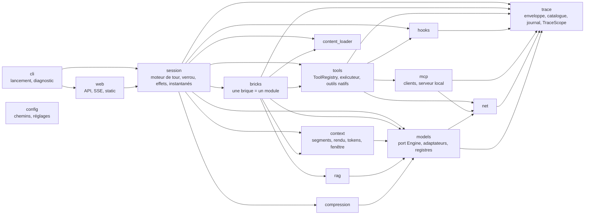
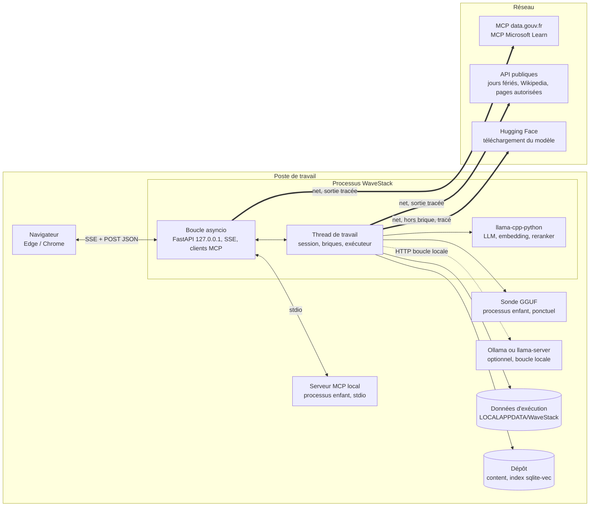
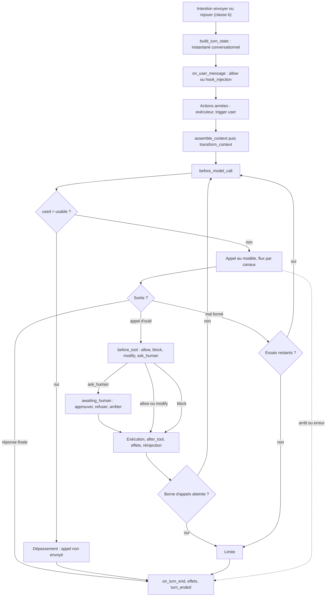

# Architecture Spine — WaveStack

## Design Paradigm

**Moteur de tour à journal d’événements.** Le harnais est une boucle de tour explicite. Tout ce qu’il fait est émis comme **événement de trace** et ajouté en fin de journal. Les cinq volets ne sont que des projections de ce journal, en lecture seule : l’interface ne peut montrer que ce que le harnais a réellement fait.

Les briques sont des modules qui s’accrochent à des points fixes du tour. Elles renvoient des *contributions* (segments, outils) et des *effets* typés ; seule la session les applique. Le modèle, les outils, le MCP et le réseau sont derrière des ports (hexagonal).



Règles de dépendance :
- Les flèches ne remontent jamais, et personne n’importe `web` ni `cli`.
- Une brique n’importe jamais une autre brique.
- Seul `models` importe les bibliothèques d’inférence, et seul `net` crée des clients HTTP.
- `trace` et `config` n’importent rien du projet ; tout module peut les importer.
- Un module émet dans le journal sans recevoir d’émetteur en paramètre, par la `TraceScope` (AD-2).

## Invariants & Rules

### AD-1 — Journal d’événements, interface en projection [ADOPTED]

- **Binds:** FR-1 à FR-4, FR-7, FR-14, FR-22, FR-28, FR-30, FR-41, NFR-8
- **Prevents:** des volets qui affichent un état différent de ce que le harnais a fait ; une interface qui calcule elle-même ce qu’elle n’a pas reçu.
- **Rule:** Toute donnée affichée provient d’un événement du journal ou d’une réponse de lecture de l’API construite à partir du journal (`/api/state`, `/api/architecture`, `/api/diagnostic`).
  - Le front ne recalcule ni tokens, ni contexte, ni disponibilité, ni ventilation de la jauge, ni séparation du raisonnement.
  - Sont permises côté front :
    - la mise en forme ;
    - les écarts entre deux valeurs reçues ;
    - le chronomètre local ancré sur le `ts` d’un `*_started`, que remplace le `duration_ms` du `*_ended`.
  - Un seul magasin de projection côté navigateur consomme tous les événements, que les volets soient visibles ou masqués.

### AD-2 — Enveloppe, catalogue et flux des événements

- **Binds:** tous les modules qui émettent ; le front
- **Prevents:** des formes d’événement incompatibles ; un événement qu’on ne peut rattacher à son appel, son étape ou son nœud ; une reconnexion qui perd des événements.
- **Rule:** L’enveloppe se compose des champs suivants :
  - `{seq, ts, session_epoch, turn_id, context_id, call_id, step_id, parent_step, kind, actor, trigger, brick, component, edge, payload}` ;
  - `seq` est un entier strictement croissant sur toute la vie du processus, jamais remis à zéro. Une réinitialisation émet `session_reset` et incrémente `session_epoch`, ce qui vide les projections ;
  - `ts` est en ISO 8601 à la milliseconde. Les durées (`duration_ms`) sont mesurées avec `time.monotonic()` ;
  - `turn_id`, `context_id`, `call_id`, `step_id`, `component` et `edge` valent `null` hors portée (démarrage, diagnostic, activation d’une brique) ;
  - `actor` (`model`, `harness` ou `user`) indique qui produit l’événement ;
  - `trigger` (`model`, `user`, `harness` ou `hook`) indique qui a causé la chaîne. Il est hérité de l’étape parente, et c’est lui qui porte les badges « déclenché par le modèle » et « forcé par l’utilisateur » ;
  - `component` et `edge` sont des identifiants du schéma (AD-12).

  **Règles du catalogue :**
  - Le catalogue des `kind` et un modèle pydantic par `payload` vivent dans le seul module `trace`.
  - Une story ajoute ses `kind`, mais ne change jamais l’enveloppe.
  - Toute opération qui dure émet une paire `*_started` / `*_ended` sur le même `step_id`. `*_started` porte `phase_label` en français (« Lecture du contexte (1 840 tokens) ») ; `*_ended` porte `duration_ms` et le `status`.
  - Les `kind` fixés dès maintenant sont :
    - `turn_started{replay_of}` et `turn_ended{status: completed|cancelled|limit|overflow|error}`, émis seulement dans le contexte `main` ;
    - `session_reset` ;
    - `context_rendered`, `context_preview` (AD-9) et `prefix_not_reused{common_tokens}` (AD-4) ;
    - `context_overflow{used, usable}`, `output_truncated{channel, output_tokens, max_tokens}` et `limit_reached{limit: calls|retries|sub_calls}` (AD-9, AD-10), émis par la session ;
    - `model_call_started`, `model_first_token`, `model_delta{channel: reasoning|text|tool_call, text}` et `model_call_ended` ;
    - `tool_started` et `tool_ended{status: ok|error|blocked|limit|overflow}` ;
    - `hook_decided`, `approval_requested{approval_id}` et `approval_resolved{approval_id, decision}` ;
    - `outbound_request{origin: brick|diagnostic|download}` (AD-15) ;
    - `effect_applied` ;
    - `session_state` ;
    - `architecture_changed` ;
    - `diagnostic_check` ;
    - `harness_error`.
  - `model_delta` transporte du texte UTF-8 complet, regroupé toutes les 50 ms au plus. `model_call_ended{raw_output, reasoning, text, tool_calls, prompt_tokens, output_tokens, prompt_ms, gen_ms, stop_reason: stop|length|cancelled|error}` fait foi, et les projections remplacent les deltas par lui.

  **Portée et flux :**
  - La session pose la portée courante dans une `contextvar` `TraceScope` ; `tools`, `hooks`, `mcp` et `net` émettent sans paramètre. La portée porte aussi `origin` (`brick`, `diagnostic` ou `download`), posé par l’appelant et lu par `net`. Un passage de thread à boucle copie explicitement la portée (AD-24).
  - Le journal vit en mémoire seulement : un redémarrage le perd.
  - Le flux passe par `fastapi.sse.EventSourceResponse`, avec `id = seq`. La reprise se fait par `Last-Event-ID`.
  - Le front démarre par `GET /api/state` (état courant et dernier `seq`), puis reprend le flux au `seq` suivant.

### AD-3 — Un seul écrivain, un verrou d’opération, trois classes d’intentions

- **Binds:** session, web, bricks, FR-5, FR-7, FR-11, FR-12, FR-32, FR-39, FR-42
- **Prevents:** deux chemins de mutation de l’état ; une commande qui modifie l’état en plein tour ou en plein rechargement ; des commandes refusées sans raison ; des actions armées à deux endroits.
- **Rule:** Seule la `Session` modifie l’état : historique, `wanted` des briques, actions armées, réglages, mémoire globale, `settings.json`.
  - **Verrou d’opération.** La session est toujours dans l’un de ces états : `idle`, `turn`, `awaiting_human`, `model_load`, `download`, `reset` ou `diagnostic`. En diagnostic bloquant, une `Session` minimale existe dans l’état `diagnostic` et ne traite que `select_model` et `download_model`. Elle l’émet par `session_state{state, reason_fr}`, que le front utilise pour désactiver ses commandes en affichant la raison.
  - **Classes d’intentions** (`POST`, JSON) :
    - **(a) Acceptées à tout moment**, prises en compte au tour suivant : bascule d’une brique ou d’une sous-option, armer ou désarmer une action, enregistrer le prompt système.
    - **(b) Refusées hors `idle`**, avec la raison : envoyer, rejouer, changer de modèle, de fenêtre ou de bornes, télécharger un modèle (`download_model`), modifier la mémoire globale, vider la conversation, lancer un scénario.
    - **(c) Préemptives** : décision H5 (qui porte son `approval_id` ; la première réponse l’emporte), arrêt du tour, réinitialisation (qui vaut arrêt puis réinitialisation).
  - **Actions armées.** Une `ArmedAction{armed_id, kind, brick, target, args}` n’existe que dans la session, et le front projette la puce depuis les événements.
    - Elles sont consommées après `on_user_message` et avant le premier appel au modèle, dans l’ordre d’armement, par l’exécuteur (AD-14), avec `trigger = user`.
    - Une action n’est abandonnée, avec un événement, que si son mode `forced` est indisponible (AD-6).
    - La liste est vidée en fin de tour, quel que soit le statut.
  - **Réglages.** Un réglage modifié prend effet au tour suivant. Un rechargement refusé (budget, erreur) laisse actifs le modèle et la fenêtre précédents.

### AD-4 — Le contexte : segments typés, rendu par le harnais, tokens attribués exactement

- **Binds:** context, bricks, models, FR-2, FR-8, FR-24, FR-30, FR-32, FR-34, FR-41
- **Prevents:** un contexte affiché différent du contexte envoyé ; des totaux qui ne tombent pas juste ; une jauge qui ne sait pas classer un segment ; un historique illisible après un changement de modèle.
- **Rule:**
  - **Segment.** Un segment est `{id, kind, brick, component, text, tokens, compressed_from?}`. `context_rendered` porte la liste ordonnée des segments, morceaux de gabarit compris (type `template`) : leur concaténation est exactement le prompt envoyé. Le front n’a besoin d’aucun décalage de caractères.
  - **Types de segment.** `SegmentKind` est une énumération fermée, dans `context`, dans cet ordre d’empilement de la jauge :
    `system_prompt, global_memory, tool_catalog, skill_catalog, skill_body, history, rag_excerpt, tool_result, subagent_result, hook_injection, user_message, assistant_turn, template`.
    - Leur libellé français est dans `content/`. `user_message` et `template` forment ensemble « Message et gabarit ».
    - `assistant_turn` couvre la sortie du modèle rendue dans les appels suivants du même tour (raisonnement, texte, appel d’outil), ainsi que l’appel fabriqué d’une action forcée, attribué à la brique de l’action.
    - Ajouter un type exige un amendement du spine.
  - **Historique.** L’historique est stocké sous forme structurée : messages `{role, content, reasoning, tool_calls: [{name, arguments}]}`. Il est re-rendu par le gabarit du modèle actif à chaque appel, et tout ce qui vient d’un tour antérieur est de type `history` (`brick = short_memory`). C’est le gabarit qui décide de ce qu’il garde, par exemple le raisonnement des tours précédents, que Qwen3.5 efface. La réponse d’un méta-outil de chargement (AD-25) y est stockée sous forme de talon court (« skill X chargé »), car son contenu a rejoint son emplacement stable.
  - **Source de vérité.** Le `TurnState`, figé par `build_turn_state` (AD-17), est la seule source des emplacements stables pour tous les appels du tour. Mémoire globale, skills et documentations y sont lus au début du tour. Ce qui est chargé ou écrit pendant le tour va dans `loaded_in_turn` : l’exécuteur le lit (AD-25), et l’assembleur ne s’en sert que pour les réponses d’outil.
  - **Emplacements.** Une table unique dans `context`, indexée par (type, phase `stable` ou `turn`), fixe l’emplacement de chaque segment dans le gabarit :
    - message système (`stable`) : `system_prompt`, `global_memory`, `skill_catalog`, `skill_body` ;
    - variable `tools` (`stable`) : `tool_catalog`, un segment par outil, rattaché à la brique qui le déclare ;
    - messages de l’historique ;
    - message utilisateur du tour : `hook_injection`, `rag_excerpt`, `user_message` ;
    - dans le tour (`turn`) : messages de l’assistant (`assistant_turn`) et réponses d’outil (`tool_result`, `subagent_result`, et, pour les méta-outils, `skill_body` et `tool_catalog`).

    Les segments stables précèdent les variables.
  - **Rendu.** Le gabarit est `tokenizer.chat_template` du modèle. Il est rendu dans un `ImmutableSandboxedEnvironment(trim_blocks=True, lstrip_blocks=True)` configuré comme transformers :
    - extensions `loopcontrols`, plus une extension `generation` sans effet ;
    - filtre `tojson(x, ensure_ascii=False, indent=None, separators=None, sort_keys=False)` ;
    - globales `raise_exception` et `strftime_now` ;
    - variables `messages`, `tools`, `add_generation_prompt`, `bos_token`, `eos_token`, et `enable_thinking` si le registre le prévoit (AD-6).

    Un test de non-régression compare le rendu Qwen3.5 à une chaîne de référence (outils, accents, apostrophe).
  - **Attribution des tokens.** L’algorithme, dans `context/render.py`, est normatif :
    1. **Prompt envoyé.** C’est toujours le rendu du gabarit avec les vraies valeurs, jamais une reconstruction.
    2. **Normalisation.** À l’assemblage, chaque texte de segment (hors `template`) perd ses blancs de tête et de fin, ainsi que tout caractère de la zone privée Unicode. Toute chaîne qui correspond à un token spécial du vocabulaire (`<|im_start|>`…) y est neutralisée, avec un événement : un contenu non fiable ne peut pas injecter de structure.
    3. **Rendu d’attribution.** Un second rendu, avec les mêmes valeurs, encadre chaque texte de segment **non vide** de sentinelles de la zone privée Unicode (U+E000 à U+E002 et l’index du segment). Un texte vide ne reçoit pas de sentinelles et ne produit pas de segment. Pour un outil de la variable `tools`, les sentinelles encadrent les chaînes de sa définition.
    4. **Contrôle du texte.** Une fois les sentinelles retirées, le rendu d’attribution doit être égal au prompt envoyé, octet pour octet. Sinon, `harness_error` « attribution approximative » est émis, le texte non localisé va à `template`, et le prompt envoyé ne change pas.
    5. **Découpage.** Le prompt est découpé en segments ordonnés et disjoints ; les morceaux hors sentinelles sont des segments `template`. Les segments ne s’imbriquent jamais : un segment englobant est coupé en morceaux disjoints, de même type, brique et composant, avec chacun son `id`.
    6. **Tokens.** Le prompt entier est tokenisé une seule fois. `Engine.token_pieces(ids)` (AD-5) donne les octets de chaque token, et le harnais vérifie que `b"".join(pieces) == prompt.encode("utf-8")` ; sinon, `harness_error`. Les décalages se cumulent en octets, et chaque token est attribué au segment qui contient son premier octet.

    La somme est égale au total par construction. Le moteur factice le vérifie. Le test de non-régression Qwen3.5 vérifie les contrôles 4 et 6, sur ces cas : un assistant à contenu vide qui appelle un outil, `load_tool_doc` avec deux serveurs, et un token de 128 espaces.
  - **Ajout seul pendant un tour.** Le rendu du gabarit fait foi, et l’ajout seul est un contrôle, pas une hypothèse. La session compare les ids de l’appel n+1 à ceux de l’appel n suivis de sa sortie. Si le préfixe commun est plus court, elle émet `prefix_not_reused{common_tokens}`, et la relecture s’explique dans la trace. Le test de non-régression Qwen3.5 couvre un tour à deux appels.
  - **Étape `transform_context`.** Elle est appelée par la session entre l’assemblage et le rendu, et seulement avant le premier appel d’un tour. C’est là que s’applique la compression (AD-22).

### AD-5 — Le port moteur reçoit du texte déjà rendu, rien de plus

- **Binds:** models, FR-32, FR-34
- **Prevents:** un adaptateur qui envoie des messages de chat ou ajoute des tokens ; un serveur qui tronque le prompt en silence.
- **Rule:** Le port `Engine` est synchrone : `complete(prompt_ids | prompt_text, stop, max_tokens, cancel) → flux de fragments`, `tokenize(str) → ids`, `token_pieces(ids) → list[bytes]`, `metadata()`, `close()`.
  - **`llama_cpp`** (en processus, par défaut) : reçoit les ids tokenisés par le harnais. `tokenize` encode en UTF-8 et appelle `tokenize(..., add_bos=False, special=True)`. `token_pieces` appelle `llama_cpp.llama_token_to_piece(..., special=True)` et réagrandit le tampon quand le retour est négatif. `Llama.detokenize` est interdit ici, car son tampon de 32 octets tronque sans erreur.
  - **`llama_server`** (`/completion`) : reçoit également les ids. Son tokenizer vient de `/tokenize`, et `token_pieces` de `/tokenize` avec `with_pieces: true`.
  - **`ollama_raw`** (`/api/generate`, `raw: true`) :
    - reçoit la chaîne et envoie toujours `options.num_ctx`, égal à la fenêtre effective ;
    - si le `prompt_eval_count` renvoyé diffère du compte du harnais, un événement `harness_error` « transparence réduite » est émis ;
    - son tokenizer et `token_pieces` viennent du GGUF ouvert en `vocab_only`, soit environ 80 Mo, comptés par AD-8, avec le même code que `llama_cpp`.
  - Aucun adaptateur au format chat ni « compatible OpenAI » en V1.
  - Les adaptateurs streament toujours en interne et testent le `CancelToken` à chaque fragment.

### AD-6 — Registre des capacités par famille de modèle

- **Binds:** models, bricks, FR-9, FR-13, FR-15, FR-33
- **Prevents:** un parseur d’appels d’outils ou un repérage du raisonnement improvisés par chaque brique ou par le front.
- **Rule:** Le registre associe à chaque famille (détectée par `general.architecture` et le gabarit) :
  - son `tool_call_parser` (par exemple le XML `qwen3_coder`) ;
  - ses `stop_sequences` ;
  - un **séparateur incrémental** qui répartit le flux en canaux `reasoning`, `text` et `tool_call` ;
  - sa variable de raisonnement ;
  - sa taille de contexte native.

  Pour une famille inconnue, les données sont lues dans le GGUF. Un GGUF sans `chat_template` est « incompatible », avec la raison. Le registre est réévalué à chaque changement de modèle.
  - **Disponibilité par mode.** Elle se calcule par mode d’action : `model` (décidée par le modèle), `forced` (forcée par l’utilisateur) et `injection` (contenu mis dans le contexte). Sans parseur connu, le mode `model` est indisponible, avec sa raison, mais `forced` et `injection` restent disponibles. Ce calcul a lieu au point unique d’AD-12.

### AD-7 — Découverte des modèles, et sonde avant le premier chargement

- **Binds:** models, diagnostic, FR-34, FR-37, UJ-3, NFR-8
- **Prevents:** plusieurs logiques de recherche de fichiers ; le lancement d’Ollama pour lire ses modèles ; un GGUF inconnu qui fait planter le processus en pleine session.
- **Rule:**
  - **Candidats.** Une seule fonction de découverte liste les candidats :
    - fichier saisi ;
    - dossier `models/` d’AD-20 ;
    - cache Hugging Face (`HF_HUB_CACHE`, `HF_HOME`, sinon `~/.cache/huggingface/hub`, `snapshots/*/*.gguf`) ;
    - LM Studio (`~/.lmstudio/models`, puis `~/.cache/lm-studio/models`) ;
    - Ollama (`OLLAMA_MODELS`, sinon `~/.ollama/models`) : on lit les manifestes, et la couche `application/vnd.ollama.image.model` est un GGUF chargeable en processus. Une couche `image.tensor` est listée « incompatible », avec la raison ;
    - serveurs déjà lancés, aux adresses de boucle locale configurées (défaut `127.0.0.1:11434` et `127.0.0.1:8080`), sondés sans jamais être lancés.
  - **Sonde.** Un GGUF qui n’a jamais été chargé avec succès est d’abord ouvert dans un processus enfant (`sys.executable -m wavestack.models.probe`). La sonde fait un chargement complet, lit l’architecture et le gabarit, et mesure la mémoire résidente.
    - Un succès est mémorisé dans `settings.json` (chemin, taille, date de modification).
    - Un échec rend le fichier « incompatible », avec la raison.

### AD-8 — Budget mémoire mesuré et registre de chargement

- **Binds:** models, rag, compression, mcp, FR-32, NFR-2
- **Prevents:** des composants qui se chargent sans se voir ; un dépassement de budget découvert trop tard ; deux modèles de langage en mémoire.
- **Rule:** Tout composant lourd passe par le `LoadRegistry` : modèle, tokenizer `vocab_only`, embedding, reranker, compresseur, modèle d’un serveur externe.
  - **Refus.** Le registre refuse le chargement quand `RSS mesuré (psutil) de WaveStack et de ses processus enfants + coût estimé` dépasse le budget configuré (4 Go par défaut). Le message en français est chiffré.
  - **Estimation du coût.** Elle vaut la mesure de la sonde (AD-7) quand elle existe. Sinon : taille du fichier, plus cache KV à la fenêtre effective, plus une marge.
  - **Cycle de vie.** Un composant se charge à l’activation de sa brique et se libère (`close()`) à sa désactivation.
  - **Mode serveur.** Le modèle en processus est libéré, et la mémoire du modèle servi est comptée : `/api/ps` pour Ollama, taille du fichier pour llama-server. En quittant Ollama, l’adaptateur envoie `keep_alive: 0`.
  - Le diagnostic affiche la même mesure.

### AD-9 — Fenêtre de contexte, réserve de sortie, jauge et aperçu

- **Binds:** context, models, FR-41, NFR-1, NFR-8, FR-21, FR-38
- **Prevents:** une jauge calculée sur la taille native, ou qui affiche 95 % sur un appel déjà refusé ; un appel qui déborde envoyé quand même ; une jauge qui ne bouge qu’après l’envoi.
- **Rule:**
  - **Fenêtre effective** = min(fenêtre configurée, contexte natif, contexte du serveur). La fenêtre configurée vaut **4 096 tokens par défaut** et se règle dans l’interface et dans la configuration ; un changement recharge le modèle (classe b).
  - **Réserve de sortie** : 512 tokens, ou 1 536 quand la brique raisonnement est active. `usable = fenêtre − réserve`. Chaque appel est envoyé avec `max_tokens = réserve`.
  - **Dépassement.** Si le contexte dépasse `usable`, l’appel n’est pas envoyé : `context_overflow`, puis `turn_ended{status: overflow}`.
  - **Sortie coupée.** Quand `model_call_ended.stop_reason = length`, la session émet `output_truncated`, avec le canal en cours.
    - Dans le raisonnement ou le texte, le tour se termine par `turn_ended{status: limit}` et n’entre pas dans l’historique (AD-17).
    - Dans un appel d’outil, il suit la voie de l’appel mal formé (AD-10).
  - **Sous-agent.** Dans un contexte `sub{n}`, un dépassement ou une sortie coupée terminent la délégation, pas le tour (AD-11).
  - **Calcul côté session.** `context_rendered` porte `window`, `reserve`, `usable`, `used`, `percent = used / usable`, `near_limit` (seuil 0,8, défini dans `wavestack.toml`), `overflow` et la ventilation par type de segment, tous calculés par la session.
  - **Aperçu.** Après chaque changement de configuration, la session émet `context_preview`, avec les mêmes champs et `turn_id = null`. Il est calculé sans message ni extraits RAG. La jauge l’affiche comme « prochain tour ».
  - **Scénarios fournis.** Chaque scénario déclare `expects_overflow`. Un test pytest marqué `model` rend, avec le tokenizer du modèle par défaut (GGUF ouvert en `vocab_only`), le contexte du premier appel du scénario, puis vérifie qu’il tient, ou qu’il déborde si le drapeau le demande. Le test est sauté si le GGUF est absent. Ce contexte comprend :
    - le premier prompt suggéré ;
    - les briques du scénario, et la réserve qui découle de sa brique raisonnement ;
    - les extraits RAG, comptés à leur maximum déclaré ;
    - les outils MCP, lus dans l’instantané versionné `content/mcp_snapshots/{server_id}.json`.

    En direct, si `tools/list` s’écarte de l’instantané de plus du seuil défini dans `wavestack.toml`, un avertissement est émis. Dans l’application, le `context_preview` émis au lancement d’un scénario montre le même résultat.
  - **Cas du module MCP.** La documentation complète s’y illustre avec Microsoft Learn. data.gouv.fr en documentation complète est le dépassement volontaire, qui mène au lazy loading. Le scénario Souveraineté (FR-40) utilise data.gouv.fr en lazy loading.
  - **Valeur définitive.** Elle est fixée après le banc de mesure du poste de référence : la plus grande fenêtre dont la lecture à froid tient en 30 s.

### AD-10 — Bornes de la boucle de tour

- **Binds:** session, FR-15, FR-29, FR-42, NFR-8
- **Prevents:** des compteurs différents selon la brique ; une boucle infinie ; des bornes rattachées à une brique qu’on peut éteindre.
- **Rule:** La boucle agent appartient au cœur de la session, pas à une brique.
  - **Bornes par défaut :**
    - 6 appels au modèle par tour dans le contexte principal ;
    - 2 nouveaux essais par tour après un appel mal formé, comptés dans les 6 ;
    - 4 appels pour le sous-agent, sur un compteur propre ; sa délégation compte pour 1 dans le tour principal.
  - Une action forcée ne consomme pas d’appel.
  - Les bornes sont des réglages de session, modifiables dans l’interface (affichées sur la carte de la brique outils) et dans la configuration.
  - Atteindre une borne du contexte principal émet `limit_reached{limit}`, puis `turn_ended{status: limit}`. Pour la borne `sub_calls`, voir AD-11.

### AD-11 — Sous-agent : même modèle, contexte minimal, pas un tour

- **Binds:** session, bricks, FR-29, NFR-1, NFR-2
- **Prevents:** une seconde instance du modèle ; des identifiants en collision ; un sous-agent qui hérite de tout le contexte principal et perd l’économie montrée.
- **Rule:** Le sous-agent utilise la même instance du moteur, séquentiellement, avec `context_id = sub{n}` (numéroté par session). Ce n’est pas un tour.
  - **Hooks.** Il déclenche `before_model_call`, `before_tool` et `after_tool`, jamais `on_user_message` ni `on_turn_end`.
  - **Contexte.** Une brique déclare `contributes_to` (`main` seul par défaut). Le contexte du sous-agent contient :
    - le gabarit ;
    - un prompt système du sous-agent, dans `content/` ;
    - la tâche ;
    - les outils listés par la brique sous-agent (lecture de page web par défaut).

    AD-9 s’y applique, avec son propre événement de dépassement.
  - **Résultat.** Seul le résultat entre dans le contexte principal, en `subagent_result`.
  - **Échec de la délégation.** Un dépassement, une sortie coupée ou la borne `sub_calls` émettent leur événement avec `context_id = sub{n}`, puis `tool_ended{status: limit|overflow}` de `delegate`. Le résultat réinjecté est une erreur en français, et le tour principal continue. `turn_ended` n’est jamais émis depuis un sous-contexte.
  - **Contexte principal.** Il est préservé par `save_state()` et `load_state()` si le test préalable le confirme pour le modèle hybride. Sinon, il est relu, et la latence s’affiche.

### AD-12 — Contrat de brique, disponibilité et schéma dérivés

- **Binds:** bricks, session, web, FR-3, FR-5, FR-6, FR-20, FR-33
- **Prevents:** des raisons d’indisponibilité divergentes ; des identifiants de nœuds incompatibles ; un schéma maintenu à la main ; un changement de modèle qui efface les choix de l’utilisateur.
- **Rule:**
  - **Déclaration.** Chaque brique déclare :
    - `id` et catégorie (`prompt`, `context` ou `harness`) ;
    - dépendances et capacités exigées ;
    - besoin de réseau ;
    - `contributes_to` ;
    - ses composants `{id: "{brick}.{component}", kind, hosting: local_process|local_file|network_service, edges_to}`, ce qui inclut les hooks H1 à H5 comme composants de la brique hooks.

    Les nœuds fixes sont réservés : `core.harness`, `core.model`, `core.model_sub`, `file.memory`, `file.audit`, `file.demo_dir`, `file.rag_index`. L’unicité des identifiants est vérifiée au chargement.
  - **État d’une brique.** Il vaut `wanted` (choix de l’utilisateur ou du scénario ; un changement de modèle ne le modifie jamais) et `available` (calculé en un seul point de la session, par mode d’action selon AD-6, avec sa raison en français). L’état effectif est `wanted ∧ available`.
  - **État d’un composant réseau.** Il vaut `not_contacted`, `available` ou `unavailable`, avec sa raison. Un serveur MCP public est `not_contacted` tant que sa sous-option n’est pas activée (AD-15).
  - **Schéma.** La session dérive le schéma et émet `architecture_changed{nodes, edges}` : zone locale ou réseau, disponibilité et raison, enfants (outils d’un serveur, détail d’un skill), arêtes avec `crosses_boundary`. `GET /api/architecture` en donne le dernier état.
    - Un composant est dessiné dès que sa brique est `wanted`, même indisponible.
    - Les événements d’activité portent `component` et `edge`.
  - **LLM nu.** Toutes briques éteintes, le tour est exactement celui du LLM nu.

### AD-13 — Points d’accroche du tour et hooks

- **Binds:** session, hooks, FR-26 à FR-28
- **Prevents:** des hooks qui écrivent eux-mêmes ; des décisions au vocabulaire ou aux effets divergents ; une injection de hook invisible dans le contexte.
- **Rule:**
  - **Points d’accroche fixes :** `assemble_context`, `transform_context`, `on_user_message`, `before_model_call`, `before_tool`, `after_tool`, `on_turn_end`.
  - **Signature.** Un hook a la forme `hook(ctx: HookContext) -> HookResult{decision, detail_fr, effects}`. `HookContext` est une vue en lecture seule : point d’accroche, portée, appel d’outil résolu, événements du tour.
  - **Décisions permises par point d’accroche :**
    - `on_user_message` : `allow`, ou `modify`, qui ajoute un segment `hook_injection` sans jamais réécrire le message ;
    - `before_tool` : `allow`, `block`, `modify` (qui remplace les arguments) ou `ask_human` ;
    - `before_model_call` et `on_turn_end` : `allow` ou `block` ;
    - `after_tool` : `allow`, avec des effets.
  - **Validation humaine.** Sur `ask_human`, la session passe en `awaiting_human` et émet `approval_requested{approval_id, tool, destination, preview}`. Elle attend alors une intention de classe (c), sans délai d’expiration. Un refus est réinjecté dans le contexte ; un arrêt résout l’attente en `cancelled`.
  - Toute décision est émise avec `actor = harness`.

### AD-14 — Registre et exécuteur d’outils uniques, outils locaux confinés

- **Binds:** tools, mcp, bricks, FR-13 à FR-15, FR-21, FR-22, FR-27, FR-42, NFR-4
- **Prevents:** une collision de noms entre outils natifs et MCP ; un hook qui compare des noms ; un contournement des hooks ; la lecture de tout le disque quand H1 est désactivé.
- **Rule:**
  - **Registre.** Le `ToolRegistry` est le seul à attribuer les noms exposés au modèle : outil natif ou méta-outil = nom nu, outil MCP = `{server_id}__{tool}`. En cas de collision, l’outil est indisponible, avec un événement.
  - **Description d’un outil.** Chaque outil déclare :
    - `source` : `native`, `harness`, `mcp_local` ou `mcp_public` ;
    - `hosting` et `component` ;
    - `network: bool` ;
    - `reads_local_path` : le nom de l’argument qui contient un chemin, ou `null` ;
    - `preview_request(args) → {method, url, body}` pour tout outil réseau. Pour un outil MCP, l’exécuteur construit lui-même le corps `tools/call`.
  - **Exécuteur unique.** Tout appel passe par un seul exécuteur, qu’il vienne du modèle, du sous-agent ou d’une action forcée : `before_tool`, exécution, `after_tool`, réinjection. Un appel mal formé ou inexistant produit un événement et une réaction (nouvel essai, erreur réinjectée ou arrêt).
  - **Hooks.** Ils comparent des drapeaux et des arguments résolus :
    - H1 bloque tout outil `reads_local_path` dont le chemin résolu est dans le sous-dossier confidentiel ;
    - H5 s’applique à tout outil `network = true`.
  - **Confinement, toujours actif, indépendant des hooks :**
    - `read_file` résout le chemin et refuse tout ce qui sort de `content/demo_files/` ;
    - la calculatrice évalue par `ast`, avec une liste blanche d’opérateurs, jamais par `eval` ;
    - un test couvre chaque cas.

### AD-15 — Sorties réseau : une fabrique, tout est tracé

- **Binds:** net, tools, mcp, models, cli, FR-13, FR-20, FR-22, FR-37, NFR-3, NFR-4
- **Prevents:** une donnée qui quitte le poste sans être affichée ; une bibliothèque qui contourne le proxy ou les certificats ; une page tierce qui élargit la liste d’adresses autorisées.
- **Rule:**
  - **Fabrique de clients.** `net` fabrique deux clients avec la même configuration : un `httpx.Client` synchrone (outils, `huggingface_hub` via `set_client_factory`, adaptateurs de serveurs) et un `httpx2.AsyncClient` (transport Streamable HTTP de `mcp`). La configuration commune comprend :
    - `truststore` ;
    - le proxy de l’environnement ;
    - des délais bornés ;
    - un hook de requête qui émet `outbound_request` (adresse, corps exact, `origin`) **avant** l’envoi pour toute destination hors boucle locale ;
    - la vérification de la liste d’adresses autorisées ;
    - des redirections suivies à la main et revérifiées.

    L’interface signale tout écart entre l’aperçu H5 et l’envoi.
  - **Au démarrage**, `cli` fait ceci avant tout import d’une bibliothèque tierce :
    - installer la **garde réseau** (ci-dessous) ;
    - `truststore.inject_into_ssl()` ;
    - `HF_HUB_DISABLE_XET=1` et `HF_HUB_DISABLE_TELEMETRY=1`. `HF_HUB_OFFLINE` n’est jamais fixé, car il est lu à l’import et bloquerait les téléchargements suivants.
  - **Garde réseau.** Un `sys.addaudithook` filtre deux événements :
    - `socket.getaddrinfo`, pour les noms d’hôte : c’est le seul événement vu sur toutes les boucles, Proactor de Windows compris ;
    - `socket.connect`, pour les adresses IP littérales.

    Il refuse tout hôte qui n’est ni en boucle locale, ni dans la liste autorisée (qui accepte les suffixes, comme `*.hf.co`), ni l’hôte du proxy configuré. Le refus lève `NetworkBlocked`, que l’appelant (`net`, `mcp` ou une brique) retrouve dans la chaîne des exceptions et convertit en `harness_error`. Derrière un proxy, la garde ne voit que le proxy, et le contrôle par destination reste à `net`. Les processus enfants (sonde, serveur MCP local) installent la même garde.
    - **Plafond assumé.** Une IP littérale ouverte par asyncio sous Proactor, et le code natif qui ouvre ses propres sockets, échappent à la garde.
    - **Garde en test.** `pytest` installe la même garde, limitée à la boucle locale. Un test vérifie le blocage sous `ProactorEventLoop`, avec le vrai client MCP.
  - **Hugging Face.** `huggingface_hub` n’est importé que dans `models/download.py`, qui télécharge dans le dossier `models/` d’AD-20 (`local_dir`). Les modèles se chargent toujours par leur chemin, jamais par `from_pretrained`.
  - **Boucle locale.** Elle est réservée aux adaptateurs de modèle et à la découverte ; un outil ne vise jamais la boucle locale.
  - **Liste d’adresses autorisées.** Elle vient de `wavestack.toml` ou de `settings.json` édité à la main, jamais d’une intention. La garde et `net` lisent la même liste. Par défaut, elle contient : l’adresse de la sonde, `huggingface.co` et `*.hf.co` (les téléchargements y sont redirigés), les serveurs MCP publics et les API des outils natifs.
  - **Sorties hors brique.** Elles forment une liste fermée, chacune tracée avec `turn_id = null` :
    - la sonde de connectivité du diagnostic, vers une adresse fixe, avec `origin = diagnostic` ;
    - le téléchargement d’un modèle (LLM, embedding ou reranker), seulement sur l’intention explicite `download_model`, avec `origin = download`.

    Toute autre vérification réseau (serveur MCP public, page de démonstration de `fetch_page`) a lieu à l’activation de la brique ou de la sous-option concernée.
  - **Serveur MCP public.** Il n’est contacté (`initialize`, `tools/list`) qu’à l’activation de sa sous-option ; avant, il est dessiné « non contacté ». Une réactivation retente la connexion.
  - **Règle d’adoption.** Une dépendance qui ouvre ses propres connexions n’est adoptée que si elle accepte un client injecté ou fonctionne hors ligne. Son test préalable s’exécute sous la garde.
  - Aucune télémétrie.

### AD-16 — Défaillances contenues

- **Binds:** tous, NFR-8, FR-15, FR-20
- **Prevents:** un plantage en pleine session ; une erreur brute en anglais à l’écran.
- **Rule:** Aucune exception ne traverse la frontière de la session. Toute erreur d’une brique, d’un outil, du MCP, du réseau, du contenu ou du moteur devient `harness_error` : message en français, cause, effet sur le tour. Le tour se termine avec `turn_ended{status: error}` et l’application reste utilisable.
  - Limite assumée : un plantage natif de llama.cpp en cours d’inférence emporte le processus. La sonde d’AD-7 réduit ce risque au premier chargement.

### AD-17 — Instantané conversationnel, branche et rejeu

- **Binds:** session, FR-7, FR-10, FR-25, FR-39
- **Prevents:** un rejeu qui annule le changement à comparer ; un rejeu qui voit deux fois la question ; des sémantiques divergentes de « configuration » et d’« état ».
- **Rule:**
  - **Instantané.** Au début de chaque tour, la session prend un instantané de l’**état conversationnel seul** : historique de la branche active, skills chargés, documentations MCP chargées. Tout le reste est lu dans la configuration courante au moment du tour : briques, sous-options, hooks, prompt système, réglages, modèle, actions armées. La mémoire globale est toujours dans son état courant, lu au début du tour et figé dans le `TurnState` pour tous les appels du tour (AD-4).
  - **Fonction commune.** `Session.build_turn_state(origin_turn | None)` sert à l’envoi comme au rejeu.
  - **Branche active.** L’historique est une liste de tours de la branche active. Rejouer t3 crée t4, qui fait suite à t2. t3 reste consultable, et `turn_started{replay_of}` le relie.
  - **Tour non terminé.** Un tour qui n’est pas `completed` reste dans la trace, mais n’entre pas dans l’historique.
  - **Remise à zéro.** « Vider la conversation » vide la branche et décharge skills et documentations. La réinitialisation recharge l’état initial depuis `content/`.

### AD-18 — Interface web sans compilation, API locale protégée

- **Binds:** web, FR-1 à FR-4, NFR-3, NFR-4, NFR-9, NFR-10
- **Prevents:** une dépendance à Node ou à un CDN ; un état métier dupliqué dans le front ; une page tierce qui pilote WaveStack ; une police propriétaire redistribuée.
- **Rule:**
  - **Serveur.** FastAPI sert l’API, le flux SSE, les intentions et les fichiers statiques, sur `127.0.0.1` et un port configurable.
  - **Protection de l’API :**
    - `TrustedHostMiddleware` limité à `127.0.0.1:<port>` et `localhost:<port>` ;
    - tout `POST` dont l’`Origin` n’est pas celle de l’application est refusé ;
    - intentions en `application/json` seulement ;
    - aucun en-tête CORS.
  - **Front.** HTML, CSS et JS en modules natifs, sans compilation. Toute bibliothèque est recopiée dans `static/vendor/`, et les polices dans `static/vendor/fonts/` avec leur licence.
    - `static/tokens.css` reprend les jetons de DESIGN.md sous les mêmes noms ; un test pytest compare les deux.
    - Aptos n’est jamais embarquée : elle est appelée par `local()`.
    - La taille de texte est une variable `--text-scale`, qui s’applique aussi aux libellés SVG.
  - **État du navigateur.** Il se limite à l’interface : sélection, volets masqués, mode focus, taille de texte, direct ou figé.

### AD-19 — Contenus en données, en français

- **Binds:** content, bricks, FR-6, FR-11, FR-12, FR-16, FR-23, FR-38, FR-40, NFR-7, NFR-11
- **Prevents:** des textes pédagogiques en dur dans le code ; un scénario métier qui exige de modifier le code.
- **Rule:**
  - **Fichiers.** Tout contenu pédagogique est un fichier en français sous `content/` : scénarios et programme (YAML), explications des briques, libellés des types de segment, prompts système (principal et sous-agent), skills (`SKILL.md` avec en-tête `name` et `description`), corpus RAG, mémoire globale de démonstration, fichiers de démonstration.
  - **Validation.** Le chargeur valide chaque fichier par un modèle pydantic. Un fichier invalide produit `harness_error`, pas un plantage.
  - **Scénario.** Un scénario déclare ses briques `wanted`, ses hooks actifs, ses prompts suggérés et `expects_overflow`. Un scénario qui demande une brique indisponible se lance quand même, avec la brique indisponible et sa raison.
  - **Hooks.** Ce sont du code Python, activés par la configuration et les scénarios.

### AD-20 — Données d’exécution hors du dépôt

- **Binds:** config, session, models, FR-12, FR-27 (H2)
- **Prevents:** des modèles dans OneDrive ou dans le dépôt ; des chemins différents selon les modules.
- **Rule:**
  - **Dossier unique.** Toutes les données d’exécution sont sous un seul dossier, configurable : `%LOCALAPPDATA%\WaveStack\` sous Windows, `~/.local/share/wavestack` ailleurs. Il contient `models/`, `memory.json`, `audit.log` et `settings.json`.
  - **Chemins.** Seul `config` résout ces chemins.
  - **Écriture.** Seule la session écrit ces fichiers, par les effets (AD-23).
  - **Formats :**
    - `memory.json` est une liste `{id, text, created_at, source: model|user|demo}` ;
    - `audit.log` est en JSON Lines.

### AD-21 — Installation, mise à jour, lancement et diagnostic

- **Binds:** packaging, cli, FR-19, FR-35 à FR-37, NFR-5, NFR-6
- **Prevents:** une compilation sur un poste sans compilateur ; des versions qui dérivent entre postes ; un diagnostic invisible dans le navigateur ; un processus enfant orphelin.
- **Rule:**
  - **Paquets.** `uv` seul, aucune commande `pip`.
    - `uv.lock` est versionné, et `requires-python = "==3.13.*"`.
    - `llama-cpp-python` est épinglé sur l’index CPU d’abetlen : `[[tool.uv.index]]` avec `explicit = true`, `[tool.uv.sources]`, et `no-build-package = ["llama-cpp-python"]`.
    - Mise à jour : `git pull` ou une nouvelle archive zip, puis `uv run`, qui synchronise sur le verrou.
  - **README d’installation (en français).** Il documente `UV_SYSTEM_CERTS=1` derrière un proxy, `UV_PYTHON_INSTALL_MIRROR` si GitHub est bloqué, et les domaines à autoriser : PyPI, `abetlen.github.io`, `github.com` et ses domaines de téléchargement, `huggingface.co` et `*.hf.co`.
  - **Lancement** (`uv run wavestack`) :
    1. Réserver le port. S’il est occupé et qu’une instance WaveStack répond à `GET /api/health`, ouvrir le navigateur sur cette instance et quitter avec le code 0. Sinon, message français (port en conflit, option `--port`), code non nul.
    2. Démarrer le serveur en état `diagnostic` et ouvrir `/diagnostic`.
    3. Exécuter les vérifications (mémoire, modèle, réseau) dans le thread de travail. Chacune émet `diagnostic_check{check, status, message_fr, action_fr, blocking}`, écrit dans le terminal et poussé dans le flux : une seule source.
    4. En cas d’échec bloquant, aucune session n’est créée. La page liste les candidats d’AD-7 et un champ de chemin (intention `select_model`), puis relance la vérification.
    5. `GET /api/diagnostic` garde le dernier résultat, ainsi que la version de WaveStack.
  - **Processus.** Le serveur MCP local (`MCPServer`, stdio) démarre à l’activation de la brique MCP, avec `sys.executable -m …`, et s’arrête à sa désactivation. À l’arrêt, le `lifespan` ferme les moteurs et les processus enfants : attente bornée, puis `terminate`.
  - **Modèles.** Rien ne se télécharge automatiquement.
    - Le diagnostic propose le bouton « Télécharger » (intention `download_model`, classe b, état `download`). Il passe par `models/download.py` (AD-15) et affiche une progression chiffrée.
    - Une brique RAG activée sans ses modèles d’embedding ou de reranking est indisponible, avec la raison « modèle absent » et la même action « Télécharger ».
    - La voie hors ligne consiste à copier un GGUF ou à choisir un modèle découvert.

### AD-22 — Compression et RAG derrière des ports

- **Binds:** compression, rag, session, FR-16 à FR-18, FR-31
- **Prevents:** une dépendance lourde qui fuit dans la session ; des segments compressés en double ; un index incohérent avec son modèle d’embedding.
- **Rule:**
  - **Compression.** Le `Compressor` s’applique à l’étape `transform_context` (AD-4), aux seuls types `tool_result` et `rag_excerpt`. Les réponses des méta-outils (AD-25) ne sont jamais compressées. Il renvoie des remplaçants qui gardent leur `brick` et leur `kind`, avec `compressed_from{tokens_before, text_before}`. Il est tracé avec l’avant, l’après et les tokens des deux versions. `skill_body`, `subagent_result` et `history` ne sont jamais compressés en V1.
  - **RAG.** L’index `sqlite-vec` est précalculé par `scripts/build_rag_index.py` et fourni dans le dépôt, avec l’identifiant de son modèle d’embedding. Si le modèle chargé est différent, la brique RAG est indisponible, avec la raison. L’embedding et le reranking passent par le moteur llama-cpp-python et par AD-8. Le port `Retriever.search(query) → extraits scorés` accueillera les stratégies de V2.

### AD-23 — Effets typés, appliqués par la session seule

- **Binds:** session, tools, hooks, bricks, FR-12, FR-24, FR-27 (H2), FR-42
- **Prevents:** plusieurs écrivains de la mémoire globale ou du journal d’audit ; des formats de fichier divergents ; un nœud de fichier que le schéma ne peut pas allumer.
- **Rule:**
  - **Principe.** Un outil, un hook ou une brique n’écrit ni état ni fichier : il renvoie des `Effect`. C’est une union pydantic dans `session/effects.py` :
    - `MemoryWrite{op: add|replace|delete, entry_id, text}` ;
    - `AuditAppend{lines}` ;
    - `SkillLoaded{skill_id}` ;
    - `ToolDocLoaded{tool}` ;
    - `ArmConsumed{armed_id}`.
  - **Application.** La session applique les effets dans l’ordre et persiste. Elle émet `effect_applied`, avec le `component` du fichier touché (`file.memory`, `file.audit`).
  - **Tiroir d’édition.** Il produit les mêmes effets, par intention de classe (b).
  - **Journal de trace.** `trace` n’écrit aucun fichier.

### AD-24 — Modèle d’exécution et annulation

- **Binds:** session, web, models, mcp, net, FR-1, NFR-1, NFR-8
- **Prevents:** une boucle asyncio bloquée pendant l’inférence ; deux boucles asyncio en concurrence ; un arrêt qui n’arrête rien ; une attente H5 éternelle.
- **Rule:**
  - **Thread de travail.** Un seul thread exécute les tours, les chargements de modèle, la réinitialisation et le diagnostic. La session et le port `Engine` y sont synchrones.
  - **Boucle asyncio.** Celle de FastAPI reçoit les intentions et sert le SSE ; elle ne touche jamais l’état. Les clients MCP vivent sur cette boucle. Le thread de travail les appelle par `run_coroutine_threadsafe(...).result(timeout)`, en copiant la `TraceScope`.
  - **Journal.** C’est une liste protégée par un verrou. Les abonnés SSE sont réveillés par `loop.call_soon_threadsafe`.
  - **Annulation.** Un `CancelToken` est passé à tout appel bloquant des ports : moteur, exécuteur, `net`, attente H5. La lecture du contexte par llama.cpp n’est pas interruptible : l’interface affiche « arrêt demandé » jusqu’au premier fragment.

### AD-25 — Méta-outils du harnais et actions forcées

- **Binds:** bricks, tools, session, FR-12, FR-21, FR-24, FR-25, FR-29, FR-42
- **Prevents:** des actions décidées par le modèle qui échappent aux hooks ; une action forcée rendue dans le contexte de plusieurs façons.
- **Rule:**
  - **Méta-outils.** Les actions de FR-42 hors outils sont des outils du harnais (`source = harness`), déclarés par leur brique et passés par l’exécuteur unique :
    - `remember`, pour la mémoire globale ;
    - `load_tool_doc`, pour le lazy loading MCP ;
    - `load_skill`, pour les skills ;
    - `delegate`, pour le sous-agent.
  - **Type des réponses.** La réponse d’un méta-outil prend le `SegmentKind` de ce qu’elle charge :
    - `load_skill` → `skill_body` ;
    - `load_tool_doc` → `tool_catalog` (brique `mcp`) ;
    - `delegate` → `subagent_result` ;
    - `remember` → `tool_result` (brique `global_memory`).
  - **Lazy loading.** Les outils MCP ne figurent pas dans la variable `tools`. Leur liste, une ligne par outil, est dans la description de `load_tool_doc`, dans un segment `tool_catalog` par outil. La documentation chargée entre en réponse d’outil pendant le tour (effet `ToolDocLoaded`), puis dans la variable `tools` aux tours suivants. L’exécuteur tient pour chargée toute documentation du `TurnState` ou de `loaded_in_turn` (AD-4) : l’outil qu’on vient de documenter est donc appelable dans le même tour. Appeler un outil dont la documentation n’est pas chargée produit une erreur réinjectée.
  - **Tours suivants.** La réponse d’un méta-outil de chargement reste dans l’historique sous forme de talon court (AD-4), pour ne pas compter deux fois son contenu.
  - **Action forcée.** Elle est rendue comme un appel d’outil de l’assistant, suivi de sa réponse, placé après le message de l’utilisateur. Elle porte `trigger = user`, et ses segments restent attribués à la brique.

## Consistency Conventions

| Sujet | Convention |
| --- | --- |
| Langue | Tout ce qui s’affiche, les contenus sous `content/` et la documentation utilisateur sont en français. Le code, les identifiants, les commentaires, les docstrings, les messages de commit et la documentation développeur sont en anglais. |
| Nommage | Modules et fonctions en `snake_case`, classes en `PascalCase`. Les `kind`, `id` de brique et `SegmentKind` sont en `snake_case` anglais. Les libellés français sont dans `content/`. |
| Identifiants | `turn_id` = `t{n}` ; `context_id` = `main` ou `sub{n}` ; `call_id` = `{turn_id}.{context_id}.c{n}` ; `step_id` = `{turn_id}.{context_id}.s{n}` ; `segment.id` = `{call_id}.{n}` ; composant = `{brick}.{component}` ; outil MCP = `{server_id}__{tool}`. |
| Temps | ISO 8601 à la milliseconde, avec fuseau, pour les horodatages ; `time.monotonic()` pour les durées. |
| Formats | pydantic v2 pour les événements, les intentions, les effets, les contenus et la configuration. JSON en UTF-8. |
| Configuration | Défauts dans `wavestack.toml` (dépôt), surcharges dans `settings.json` (AD-20), écrites par la session seule. |
| Messages | Un message français contient ce qui se passe, pourquoi et l’action possible (EXPERIENCE.md, Voice and Tone). Il est construit côté Python et porté par l’événement. |
| Journalisation | `logging` standard vers la console pour le technique. Le journal d’audit H2 est une donnée de démonstration (AD-23). |
| Qualité | `ruff` (lint et formatage), `pytest`. Les tests du harnais utilisent un moteur factice qui rejoue des sorties écrites à l’avance. Aucun test ne dépend du réseau : la garde d’AD-15 le garantit. Seuls les tests marqués `model` ont besoin d’un vrai GGUF ; ils sont exclus par défaut et sautés si le fichier manque. |
| Dépendances | Licence compatible avec une redistribution publique (NFR-10), vérifiée avant ajout, et règle d’adoption réseau d’AD-15. |

## Stack

| Nom | Version |
| --- | --- |
| Python (géré par uv) | 3.13 |
| uv | 0.12.18 |
| llama-cpp-python (roue CPU, index abetlen) | 0.3.35 |
| FastAPI (SSE natif `fastapi.sse`) | 0.141.1 |
| uvicorn | 0.53.0 |
| pydantic | 2.13.5 |
| Jinja2 (rendu des gabarits de conversation) | 3.1.6 |
| httpx | 0.28.1 |
| httpx2 (transitif, via mcp) | 2.13.1 |
| truststore | 0.10.4 |
| mcp (SDK Python) | 2.2.0 |
| huggingface-hub (Xet désactivé) | 1.32.0 |
| sqlite-vec | 0.1.9 |
| PyYAML | 6.0.3 |
| psutil | 7.2.2 |
| headroom-ai (optionnel, sous réserve du test préalable) | 0.38.0 |
| ruff | 0.16.8 |
| pytest | 9.1.1 |
| Modèle candidat par défaut | Qwen3.5-2B ou 0.8B, GGUF Q4_K_M (Apache-2.0) |

## Structural Seed

### Processus et lieux d’hébergement



### Déroulé d’un tour



### Arborescence minimale

```text
wavestack/                      # racine du dépôt
  pyproject.toml  uv.lock       # index llama-cpp épinglé ; script wavestack
  wavestack.toml                # configuration par défaut, liste d'adresses autorisées
  content/                      # FR : scenarios/, bricks/, prompts/, skills/, corpus/, memory/, demo_files/, mcp_snapshots/
  data/rag_index.sqlite         # index sqlite-vec précalculé
  scripts/build_rag_index.py
  src/wavestack/
    cli.py  config.py
    trace/                      # enveloppe, catalogue, journal, TraceScope
    session/                    # moteur, verrou, intentions, effets, instantanés
    context/                    # SegmentKind, emplacements, render.py, fenêtre
    models/                     # Engine, adaptateurs, découverte, probe, download, capacités, LoadRegistry
    bricks/  tools/  hooks/  mcp/  rag/  compression/  net/  content_loader/
    web/                        # app FastAPI ; static/ (html, tokens.css, js, vendor/, vendor/fonts/)
  tests/
```

## Capability → Architecture Map

| Capacité | Emplacement | Régie par |
| --- | --- | --- |
| FR-1 à FR-4 : volets synchronisés | `web/static`, `web` | AD-1, AD-2, AD-18, AD-24 |
| FR-5, FR-6 : briques et explications | `bricks`, `session`, `content/bricks` | AD-12, AD-19 |
| FR-7, FR-39 : rejeu et réinitialisation | `session` | AD-17, AD-3 |
| FR-42 : déclenchement forcé | `session`, `tools` | AD-3, AD-14, AD-25 |
| FR-8 à FR-12 : briques de base | `bricks`, `context`, `content` | AD-4, AD-6, AD-19, AD-20, AD-23, AD-25 |
| FR-13 à FR-15 : outils | `tools`, `net` | AD-14, AD-15, AD-16 |
| FR-16 à FR-18 : RAG | `rag` | AD-8, AD-22 |
| FR-19 à FR-22 : MCP | `mcp`, `net`, `tools` | AD-14, AD-15, AD-21, AD-25 |
| FR-23 à FR-25 : skills, Caveman | `bricks`, `content/skills` | AD-4, AD-23, AD-25 |
| FR-26 à FR-28 : hooks | `hooks`, `session` | AD-13, AD-14, AD-23 |
| FR-29 : sous-agent | `bricks`, `session` | AD-10, AD-11, AD-25 |
| FR-30, FR-41 : tokens et jauge | `context` | AD-4, AD-9 |
| FR-31 : compression | `compression` | AD-4, AD-22 |
| FR-32 à FR-34 : modèles | `models` | AD-5 à AD-8 |
| FR-35 à FR-37 : installation, diagnostic | `cli`, `config` | AD-20, AD-21 |
| FR-38, FR-40 : scénarios | `content/scenarios`, `content_loader` | AD-9, AD-19 |
| NFR-1, NFR-2 | `models`, `context` | AD-8, AD-9, AD-24 |
| NFR-3, NFR-4 | `net`, `web` | AD-15, AD-18 |
| NFR-5, NFR-6 | `cli`, `config` | AD-20, AD-21 |
| NFR-7, NFR-11 | `content` | AD-19, conventions |
| NFR-8 | `session` | AD-10, AD-16, AD-24 |
| NFR-9 | `web/static` | AD-18 |
| NFR-10 | dépôt | AD-18, conventions |

## Deferred

- **Banc de mesure sur le poste de référence** : `llama-bench`, lecture à froid de 4 096 tokens, gain du préfixe entre deux appels d’un même tour, `save_state()` et `load_state()` sur le modèle hybride. Ce banc fixe la fenêtre par défaut et le modèle par défaut (0.8B ou 2B), selon AD-9 et AD-11.
- **Test préalable de Headroom** (première story du palier 2). Critères :
  - fonctionne hors ligne, sans téléchargement à l’exécution, sous la garde réseau d’AD-15. litellm, que tire headroom-ai, télécharge sa table des prix à l’import : il faut `LITELLM_LOCAL_MODEL_COST_MAP=True`, et un cache tiktoken (`TIKTOKEN_CACHE_DIR`) fourni ;
  - sans torch ;
  - respecte la règle d’adoption d’AD-15 ;
  - tient dans le budget d’AD-8 ;
  - licence compatible.

  En cas d’échec, le compresseur maison minimal prend le relais : minification JSON, champs vides retirés, listes raccourcies.
- **Modèles d’embedding et de reranking** : test préalable au palier 2. Le reranking par llama-cpp-python n’est pas confirmé ; le repli est fastembed.
- **Schéma YAML des scénarios** : fixé par la première story de scénarios dans un modèle pydantic, dans le cadre d’AD-19.
- **Bibliothèque JS éventuelle** (JS natif, ou petite bibliothèque recopiée) : première story d’interface, dans le cadre d’AD-18.
- **Outils du serveur MCP local, second skill, corpus RAG** : stories de contenu.
- **Débit du téléchargement HTTP sans Xet** : à vérifier ; le repli est la copie manuelle du GGUF.
- **AppLocker et WDAC** face aux DLL non signées : session pilote. Le repli est la démonstration pilotée par le formateur.
- **Intégration continue** (GitHub Actions, `ruff` et `pytest` sous Windows) : quand le dépôt est publié.
- **macOS et Linux** : pris en charge au mieux (NFR-6) ; seul `config` porte les différences de chemins.
- **V2** : adaptateur de serveur au format chat, multi-agent, stratégies RAG avancées, indexation des documents de l’utilisateur.
