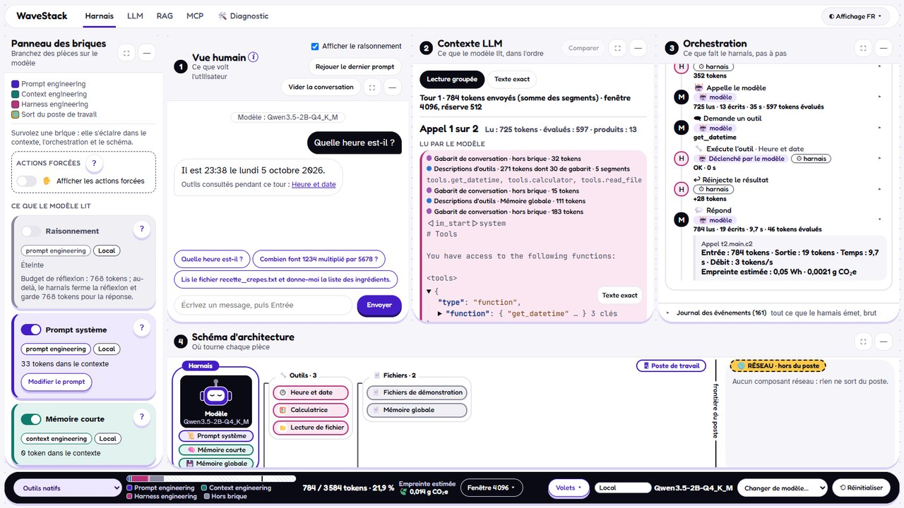

# Guide d'utilisation

[← Retour au README](../README.md)

Ce guide décrit l'interface de WaveStack, le programme de formation et chaque atelier. Pour
installer et lancer WaveStack, voir [l'installation détaillée](installation.md) ; pour les
modèles (local, serveur, cloud), voir [Modèles](modeles.md).

- [L'interface](#linterface)
- [Programme de formation](#programme-de-formation)
- [Brique RAG, corpus et index](#brique-rag-corpus-et-index)
- [Compression du contexte (Headroom)](#compression-du-contexte-headroom)
- [Atelier LLM](#atelier-llm)
- [Atelier RAG](#atelier-rag)
- [Atelier MCP](#atelier-mcp)
- [Langue](#langue)
- [FinOps, coût estimé des appels cloud](#finops-coût-estimé-des-appels-cloud)
- [GreenOps, empreinte estimée des appels au modèle](#greenops-empreinte-estimée-des-appels-au-modèle)

## L'interface



La barre de navigation, en haut de chaque page, mène aux cinq onglets ; le titre complet de
chaque écran est celui de l'onglet du navigateur et de la page :

| Onglet | Écran | Adresse | À quoi il sert |
|---|---|---|---|
| **Harnais** | Atelier Harnais | `/` | L'écran principal : les briques, la conversation et ses quatre volets |
| **LLM** | Atelier LLM | `/llm` | L'intérieur du modèle actif, sans aucune brique (voir [Atelier LLM](#atelier-llm)) |
| **RAG** | Atelier RAG | `/rag` | Une chaîne RAG à monter et exécuter pièce par pièce (voir [Atelier RAG](#atelier-rag)) |
| **MCP** | Atelier MCP | `/mcp` | Le protocole MCP entre le harnais et un serveur (voir [Atelier MCP](#atelier-mcp)) |
| **🛠️ Diagnostic** | Diagnostic et modèles | `/diagnostic` | Les vérifications du lancement, le choix du modèle et les clés API (voir [l'installation](installation.md#premier-lancement-et-diagnostic)) |

Le tableau des modèles et de leurs capacités est la page Diagnostic elle-même (voir
[Changer de modèle](modeles.md#changer-de-modèle)) : une carte par modèle, locaux puis cloud,
par éditeur ; l'entrée « Tableau des modèles… » du sélecteur de la barre du bas y mène, et
l'ancienne adresse `/models` y redirige.

Le menu **Affichage ▾**, à droite, règle le thème, la [langue](#langue) et le mode projection
(tous les textes agrandis pour la salle).

**L'atelier** se lit de gauche à droite :

- **Panneau des briques** : chaque brique (raisonnement, prompt système, mémoires, outils, RAG,
  MCP, skills, hooks, sous-agent, compression) s'allume par son interrupteur, avec sa catégorie
  (prompt, context ou harness engineering), son hébergement (local ou réseau) et son bouton
  « ? ». « Afficher les actions forcées » révèle les boutons de secours qui déclenchent un outil
  ou un skill quand un petit modèle ne le fait pas seul.
- **① Vue humain** : la conversation, telle que la voit l'utilisateur, avec les prompts
  suggérés du scénario et « Rejouer le dernier prompt ».
- **② Contexte LLM** : ce que le modèle lit vraiment, dans l'ordre, segment par segment
  (gabarit, prompt système, descriptions d'outils, historique…), en « Lecture groupée » ou en
  « Texte exact » ; « Comparer » met deux tours côte à côte.
- **③ Orchestration** : ce que fait le harnais, pas à pas (appel au modèle, demande d'outil,
  exécution, réinjection du résultat), avec les tokens, la durée, le coût et l'empreinte de
  chaque appel. Le « Journal des événements » donne tout ce que le harnais émet, brut.
- **④ Schéma d'architecture** : où tourne chaque pièce, sur le poste de travail ou sur le
  réseau, de part et d'autre de la frontière du poste.

La **barre du bas** porte le sélecteur de scénario, la jauge de la fenêtre de contexte (tokens
utilisés, par catégorie), la dépense et l'empreinte estimées, le réglage
[Fenêtre ▾](modeles.md#fenêtre-de-contexte), le menu « Volets » pour masquer ou réafficher un
volet, le modèle actif avec « Changer de modèle… », et « Réinitialiser ».

## Programme de formation

Le sélecteur de scénario de la barre du bas liste six modules, dans l'ordre des briques, soit
5 h 15 au total, à répartir sur plusieurs séances :

| Module | Durée | Scénarios |
|---|---|---|
| 1. Du LLM nu au harnais | 60 min | LLM nu, raisonnement, mémoire courte, prompt système, mémoire globale |
| 2. Outils | 45 min | outils natifs, outils réseau |
| 3. RAG | 45 min | RAG, RAG avec reranking |
| 4. MCP | 45 min | documentation complète, lazy loading |
| 5. Skills et hooks | 60 min | skills, Caveman, hooks |
| 6. Sous-agent et compression | 60 min | sous-agent, compression du contexte |

Lancer le premier scénario d'un module active les briques des modules précédents et restaure la
mémoire globale de démonstration : on peut reprendre la formation à n'importe quel module, dans
un état reproductible. Deux exceptions, que la consigne rappelle : le raisonnement reste éteint
après le module 1 (sa réserve de sortie prend de la place et allonge chaque tour), et le RAG
après le module 3 (ses extraits sur Exemplia sont hors sujet dans les démonstrations suivantes,
trompent un petit modèle et font relire tout le contexte à chaque tour). Rallumez-les à la main
pour les montrer.

Pour un petit modèle local, les prompts suggérés nomment l'outil ou le skill attendu (par
exemple `load_skill` et `meeting_minutes`, ou `mslearn__microsoft_docs_search`) : un modèle
plus gros fait seul le lien entre la demande et l'outil, ce qui se montre avec un modèle cloud.
Quand une action forcée existe, la consigne la donne en secours : « Déclencher le skill »
(Skills), « Forcer l'appel » sur « Lecture de fichier » avec un préréglage (Compression, SOC),
« Charger la documentation » en lazy loading (Lazy loading, Souveraineté), puis « Rejouer le
dernier prompt ». Un appel d'outil MCP ne se force pas : dans « MCP en documentation
complète », IAM, et pour la recherche elle-même en lazy loading, l'appel reste au modèle, et
la consigne dit quoi montrer s'il ne vient pas.

Le groupe « Transverses et métier » suit les modules : « Où vont mes données ? » (outils locaux,
serveur MCP local et data.gouv.fr actifs dès le lancement, en lazy loading ; décochez puis
recochez data.gouv.fr pour voir le flux sortant disparaître puis revenir), puis trois
scénarios métier, fictifs, pour que chaque practice imagine ses usages. Leur consigne, projetée,
se termine par le message à retenir ; la réponse attendue, ci-dessous, est pour le formateur.

| Scénario | Durée | Réponse attendue |
|---|---|---|
| SOC : journal d'audit et garde-fou | 20 min | Un seul incident, le compte adm.leroy : connexion depuis un pays inhabituel à 02:14 UTC (accès initial, comptes valides), auto-ajout aux « Admins du domaine » à 02:15 (élévation de privilèges, manipulation de compte), antivirus arrêté à 02:21 (contournement des défenses), 2,3 Go sortants à 02:40 (exfiltration), pendant une fenêtre de maintenance où des alertes étaient en sourdine. Les échecs de svc-sauvegarde sont à investiguer à part. Au second prompt, H1 bloque l'inventaire des comptes à privilèges : l'agent doit escalader vers un analyste habilité, comme le prompt le lui demande ; s'il ne le fait pas (fréquent avec un petit modèle), le formateur conclut : l'agent n'a pas ce privilège, la décision revient à un analyste habilité. |
| IAM : Entra ID avec Microsoft Learn | 15 min | MFA des administrateurs : une stratégie d'accès conditionnel qui cible les rôles d'administrateur et exige l'authentification multifacteur (modèle « Exiger l'authentification multifacteur pour les administrateurs »), ou les paramètres de sécurité par défaut pour un petit locataire. PIM : rôles attribués « éligibles », activés à la demande pour une durée limitée, avec justification, MFA et, au besoin, approbation. La réponse cite ses liens Microsoft Learn. |
| Souveraineté : où partent les requêtes ? | 15 min | Deux flux sortent du poste : la recherche vers data.gouv.fr (opérateur public français) et celle vers Microsoft Learn (éditeur américain, soumis au Cloud Act même en Europe). Chaque requête révèle le sujet de la mission. Hébergement et qualification (SecNumCloud) de chaque serveur restent à vérifier ; le modèle local ne sort pas du poste, un modèle cloud y ajouterait un troisième flux. |

IAM et Souveraineté demandent un accès à `learn.microsoft.com` et `mcp.data.gouv.fr` : sur le
réseau d'une entreprise, faites autoriser ces deux hôtes par le proxy avant la séance. Sans
réseau, chaque serveur est dessiné indisponible avec sa raison et le tour se poursuit sans lui.

Si la carte MCP signale qu'un serveur public s'écarte de son instantané (outils ajoutés ou
retirés, ou documentation plus lourde), la jauge prévue pour ses scénarios peut ne plus tenir :
passez en lazy loading ou agrandissez la fenêtre, puis faites mettre l'instantané à jour. Pour
ajouter un scénario ou mettre à jour les instantanés, voir
[Contribuer](../CONTRIBUTING.md#ajouter-un-scénario).

## Brique RAG, corpus et index

La brique RAG cherche dans huit textes fictifs (`content/corpus/`, l'organisation imaginaire
« Exemplia ») avec un petit modèle d'embedding local, nommé dans la seule section
`[rag.embedding]` de `wavestack.toml` (Granite Embedding 107M multilingue, GGUF Q8_0, 121 Mo,
verdict provisoire de la story 12). Les tailles sont en Mo décimaux (1 Mo = 1 000 000 octets),
sur la carte comme ici.

Sur une installation neuve, tout se fait depuis la carte RAG, sans ligne de commande :

1. « Télécharger le modèle d'embedding » : le fichier va dans `models/embedding/` du dossier de
   données (sans réseau, copiez-le à la main à cet endroit, puis cliquez de nouveau) ;
2. « Construire l'index » : le corpus est découpé et indexé sur le poste, dans
   `data/rag_index.sqlite` (sqlite-vec), avec une progression et « Arrêter ».

**Un corpus et un index par langue.** Le corpus anglais et le corpus allemand sont dans
`content/i18n/{en,de}/corpus/`, sous les mêmes noms de fichiers, et les titres des documents
dans `content/i18n/{en,de}/rag.yaml`. Chaque langue a son index, à côté du français :
`data/rag_index.en.sqlite` et `data/rag_index.de.sqlite` (le chemin de `[rag] index_path`,
`.{langue}` inséré avant l'extension). Les trois index sont livrés avec le dépôt : la brique
RAG et l'atelier RAG ouvrent celui de la langue de la session, titres des extraits compris.
Après un changement de langue, un index absent se construit depuis la carte, comme ci-dessus.
Après un changement de `[rag.embedding]` ou de `[rag] chunk_max_chars`, reconstruisez les trois
index ensemble, un par un : `uv run python scripts/build_rag_index.py --lang fr`, puis
`--lang en`, puis `--lang de`.

Le script fait la même chose, pour une langue à la fois (`fr` par défaut, jamais lue dans
`settings.json`), et peut committer l'index avec le dépôt :

```bash
uv run python scripts/build_rag_index.py                  # modèle de [rag.embedding], français
uv run python scripts/build_rag_index.py --lang de        # corpus allemand, rag_index.de.sqlite
uv run python scripts/build_rag_index.py --download       # télécharge d'abord le modèle
uv run python scripts/build_rag_index.py --model C:\chemin\modele.gguf
```

`--model` n'accepte que le fichier déclaré (même taille, même sha256 s'il est renseigné).
L'index garde l'identifiant, les dimensions et le fichier de son modèle, et une empreinte du
corpus de sa langue : un autre modèle, un corpus modifié (ou celui d'une autre langue) ou un
autre `[rag] chunk_max_chars` rendent la brique indisponible, avec la raison, et la carte
propose « Construire l'index ». Le dossier
`models/embedding/` n'est jamais proposé comme modèle de conversation.

### Reranking (sous-option de la brique RAG)

La case « Reranking » de la carte RAG ajoute une seconde passe : la recherche retient
`[rag] rerank_candidates` candidats (8 par défaut, de `top_k` à 20), un reranker local les note
un par un avec la question, et seuls les `[rag] top_k` premiers (3 par défaut, 20 au plus)
entrent dans le message. L'étape « Reranking » d'Orchestration montre l'ordre avant et après.

- **Modèle.** Il est nommé dans la seule section `[rag.reranker]` de `wavestack.toml` : BGE
  Reranker v2 M3, GGUF Q4_K_M, 438 Mo, Apache-2.0. C'est le verdict **provisoire** de la
  story 12 : sa latence et sa mémoire restent à mesurer sur le PC cible.
- **Mémoire.** Il est compté dans le budget mémoire (`[memory]`, calculé au lancement) pour la
  taille de son fichier plus `[memory] load_margin_mb` (environ 690 Mo), ou pour
  `measured_rss_mb` une fois mesuré.
  Refusé, seule la case est indisponible, avec la raison chiffrée.
- **Lenteur.** Un passage du reranker par candidat, avant le premier appel au modèle : si
  l'étape « Reranking » est trop lente sur le poste, baissez `[rag] rerank_candidates` dans
  `settings.json`.
- **Sans le modèle,** la case propose « Télécharger le modèle de reranking » (fichier dans
  `models/reranker/`, ou copie à la main au même endroit) et le RAG fonctionne sans reranking.
  Le dossier `models/reranker/` n'est jamais proposé comme modèle de conversation.

## Compression du contexte (Headroom)

La brique Compression passe les gros résultats d'outils et les extraits RAG à
[Headroom](https://pypi.org/project/headroom-ai/) (`headroom-ai` 0.38.0, Apache-2.0), avant
l'appel au modèle. C'est une dépendance optionnelle, non installée par `uv run wavestack` seul :
installez-la une fois, depuis le dossier de WaveStack, avant une séance qui l'utilise.

```bash
uv sync --extra compression
uv run wavestack
```

- **Installation et mise à jour.** Relancez `uv sync --extra compression` après chaque mise à
  jour. Attention : un `uv sync` sans `--extra compression` retire Headroom et ses dépendances
  (`uv run wavestack`, lui, les garde).
- **Réseau à l'installation.** L'extra se télécharge depuis PyPI (`pypi.org`,
  `files.pythonhosted.org`) : environ 40 paquets, 285 Mo sur disque. Ensuite, Headroom tourne
  hors ligne, sans télémétrie ni modèle d'apprentissage automatique (variables posées par
  WaveStack au lancement).
- **Table de comptage.** WaveStack livre la table `cl100k_base` de tiktoken (1,6 Mo, licence
  MIT, `src/wavestack/compression/tiktoken/`) : celle de litellm arrive en fins de ligne CRLF
  et tiktoken la supprime au premier usage. Si la carte dit la table absente ou altérée,
  restaurez-la : `git checkout -- src/wavestack/compression/tiktoken`, ou reprenez-la depuis
  l'archive (un outil qui convertit les fins de ligne l'altère).
- **Poste verrouillé.** headroom-ai apporte deux binaires natifs non signés (`_core.pyd` et
  l'exécutable `ast-grep`) : AppLocker ou WDAC peuvent les bloquer. La carte de la brique dit
  alors pourquoi elle est indisponible ; le reste de WaveStack fonctionne.
- **Sans l'extra,** la carte de la brique est indisponible et donne la commande d'installation.
- **Réglages.** Headroom ajoute 84 Mo de mémoire au pic sur le PC cible (107 Mo sous Linux),
  avec le comptage `gpt-4` ; `[compression] cost_mb` en compte 110, contrôlés par le budget.
  Un texte plus court que
  `[compression] min_chars` (300 caractères) n'est pas compressé. La brique n'a d'effet
  qu'avec Outils, MCP ou RAG : sans eux, rien à compresser.

## Atelier LLM

Le lien **« LLM »** de la barre de navigation ouvre l'Atelier LLM (page `/llm`) : ce qui se passe *dans* le modèle
actif, sans aucune brique (ni prompt système, ni historique, ni outil, ni mémoire) et sans
toucher à la conversation de l'atelier. Le modèle ne s'y change pas : le lien « Changer de modèle
dans l'atelier » ramène au sélecteur de la barre du bas.

- **Tokenisation et vectorisation.** « Découper en tokens » découpe le texte saisi (2 000
  caractères au plus), sans gabarit, par le tokenizer du modèle actif : une puce par token avec
  son identifiant (512 au plus), les blancs rendus visibles (`␣`, `↵`), un marqueur du gabarit
  comme `<|im_end|>` en un seul token marqué « spécial ». Un schéma suit le chemin d'un token :
  texte → tokens → identifiants → ligne de la table d'embedding (vocabulaire × dimension) →
  vecteur → couches, avec les dimensions réelles du modèle (lues par llama.cpp, dans l'en-tête
  GGUF, ou données par llama-server), ou « inconnue » et pourquoi. Un modèle cloud n'a pas de
  tokenizer sur le poste : la page le dit et montre l'estimation du harnais.
- **Réglages d'échantillonnage.** L'échantillonnage est un paramètre de chaque appel au
  modèle : l'atelier envoie toujours les valeurs du harnais (température 0,7, top-k 20, top-p
  0,8, min-p 0), l'écran envoie les siennes, réglables par curseur (température 0 à 2, top-k 0 à
  100, 0 le désactivant, top-p 0,05 à 1, min-p 0 à 0,5), au moteur en processus, à llama-server et à Ollama. Un
  modèle cloud ne prend que ce que son entrée déclare (`sampling`, voir [Modèles cloud](modeles.md#modèles-cloud)), les
  autres réglages sont grisés avec leur raison. Chaque appel trace son échantillonnage dans
  `model_call_started` (journal des événements).
- **Lecture du prompt et génération.** « Générer » envoie le texte comme un seul message de
  l'utilisateur, rendu par le gabarit du modèle, sans prompt système ni historique. La page
  montre le prompt rendu, son nombre de tokens, le temps jusqu'au premier token et le débit de
  lecture, puis les tokens un par un (des fragments pour un modèle cloud) et le débit de
  sortie. « Arrêter » interrompt. Pendant la génération, l'atelier attend (état « écran LLM
  nu ») ; sa conversation n'en reçoit rien, et l'état du moteur est restauré pour le tour
  suivant.
- **Chargement du modèle.** L'écran montre le dernier chargement fait dans l'atelier, étape
  par étape (libération du modèle précédent, sonde, contrôle du budget, création du moteur,
  prêt), avec les durées et la mémoire : RAM du processeur pour un fichier (pas de carte
  graphique), processus du serveur pour un modèle d'Ollama ou de llama-server, aucune mémoire
  sur le poste pour un modèle cloud. Un chargement en cours se suit en direct.
- **Raisonnement.** « Raisonner avant de répondre » s'active quand le modèle sait raisonner
  (grisé avec la raison sinon, verrouillé pour un modèle qui raisonne toujours) ; la réflexion
  et la réponse s'affichent dans deux couloirs, avec la réserve de 1 536 tokens et, en local,
  la coupe du harnais au budget de réflexion.
- **Tokens candidats.** Avec un fichier GGUF chargé par WaveStack (moteur en processus),
  « Montrer les tokens candidats » garde, pour chaque token produit, les cinq tokens que le
  modèle jugeait les plus probables : survolez, donnez le focus ou cliquez une puce pour voir
  leur probabilité, ceux que top-k, top-p ou min-p écartent et leur chance réelle d'être tirés
  (la température appliquée), le token tiré marqué. La lecture coûte peu (le vocabulaire d'une
  seule position par token). Avec llama-server, Ollama ou un modèle cloud, la case est grisée :
  WaveStack ne lit pas leurs probabilités.

Les textes de la page sont dans `content/llm_lab.yaml`. Les événements de l'écran sont tracés
dans le contexte `llm` : le journal des événements de l'atelier les liste, aucun volet ne les
montre.

## Atelier RAG

Le lien **« RAG »** de la barre de navigation ouvre l'Atelier RAG (page `/rag`) : l'architecture d'une chaîne
RAG, dessinée pièce par pièce, puis exécutée sur une question, étape par étape. C'est un bac à
sable : la brique RAG de l'atelier (ses réglages, son index, ses modèles) ne change pas.

- **La chaîne.** Sept cartes : découpage du corpus, embedding, base vectorielle, recherche,
  reranking, construction du contexte, génération. Chaque carte nomme son option (le modèle
  déclaré dans `[rag.embedding]` et `[rag.reranker]`, sqlite-vec…), ses réglages, et explique
  ce qu'elle fait ; une note dit ce qu'une exécution rencontrerait (modèle absent, index de la
  brique à construire). La génération est dessinée mais ne s'exécute pas ici : générer, c'est un
  tour de l'atelier ; la carte montre ce que le modèle recevrait.
- **L'exécution.** « Lancer la chaîne » exécute chaque étape sur la question (500 caractères au
  plus) et montre ce qu'elle reçoit, ce qu'elle produit, ses chiffres, ses extraits (rang, rang
  d'avant, document, score), sa durée et la mémoire de WaveStack. La chaîne livrée lit l'index
  de la brique (sans jamais y écrire) ; l'embedder et le reranker sont empruntés à la brique RAG
  quand elle les a chargés, sinon chargés pour l'exécution (dans le budget mémoire) puis fermés.
  Sans modèle d'embedding, l'étape le dit : téléchargez-le depuis la carte RAG de l'atelier ;
  sans reranker, le reranking est sauté et le contexte garde l'ordre de la recherche.
  « Arrêter » interrompt entre deux étapes. Pendant l'exécution, l'atelier attend (état
  « Atelier RAG : exécution en cours »).
- **Options et réglages.** Chaque carte propose ses options (les indisponibles sont grisées, la
  raison sous la carte) et ses réglages : taille des extraits (200 à 1 500 caractères), candidats
  retenus et extraits du contexte (1 à 20, jamais moins de candidats que d'extraits). La base
  vectorielle peut être l'index sqlite-vec ou une **recherche exhaustive en mémoire** (Python pur,
  sans index) ; l'embedding peut être un modèle **fastembed** (ONNX), proposé seulement s'il est
  installé, déclaré dans `settings.json` (`"rag_lab": {"fastembed": {"model_name": …, "dims": …,
  "label_text": …}}`, `"folder"` en option) et copié à la main sous `models/fastembed/<son
  dossier>` du dossier de données (par défaut `models--<model_name>`, « / » devenant « -- ») :
  l'atelier ne
  télécharge jamais rien. Une chaîne refusée dit pourquoi, en nommant l'étape.
- **Comparer deux configurations.** « Comparer avec une autre configuration » ouvre une chaîne
  B ; les deux s'exécutent l'une après l'autre sur la même question, en deux colonnes, suivies
  d'une synthèse : extraits communs, propres à A ou à B, écarts de rang (par document quand les
  deux chaînes découpent le corpus autrement). Les chaînes en cours d'édition sont gardées par le
  navigateur ; « Revenir à la chaîne livrée » les oublie.
- **Ajouter, retirer, déplacer.** Entre la base vectorielle et le contexte, les recherches, la
  fusion et le reranking se déplacent par leurs boutons « ◀ » et « ▶ » (au clavier aussi) et se
  retirent ; « Ajouter un composant » propose ceux qui manquent, placés avant le contexte : la
  **recherche lexicale BM25** (par mots, sans embedding, k1 = 1,5 et b = 0,75 ; accents et petits
  mots ignorés, sigles et nombres gardés, comme « RH » ou « 35 ») et la **fusion**
  des rangs réciproques (k = 60), qui combine deux recherches en une recherche hybride. Les
  autres étapes sont fixes. WaveStack vérifie la chaîne à chaque modification : une chaîne
  invalide (deux recherches sans fusion après elles, une fusion sans deux recherches avant elle,
  un reranking avant toute recherche…) affiche sa raison sur la carte fautive, et « Lancer » est
  désactivé.
- **Le dossier `rag_lab`.** Hors de la chaîne livrée, les vecteurs du corpus sont calculés une
  fois par modèle et par taille d'extrait, puis relus (« relus du cache »), et les index sqlite-vec
  de l'atelier sont construits à côté, dans `rag_lab/` du dossier de données (moins de 1 Mo par
  configuration pour le corpus livré). Rien n'est écrit dans le dépôt ni dans l'index de la
  brique. Ce dossier se supprime sans risque, WaveStack arrêté.

Les textes de la page sont dans `content/rag_lab.yaml`. Les événements `rag_lab_*` sont tracés
dans le contexte `rag_lab` : le journal des événements de l'atelier les liste, aucun volet ne
les montre. Après un rechargement, la page réaffiche la dernière exécution.

### FAISS et LanceDB (extra rag-alt)

La base vectorielle de l'Atelier RAG peut aussi être [FAISS](https://pypi.org/project/faiss-cpu/)
(`faiss-cpu` 1.15.1, MIT) ou [LanceDB](https://pypi.org/project/lancedb/) (`lancedb` 0.39.0,
Apache-2.0, avec `pyarrow` 25.0.1). Ce sont des dépendances optionnelles, l'extra `rag-alt`,
non installées par `uv run wavestack` seul. Depuis le dossier de WaveStack :

```bash
uv sync --extra compression --extra rag-alt
uv run wavestack
```

- **Headroom.** Gardez `--extra compression` dans la commande : un `uv sync` sans lui retire
  Headroom (la brique [Compression](#compression-du-contexte-headroom)).
- **Taille.** Environ 390 Mo sur disque sous Linux, dont pyarrow 150 Mo et lancedb 170 Mo ;
  six paquets, des roues seulement (rien n'est compilé sur le poste).
- **Hors ligne.** Une fois installés, FAISS et LanceDB ne se connectent à rien : leurs index
  sont des fichiers du dossier de données.
- **Mémoire.** Leur premier import est compté par le budget, à vie (un module Python ne se
  décharge pas) : `[rag_lab] faiss_cost_mb = 60` et `lancedb_cost_mb = 180` ; l'étape « Base
  vectorielle » dit la mémoire réellement ajoutée.
- **Le dossier `rag_lab`.** Chaque index est construit à la première exécution (« construit
  (N vecteurs) »), puis relu (« relu ») ; `rag_lab/` du dossier de données se supprime sans
  risque, WaveStack arrêté.
- **Poste verrouillé.** Leurs bibliothèques natives (DLL) ne sont pas signées : AppLocker ou
  WDAC peuvent les bloquer. L'étape « Base vectorielle » dit alors « Import refusé », l'option
  devient indisponible, et les autres bases (sqlite-vec, recherche en mémoire) restent
  utilisables.
- **Sans l'extra,** FAISS et LanceDB sont grisés dans l'Atelier RAG, avec la commande
  d'installation.
- **fastembed n'est pas livré** (décision de la story 30) : ni dépendance ni extra de WaveStack,
  car il ajoute onnxruntime et un client de téléchargement que le parcours n'a pas vérifiés hors
  ligne sous la garde réseau, ni sous Windows. Un formateur qui veut le montrer l'ajoute sur son
  poste seulement, depuis le dossier de WaveStack : `uv add --optional fastembed
  "fastembed==0.8.1"`, puis `uv sync --extra compression --extra rag-alt --extra fastembed` ;
  `git checkout pyproject.toml uv.lock` le retire avant une mise à jour. Son import est compté
  à vie par le budget (`[rag_lab] fastembed_cost_mb = 150`), son modèle à part, le temps d'une
  exécution.

## Atelier MCP

Le lien **« MCP »** de la barre de navigation (ou « Voir le protocole dans l'atelier MCP → »
sur la carte MCP) ouvre l'Atelier MCP (page `/mcp`) : le protocole MCP entre le harnais et un serveur, sans
modèle. C'est un bac à sable : l'atelier ouvre ses propres connexions, la brique MCP de
l'atelier (ses serveurs cochés, son mode, ses connexions) ne change pas, et rien n'est généré.

- **Les serveurs.** Les trois de la brique : le glossaire local, un processus Python lancé sur
  le poste et joint par stdio (sa commande de lancement est affichée), data.gouv.fr et
  Microsoft Learn, joints en Streamable HTTP derrière la garde réseau (ce qui sort du poste est
  dit). « Se connecter » ouvre la connexion de l'atelier ; une seule à la fois.
- **La poignée de main.** Chaque message JSON-RPC tel qu'il passe sur le transport, capturé et
  non reconstitué : `initialize`, la réponse du serveur (nom, version, capacités),
  `notifications/initialized`, `tools/list` et sa réponse, avec leur sens et leur durée. Un
  serveur public montre aussi ses requêtes HTTP sortantes ; hors ligne, la section dit l'erreur.
- **La documentation des outils.** Pour chaque outil, son nom vu par le modèle
  (`{serveur}__{outil}`), sa description et son schéma, et son poids en tokens dans le
  contexte : en documentation complète, et en lazy loading (une ligne dans la description de
  `load_tool_doc`). Compté par le modèle chargé, sinon estimé.
- **L'appel.** Un champ par paramètre, des préréglages ; la requête `tools/call`, la réponse
  brute et le texte que le harnais réinjecterait au modèle (borné comme un résultat d'outil).
  Un terme inconnu du glossaire montre une réponse `is_error`. « Arrêter », pendant un échange, l'interrompt et ferme la connexion ; sinon, elle reste ouverte jusqu'à la connexion suivante, un changement de langue ou la fermeture de WaveStack.
- **Ce que le modèle voit.** Le bloc « outils » du contexte avec ce serveur, dans les deux modes.

Les textes de la page sont dans `content/mcp_lab.yaml`. Les événements `mcp_lab_*` sont tracés
dans le contexte `mcp_lab` : le journal des événements de l'atelier les liste, aucun volet ne
les montre. Pendant un échange, l'atelier attend (état « Atelier MCP : échange en cours »).

## Langue

Le sélecteur de langue est dans le menu « Affichage ▾ », à droite de la barre de navigation
(avec le thème et le mode projection ; sa face montre le code de la langue, « FR »), et propose **Français**, **English** et **Deutsch**. Il ne s'ouvre que sur une conversation vide : après un
échange, il est grisé et son infobulle demande de cliquer d'abord sur « Vider la conversation »
ou « Réinitialiser ». Le choix est enregistré dans `settings.json` (`"language": "en"`), repris
au lancement suivant, et la page se recharge dans la langue choisie.

La langue change :
- **ce qui part vers le modèle** : prompt système par défaut, prompt du sous-agent,
  descriptions des outils et de leurs paramètres (outils natifs, serveur MCP local,
  méta-outils `load_skill`, `load_tool_doc`, `remember`, `delegate`), skills, texte et date
  ajoutés par H3, introduction et entrées de la mémoire globale de démonstration, glossaire du
  serveur MCP local, introduction et format des extraits du RAG ;
- **les libellés tirés de ces mêmes fichiers** : noms et préréglages des outils (carte
  « Outils », schéma, actions forcées), noms et descriptions des hooks et points du tour
  (Orchestration), noms des skills, libellés des serveurs MCP et de leurs préréglages, bouton,
  phase et préréglages du sous-agent, textes du tiroir de la mémoire, boutons et phases de la
  carte RAG ;
- **l'écran principal** : boutons, volets, menus, infobulles, jauge, Orchestration, schéma et
  messages de l'interface elle-même, avec les nombres, montants et heures au format de la
  langue (« 1 234 », « 1,234 », « 1.234 »). Ses textes sont dans `content/ui.yaml`.

- **le reste** : les noms et explications des briques, les scénarios et leurs consignes,
  les ateliers (« Atelier LLM », « Atelier RAG », « Atelier MCP ») et les pages « Diagnostic et
  modèles » et « Modèles disponibles », le corpus RAG et les titres de ses documents, et les messages produits par le
  harnais (erreurs, raisons d'indisponibilité, erreurs d'outils lues par le modèle, marque de
  troncature, refus des hooks, résultat de `get_datetime`), tirés de `content/messages.yaml`.

Seule la sortie du terminal (`wavestack diagnostic`, `scripts/build_rag_index.py`) reste en
anglais, quelle que soit la langue choisie.
Une mémoire globale que vous avez modifiée est gardée telle quelle ; la mémoire de
démonstration, elle, passe dans la nouvelle langue.

Les traductions sont dans `content/i18n/en/` et `content/i18n/de/`, avec les mêmes noms de
fichiers que `content/` ; un fichier absent y est lu en français.

## FinOps, coût estimé des appels cloud

Chaque entrée `[[cloud.models]]` (voir [Modèles cloud](modeles.md#modèles-cloud)) peut
déclarer ses prix dans `pricing` : prix d'entrée et prix de
sortie, en dollars par million de tokens, et la date du relevé (`checked`, au format
AAAA-MM-JJ). Relevés le 2026-09-29 sur les pages officielles : Groq `openai/gpt-oss-120b` et
Mistral Small 4 à 0,15 $ / 0,60 $, Gemini `gemini-3.5-flash-lite` à 0,30 $ / 2,50 $. Sur le
plan gratuit de Mistral, le coût réel est nul : le prix affiché est le prix catalogue ; sur un
plan payant, la consommation est facturée à ce prix. Gemma n'a pas de `pricing` : le modèle est
gratuit, aucun coût n'est estimé ni affiché (« — »).

**Estimation.** Pour chaque appel cloud, WaveStack calcule le coût d'entrée (tokens du prompt ×
prix d'entrée / 10⁶) et le coût de sortie (tokens produits × prix de sortie / 10⁶, les tokens de
raisonnement compris, même ceux que Gemini ne compte pas dans `completion_tokens`). Les tokens
viennent de `usage` quand le fournisseur le renvoie ; sinon ils sont estimés, et le coût aussi
(« ≈ »). Ce sont toujours des estimations : ni les en-têtes de facturation ni la console du
fournisseur ne sont lus. Un appel arrêté (« Arrêter ») compte son entrée telle qu'envoyée, et la
sortie reçue avant l'arrêt ; un appel refusé avant toute réponse ne compte rien. L'estimation
suit le prix catalogue. Les tokens d'entrée lus dans le cache du fournisseur ou écrits dans ce
cache sont comptés à leurs propres prix quand l'entrée les déclare dans `pricing`
(`cache_read_usd_per_mtok`, `cache_write_usd_per_mtok`, facultatifs), au prix d'entrée sinon. Les
prix par palier ou pour les longs contextes, les prix du traitement par lots (batch) et les
offres gratuites ne sont pas pris en compte.

**Plafond de la séance.** `[finops] max_session_usd` (5 $ par défaut) borne la dépense de la
séance : quand le total de la séance l'a atteint, un appel à un modèle qui déclare ses prix n'est
pas envoyé, et le message dit le plafond, le total et comment le relever. Les modèles sans
`pricing` (local, Gemma) restent utilisables. Les appels déjà en cours ne sont jamais
interrompus : le total peut dépasser le plafond du coût de chacun d'eux. Une valeur illisible,
`nan`, `inf`, négative ou booléenne vaut 5 ; aucune valeur ne désactive le plafond, et `0` refuse
tout appel tarifé. Pour le relever, modifiez-le dans `settings.json`, par exemple
`{"finops": {"max_session_usd": 10}}`, WaveStack arrêté, puis relancez : le total de la séance ne
revient à zéro qu'au relancement.

**Affichage.** « Coût estimé : entrée … $ · sortie … $ » dans le détail de chaque appel
(Orchestration), le total du tour dans son en-tête (« coût estimé … $ »), et « Dépense
estimée » dans la barre du bas dès le premier appel payant : le total de la séance, entrée + sortie
(arrondies au centième de cent), la phrase entière (4 chiffres significatifs, conversion en
euros) dans l'infobulle. Ce total compte tous les appels payants : les tours, le sous-agent,
« Tester » au diagnostic et l'Atelier LLM. Ni « Vider la conversation » ni « Réinitialiser »
ne le remettent à zéro ; seul un relancement de WaveStack le fait (il n'est jamais écrit sur le
disque). Les prix déclarés sont aussi sur la ligne « Prix » de la carte
dépliée d'un modèle, page Diagnostic. Un modèle local n'a pas de coût, et une entrée sans `pricing` non
plus.

**Mettre les prix à jour.** Relevez les prix sur la page du fournisseur, puis surchargez l'entrée
dans `settings.json`, par exemple `{"id": "gemini", "pricing": {"input_usd_per_mtok": 0.3,
"output_usd_per_mtok": 2.5, "cache_read_usd_per_mtok": 0.03, "checked": "2027-01-02"}}`, et
relancez WaveStack (`cache_read_usd_per_mtok` et `cache_write_usd_per_mtok` sont facultatifs). Le taux de
conversion se règle dans `[finops] eur_per_usd` (euros pour un dollar, 0,86 par défaut, borné de
0,5 à 2 ; une valeur illisible, `nan` ou `inf`, vaut 0,86). Ce taux par défaut a été relevé le
2026-09-30 : mettez-le à jour. Un prix négatif rend l'entrée invalide : elle est écartée au lancement, avec la raison.

## GreenOps, empreinte estimée des appels au modèle

WaveStack estime, pour chaque appel au modèle, l'énergie consommée (Wh) et les émissions (g CO₂e),
puis les additionne par tour et par séance, sans aucun appel réseau.

**Modèle cloud : méthode EcoLogits.** La bibliothèque `ecologits` (dépendance normale, son cœur
seul : aucun SDK n'est instrumenté) estime l'impact d'un appel à partir de ses tokens de sortie
(raisonnement compris) et de sa durée, pour le modèle que nomme le champ `impacts` de l'entrée
`[[cloud.models]]` ([Modèles cloud](modeles.md#modèles-cloud)) : `provider` et `model` tels qu'EcoLogits les connaît, et `zone`, facultative,
le mix électrique (code ISO à trois lettres ; par défaut celui du fournisseur dans EcoLogits).
Préréglages : Groq → `huggingface_hub` / `openai/gpt-oss-120b` (EcoLogits ne connaît pas Groq ;
gpt-oss y figure chez Hugging Face, sur GPU), Mistral → `mistralai` / `mistral-small-latest`,
Gemini → `google_genai` / `gemini-3.5-flash-lite`, Gemma → `google_genai` /
`gemma-4-26b-a4b-it`. Le champ facultatif `note_text` de `impacts`
s'ajoute à l'infobulle de chaque appel : celui de Groq dit que l'estimation passe par un autre
hébergeur. Quand EcoLogits donne une fourchette (architecture non
publiée, comme Gemini), elle est gardée : « 0,066–0,45 Wh ». Ses avertissements (architecture non
publiée, modèle multimodal) sont repris en français dans l'infobulle. Sans `impacts`, ou pour un
modèle qu'EcoLogits ne connaît pas, l'appel n'a pas d'empreinte, et l'infobulle dit pourquoi.

**Modèle local : CodeCarbon.** Avec l'extra `greenops`, un traceur CodeCarbon hors ligne entoure
chaque génération : le processus de WaveStack seul pour le moteur intégré, le poste entier pour
Ollama et llama-server (processus à part). Seule son énergie est gardée ; les émissions en
découlent à `[greenops] local_gco2e_per_kwh` (41,4 g CO₂e par kWh par défaut, le facteur du mix
France d'EcoLogits ; RTE donne pour 2025 19,6 g en émissions directes, environ 29 g en cycle de
vie). Sous Windows, sans RAPL ni droits administrateur, CodeCarbon estime la puissance du
processeur à partir de son TDP et de sa charge : c'est une estimation, pas une mesure. Ni le
GPU, ni un fichier `emissions.csv`.

**Deux périmètres différents.** Le chiffre local ne compte que l'électricité consommée pendant
l'appel (kWh × 41,4 g/kWh), sans la fabrication du poste. Le chiffre cloud d'EcoLogits est un
cycle de vie : l'électricité des serveurs et une part de leur fabrication. Les deux s'additionnent
dans la séance, mais ne se comparent pas terme à terme.

```bash
uv sync --extra compression --extra greenops   # gardez vos autres extras dans la commande
```

Environ 150 Mo installés : l'installation de l'extra demande le réseau (PyPI) ou un cache local
de paquets. Dès qu'un modèle local est prêt, CodeCarbon s'importe en arrière-plan (environ 70 Mo
en mémoire, `[greenops] codecarbon_cost_mb = 80` comptés une fois, à vie, par le budget mémoire)
et détecte le processeur (quelques secondes, une seule fois ; un appel qui commence avant la fin
de cette préparation l'attend). Sans l'extra, ou si le budget le
refuse, tout le reste fonctionne : l'empreinte locale est « indisponible », et l'infobulle en
donne la raison (la commande d'installation, ou le refus du budget). Une estimation qui échoue
n'arrête jamais un tour : l'appel n'a pas d'empreinte, avec la raison.

**Affichage.** « Empreinte estimée : 0,11 Wh · 0,046 g CO₂e » dans le détail de chaque appel
(la méthode et ses limites dans l'infobulle), la somme du tour dans son en-tête, et l'empreinte
de la séance dans la barre du bas : troisième ligne de « Dépense estimée », sous la dépense
(« 🍃 0,12 g CO₂e »), la phrase entière dans l'infobulle ; « Empreinte estimée » sur deux lignes
tant qu'aucun appel payant n'a eu lieu. Comme la dépense, ce total compte les tours, le sous-agent,
« Tester » et l'Atelier LLM, et seul un relancement le remet à zéro. L'embedding et le
reranker du RAG ne sont pas comptés.
